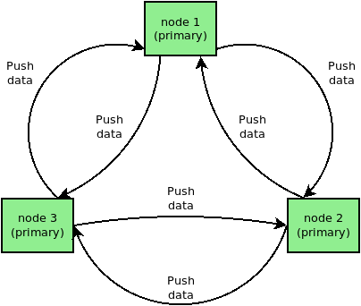

alfred architecture
===================

Introduction
------------

alfred is a user space daemon for distributing arbitrary local
information over the mesh/network in a decentralized fashion. This data
can be anything which appears to be useful - originally designed to
replace the batman-adv visualization (vis), you may distribute
hostnames, phone books, administration information, DNS information, the
local weather forecast ...

Typically, alfred runs as unix daemon in the background of the system. A
user may insert information by using the alfred binary on the command
line, or use custom written programs to communicate with alfred directly
through unix sockets. Once the local data is received, the alfred daemon
takes care of distributing this information to other alfred servers on
other nodes somewhere in the network. As addressing scheme IPv6
link-local multicast addresses are used which do not require any manual
configuration. A user can request data from alfred, and will receive the
information available from all alfred servers in the network.

More user related information can be found in the [[alfred:Alfred]]
overview page.

Alfred specific terms
---------------------

+----------+--------------------------------------------------------------------------------------------------------------------------------------------+
| node     | a node is a device able to run alfred                                                                                                      |
+----------+--------------------------------------------------------------------------------------------------------------------------------------------+
| server   | an alfred instance running on a node, able to communicate with alfred processes on other nodes and with clients running on the same node   |
+----------+--------------------------------------------------------------------------------------------------------------------------------------------+
| client   | a program which supports the alfred protocol and communicates with the alfred server on the same node                                      |
+----------+--------------------------------------------------------------------------------------------------------------------------------------------+
| master   | an alfred server process which stores incoming data, synchronizes it with other master servers and accepts requests/data from slaves       |
+----------+--------------------------------------------------------------------------------------------------------------------------------------------+
| slave    | an alfred server process which only manages its own data, pushes/requests the data to/from **its** master server                           |
+----------+--------------------------------------------------------------------------------------------------------------------------------------------+

Network
-------

Structure
~~~~~~~~~

An alfred network used for exchanging data is built using different
nodes running an alfred server. Servers are detected and connect to each
other automatically.

|image0|

Such a network has to contain at least one master server. Master servers
are used as global data storage and help to synchronize data with other
nodes. This role is so important that they actively announce there
presence to all nodes. Other master servers are automatically
synchronizing their stored data to have it distributed to all reachable
master nodes.

The second type of servers are slaves. Slaves don't try to gather all
data stored in the alfred network. Instead they only connect to their
best master server to request data when required and to push the data
from local clients to the alfred network through master servers.

Network layer
~~~~~~~~~~~~~

All communication between servers in an alfred network is done through
IPv6 link-local UDP messages. This only allows communication in the
current subnet but messages will not be routed between different
subnets.

The underlying layer can for example be batman-adv which makes all nodes
in a mesh look like being connected to a big switch. This makes it
possible to reach all nodes even in situations where they would not be
able to reach each other through the actual link medium. Therefore,
link-local messages are enough for this scenario. Deployments with a
different kind of underlying layer may have to evaluate if they can
provide a medium which also provides IPv6 link-local communication
between all nodes.

All the messages are sent through the IANA unregistered UDP/IPv6 port
0x4242 (in decimal: 16962).

Detection of neighbors
~~~~~~~~~~~~~~~~~~~~~~

The master server will announce itself using IPv6 link-local multicast
messages. This makes it possible to reach all nodes with a single
message unless it is dropped while being forwarded/transmitted.

|image1|

The periodically (10s) transmitted announcement multicast messages will
be received by the other alfred servers and be store for later. Master
servers use this information to synchronize data and slave servers use
it to have access to the global data.

|image2|

The slave servers need therefore a way to find their best master server.
The current strategy for non-batman-adv server is to choose one server
randomly and and don't use an extra metric. But batman-adv networks
already provide the TQ value to quantify the quality to a master server.
The best master server is just the server with the best TQ for a slave
node.

The mac address is used by alfred to associate the messages with an
unique data source. It is calculated by evaluating the received UDP/IPv6
packet source address. This mac address can then be used to retrieve the
master server TQ from the batman-adv debug tables.

Detected neighbor servers are automatically dropped after a timeout of
60s since the last announcement was received.

Client data exchange
~~~~~~~~~~~~~~~~~~~~

The client communication to the alfred server is done through unix
sockets on the same node. The path is defined as /var/run/alfred.sock

The used packet format is shared between the server2server and the
client2server communication. There are some minor differences which will
be explained later.

The easiest communication is the push of data to an server. The client
just has to create a alfred\_push\_data packet with the attached data at
the end. The server receives it, stores it, closes the client connection
and handles the forwarding of the data to the other servers in the
alfred network.

Slightly more complicated is the request of data from a master server.
The client has to send an alfred\_request packet to the master server
with the type it requests. The reply will be an arbitrary number of
alfred\_push\_data packets of the requested type which contain the data
set by the clients on this node and from other nodes. The data from
other servers will only be as new as the latest successful data
synchronization.

|image3|

The alfred request to an slave server looks exactly the same as the
request to a master server. But the slave server doesn't store all data
which is currently in the alfred network. Instead the slave server has
to ask its master server to send information for this type to the slave
server. This is done the same way as a client would do it but through a
link-local UDP/IPv6 message. The request will be replied by the server
with alfred\_push\_data packets and a single alfred\_status end packet
containing the number of sent alfred\_push\_data packets.

This request can obviously fail for different reasons. The slave server
uses an timeout (10s) for these requests and informs the client using an
alfred\_packet\_status error message that the request failed. Otherwise
the slave server will reply with alfred\_push\_data packets the same way
as a master server.

|image4|

The best practice for a client is to implement the handling of error
messages even when it is only used together with master servers.

Synchronization
~~~~~~~~~~~~~~~

Data synchronizations are done master2master and slave2master. The slave
will only send data from its clients to a single server. Master servers
are sending their stored data to all other known master servers. This
only contains the data from their local clients and data pushed from
slave server.

|image5|

The synchronization is started pro-actively by the slave or master
server every 10s. It is initiated by an alfred\_push\_data packet with a
transaction id and the first data blocks. This transaction id should be
unique for the time of the synchronization but the same for all packets
of a synchronization transaction.

The last packet is an alfred\_status end packet with the number of sent
alfred\_push\_data packets during this synchronization transaction. If
it doesn't match with the number of packets the master server received,
then the transaction failed and the remote master server drops the
received data.

Data is automatically pruned from the server storage 600s after the last
time it was received/refreshed.

Packet formats
--------------

General format
~~~~~~~~~~~~~~

The data stored in the packet headers is always stored in network byte
order (big endian). The packet format is TLV based (type, value, length)
which appears in different headers. The type is only defined by alfred
for the outer TLV and can be PUSH\_DATA(0), ANNOUNCE\_MASTER(1),
REQUEST (2), STATUS\_TXEND(3), STATUS\_ERROR(4). The only special type
is MODESWITCH (5) which is used internally to switch a server between
master and slave mode.

The length value is always the length of the payload following the TLV.
This is especially important when multiple TLV + payload blocks appear
after each other.

The version field is also only defined for the outer TLV and has to be 0
for the specified first packet format.

Master announcement
~~~~~~~~~~~~~~~~~~~

|image6|

The announcement is only done by the master servers to announce
themselves via link-local UDP/IPv6 multicast. It doesn't contain any
more information. The receiver has to calculate the mac address of the
sender by decoding the link-local IPv6 sender address.

Request data
~~~~~~~~~~~~

|image7|

Requests are done by clients via unix socket or by slave servers via
link-local UDP/IPv6 unicast.

The requested type is the type of data which the transmitter wants to
receive. The alfred\_push\_data packets sent as reply must only contain
data blocks from this type.

The transaction id must be unique during the time the request is made
and answered.

Finish transaction
~~~~~~~~~~~~~~~~~~

|image8|

Servers send status end packets via link-local UDP/IPv6 unicast. It is
the last packet of a transaction (synchronization or reply to a
request). The transaction id has to be equal to the transaction id of
the alfred\_push\_data packets and the alfred\_request. The number of
packets has to be equal to the number of alfred\_push\_data packets with
the same transaction id to accept the transaction as successful.

Inform about an error
~~~~~~~~~~~~~~~~~~~~~

Slave servers send error messages via unix sockets to clients. This
tells the client that the request of data from the master server failed.
The transaction id has to be same as the transaction id of the
alfred\_request packet.

|image9|

The only currently used error code is 1.

Push data
~~~~~~~~~

Push data packets are sent/received by clients to send data via unix
sockets to/from servers. Clients send it to store data on a server.
Servers send it to clients as answer to alfred\_request packets.

Servers sent push data packets via UDP/IPv6 to synchronize data between
them. Master server also sent them to slave server as answer to
alfred\_request packets.

The transaction id has to be unique during the time of the transaction
but the same for all packets of one transaction. The sequence number has
to be increased for each packet of a transaction.

|image10|

The payload of the alfred\_push\_data packet after the transaction
information is split into an arbitrary number of alfred\_data blocks.
Each data block is started with the mac address of the server which
initially stored the data. The next part is the TLV header which
describes the data part of the alfred\_data block. The type and version
are user/client defined. The length is the number of bytes for the data
stored after the TLV header.

The number of alfred\_data blocks in a single alfred\_push\_data has
always to be **1** for communication via unix sockets. The aggregation
of multiple data blocks is only allowed for communication via UDP/IPv6.

Alfred allows type from 65 up to 255 as general types for client data. 0
- 64 are reserved (e. g. batadv-vis(1) and alfred-gpsd(2)). The version
information has to be evaluated by a client to make sure that it can
correctly interpret the data.

One push data packet can be up to 65535 bytes in size. This limits the
number of bytes per data block to 65517 bytes.

.. |image1| image:: announce_master.png
.. |image2| image:: master_selection.png
.. |image3| image:: node_architecture_master.png
.. |image4| image:: node_architecture_slave.png

.. |image6| image:: packet_announce_master_v0.png
.. |image7| image:: packet_request_v0.png
.. |image8| image:: packet_status_v0_end.png
.. |image9| image:: packet_status_v0_error.png
.. |image10| image:: packet_push_data_v0.png

