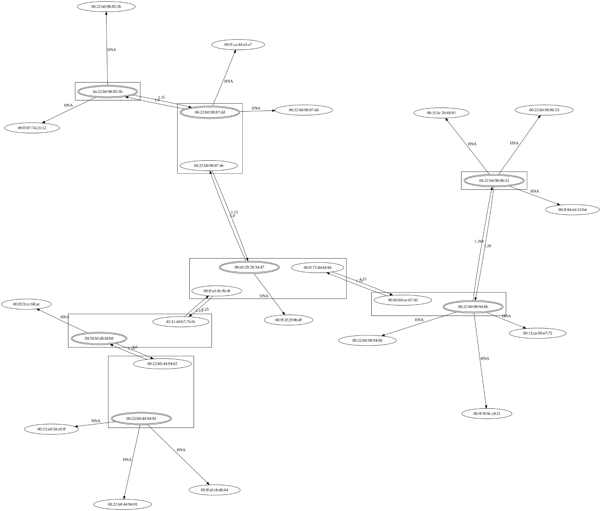

.. SPDX-License-Identifier: GPL-2.0

==========
Batadv-vis
==========

batadv-vis can be used to visualize your batman-adv mesh network. It
read the neighbor information and local client table and distributes
this information via alfred in the network. By gathering this local
information, any vis node can get the whole picture of the network.

It allows output of different formats (json, graphviz) and replaces the
in-kernel vis functionality found in older batman-adv kernel modules
(<2014). See the sample picture below. For more information, please read
the vis section of the
`README <https://git.open-mesh.org/alfred.git/blob_plain/refs/heads/main:/README.rst>`__
or the
`manpage <https://downloads.open-mesh.org/batman/manpages/batadv-vis.html>`__
for usage.

|image0|

