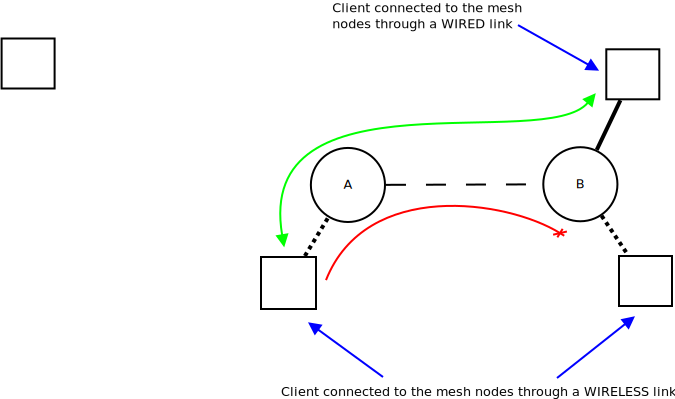

Ap-isolation
============

What is it?
~~~~~~~~~~~

Like any commercial Access Point, the "Access Point Isolation" is a
feature that prevents any communication between stations connected to
the same infrastructured BSSID. B.A.T.M.A.N. Advanced replicates the
same behaviour by denying communication between clients connected to
their nodes through a wireless link. Note that communication from and to
clients connected through a wired link is left untouched.

|image0|

The picture above shows a simple scenario where AP-Isolation is enabled
either on node A and B: communications between wireless stations are
prevented, while communications between wireless and wired clients are
allowed.

How to enable it?
~~~~~~~~~~~~~~~~~

::

    batctl ap_isolation 1

or

::

    batctl ap 1

To disable it, just switch 1 to 0

Note that packets are checked either at the sender or the receiver node,
therefore, if at least one of those have AP-Isolation enabled, the
communication is forbidden. However we strongly suggest to enable the
AP-Isolation on all the nodes in order to prevent wasting of resources.
(E.g. send of data over the mesh knowing that it is going to be dropped
at the receiver)

Remember that B.A.T.M.A.N.-Advanced AP-Isolation will provide
"inter-meshnode communications" prevention only. Therefore if you want
to block communications between clients connected to the same access
point (actually mesh node) you may want to enable the "classic
AP-Isolation" function provided by the access point itself.

Broadcast and multicast packets instead do not have a single
destination, therefore such packets could be destined for wireless
clients as well as wired clients. B.A.T.M.A.N.-Advanced has no way to
distinguish these cases. To not completely block needed broadcast
traffic (ARP for instance) broadcast and multicast traffic is forwarded
through the mesh even between wireless clients.

Extending the AP-Isolation
~~~~~~~~~~~~~~~~~~~~~~~~~~

The AP-Isolation mechanism allows the user to block wireless-to-wireless
payload traffic, but this beaviour might be not enough in some setups
where a more sophisticated solution is needed.

The *:doc:`Extended AP Isolation <Extended-isolation>`* is an improvement
that allows the user to decide which client has to be classified as
*isolated* by means of firewall rules, thus increasing the flexibility
of this feature. batman-adv extracts the fwmark that the firewall
attached to each packet it receives through the soft-interface and
decides based on this value if the source client has to be considered as
isolated or not. Similar to other client attributes, the
*isolated-state* is announced throughout the network in order to inform
all other mesh nodes.

Like in the basic mechanism, with this extension isolated-to-isolated
traffic is possibly dropped at the source, while broadcast/multicast
packets are normally delivered but only after batman-adv has restored
the original fwmark. This gives the user a chance to set other firewall
rules that prevent, for example, this packet from being forwarded to
unwanted interfaces.

For more details about the Extended Isolation and how to tell batman-adv
which fwmark it has to look for, please read the
:doc:`related page <Extended-isolation>`.

