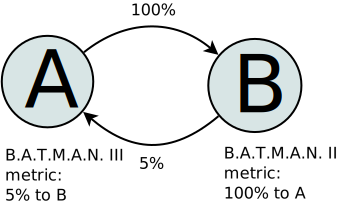
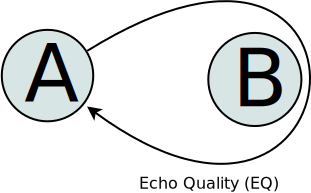
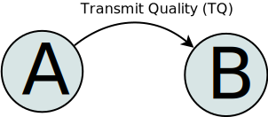
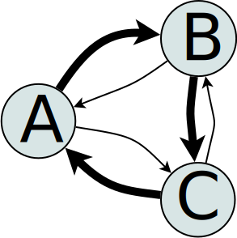
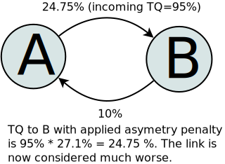
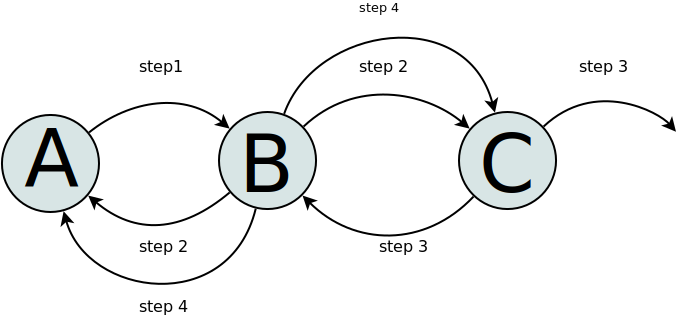
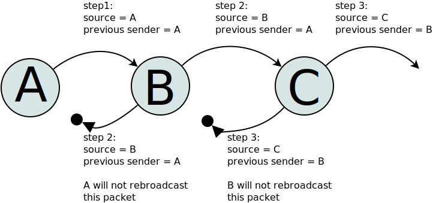
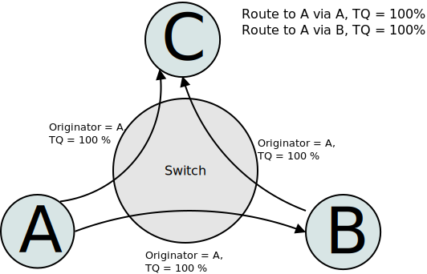
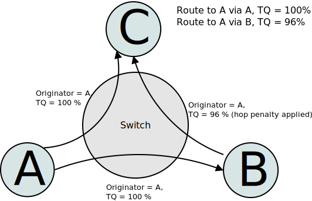
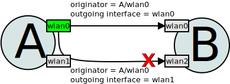

.. SPDX-License-Identifier: GPL-2.0

============================
B.A.T.M.A.N. IV (TQ) Meshing
============================

B.A.T.M.A.N. III (Introduction)
===============================

B.A.T.M.A.N. is a proactive routing protocol for Wireless Ad-hoc Mesh
Networks, including (but not limited to) Mobile Ad-hoc Networks
(MANETs). The protocol proactively maintains information about the
existence of all nodes in the mesh that are accessible via single-hop or
multi-hop communication links. The strategy of B.A.T.M.A.N. is to
determine for each destination in the mesh one single-hop neighbor,
which can be utilized as best gateway to communicate with the
destination node. In order to perform multi-hop IP-based routing, the
routing table of a node must contain a link-local gateway for each host
or network route. To learn about the best next-hop for each destination
is all that the B.A.T.M.A.N. algorithm cares about. There is no need to
find out or calculate the complete route, which makes a very fast and
efficient implementation possible.

B.A.T.M.A.N. III (Brief Overview)
---------------------------------

On a regular basis every B.A.T.M.A.N. node broadcasts an originator
message (or OGM), thereby informing its link-local neighbors about its
existence (first step). Link-local neighbors which are receiving the
Originator messages are relaying them by rebroadcasting it, according to
specific B.A.T.M.A.N. forwarding rules. The B.A.T.M.A.N. mesh network is
therefore flooded with Originator messages. This flooding process will
be performed by single-hop neighbors in the second step, by two-hop
neighbors in the third step, and so forth. OGMs are send and repeated as
UDP broadcasts, therefore OGMs are flooded until every node has received
it at least once, or until they got lost due to packet loss of
communication links, or until their TTL (time to live) value has
expired. In practise OGM packet loss caused by interference, collision
or congestion is significant. The number of OGMs received from a given
Originator via each link-local neighbor is used to estimate the quality
of a (single-hop or multi-hop) route. In order to be able to find the
best route to a certain originator, B.A.T.M.A.N counts the
originator-messages received and logs which link-local neighbor relayed
the message. Using this information B.A.T.M.A.N. maintains a table with
the best link-local router towards every originator on the network.
Unlike wired networks, WiFi setups often face the problem of asymetric
links (Node A has a better connection towards Node B than vice versa).
To ensure that the detected connections allow communication in both
directions each B.A.T.M.A.N. node awaits rebroadcasts of its own OGMs
from his neighbors within a certain timeframe (bidirectional link
check). If the OGMs are not successfully retransmitted the connection is
considered too asymetric (unusable) and therefore ignored.

B.A.T.M.A.N. IV (TQ)
====================

The B.A.T.M.A.N. III algorithm has serious problems when it comes to
asymetric links. The bidirectional link check tries to limit its impact
but the result is far from being perfect. The timeframe in which
B.A.T.M.A.N. accepts his own OGMs being rebroadcasted by its neighbor
allows to tweak the behaviour. If this timeframe is rather short
B.A.T.M.A.N. is very strict on choosing links. This may lead to many
ignored links which might be usable in one direction. Only symetric
connections will be considered. If the timeframe value is less strict
B.A.T.M.A.N. will accept more links but tends to route in the wrong
direction.

Example: OGMs from Node A propagate to B. The link is asymetric,
therefore B receives all packets from A in contrast to A which receives
almost nothing from B. As all the packets from A get to B the packet
count at B's side goes up. B will assume that it has a perfect link
towards A which is not the case.

|asymetry illustration|

To overcome this flaw B.A.T.M.A.N. IV has been enhanced with the
Transmit Quality (TQ) algorithm. The following sections are going to
outline its design and how it strengthens B.A.T.M.A.N.'s routing
capabilities in asymetric environments.

The B.A.T.M.A.N. IV Originator Message Format
---------------------------------------------

+----------------+----------------+----------------+----------------+----------------+
|                | 00             | 01             | 02             | 03             |
+================+================+================+================+================+
| 00-03          | Version        | Flags          | TTL            | GW Flags       |
+----------------+----------------+----------------+----------------+----------------+
| 04-07          | Seqence Number                  | GW Port                         |
+----------------+----------------+----------------+----------------+----------------+
| 08-11          | Originator                                                        |
|                | Address                                                           |
+----------------+----------------+----------------+----------------+----------------+
| 11-15          | Previous                                                          |
|                | Sender Address                                                    |
+----------------+----------------+----------------+----------------+----------------+
| 16-19          | TQ             | HNA length     | (...)                           |
+----------------+----------------+----------------+----------------+----------------+

Table: B.A.T.M.A.N. IV (Layer 3) Packet Format

The Transmit Quality
--------------------

B.A.T.M.A.N. IV divides a given link quality into 2 distinct parts:
receiving link quality and transmit link quality. The receiving link
quality expresses the probability of a successful packet transmission
towards the node. The transmit link quality describes the probability of
a successful transmission towards a neighbor node. Obviously,
B.A.T.M.A.N. is more interested in the transmit link quality as the
receiving link quality can't be used to influence the routing decision.

As explained in the previous section the packet counting floods the
network with receiving link quality rather than transmit link quality.
On the link-local level the transmit link quality can be derived from
the receiving link quality by applying some calculations on the packet
count.

1. B.A.T.M.A.N. knows the receiving link quality (RQ) by counting the
   packets of its neighbors.

   |Receive Quality (RQ)|

2. B.A.T.M.A.N. knows the echo link quality (EQ) by counting
   rebroadcasts of its own OGMs from his neighbors.

   |Echo Link Quality (EQ)|

3. B.A.T.M.A.N. can calculate the transmit link quality (TQ) by dividing
   the echo link quality by the receiving link quality.

   |Transmit Link Quality (TQ)|

   .. math::
     EQ = RQ \cdot TQ \qquad \Rightarrow \qquad TQ = \frac{EQ}{RQ}

This shows that B.A.T.M.A.N. IV is able to compute the local Transmit
Quality by using the same mechanisms as B.A.T.M.A.N. III without adding
further overhead.

Transmit Quality Propagation
----------------------------

The local link quality needs to be propagated throughout the network to
inform other nodes about the transmit quality. Therefore B.A.TM.A.N. IV
introduces a new field called "TQ" which is 1 byte long. This field is
added to the known B.A.T.M.A.N. III packet. Whenever the OGM is
generated this field is set to maximum length (255) before it is
broadcasted. The receiving neighbor will calculate their own local link
quality into the received TQ value and rebroadcast the packet. Hence,
every node receiving a packet knows about the transmit quality towards
the originator node.

To add the local link quality in the TQ value the following calculation
is performed:

.. math::
  TQ = TQ_{incoming} * TQ_{local}

Example: Node A broadcasts the packet with TQ max. Node B receives it,
applies the TQ calculation and rebroadcasts it. When node C gets the
packet it knows about the transmit quality towards node A.

|TQ propagation|

B.A.T.M.A.N. IV can not always rebroadcast the newly calculated TQ that
came with the latest OGM. Instead the TQ that was received via the best
neighbor is rebroadcasted to support asymetric link scenarios better.

Example: Node A and B are neighbors. Node A has a good connection
towards node B but not vice versa. The node C has a good connection
towards node A and a bad connection back, and C has a good receiving
link quality and bad sending quality towards B.

|TQ propagation - example topology|

Due to this layout the originator messages from node A have a good
chance arriving at B but the TQ value propagated by node B is very low
due to the high packet loss towards node A. The messages from node A
that travel via node C have a low probability arriving at node B due to
the packet loss towards node B but have a much better TQ value. Node B
will propagate many messages with a low TQ value (received from node A
directly) and a few messages with a high TQ value (received from node A
via node C) although the connection towards node A is very good.

|TQ propagation - different paths for the OGM|

Therefore, B.A.T.M.A.N. IV will rebroadcast the received OGM with the TQ
value of the best neighbor towards the originator. In the given example
node B will place the TQ value received via node C in the message from
node A before rebroadcasting it. It will flood its best TQ only.

|TQ propagation - only the best path is propagated|

Local TQ vs Global TQ
---------------------

A B.A.T.M.A.N. IV node has to keep track of 2 different TQ values:

1. The local TQ which represents the transmit quality towards every
   single hop neighbor (retrieved via the packet count plus TQ
   calculation).

2. The global link quality which describes the link quality towards
   every multi hop neighbor (received via B.A.T.M.A.N. IV packets).

The calculation for the local TQ needs the OGM packet count of the
neigbor and the own OGM packet count rebroadcasted by that very
neighbor. Therefore a B.A.T.M.A.N. node has keep track of received
packets over a certain interval. The slinding window size of these
statistics is called TQ\_LOCAL\_WINDOW\_SIZE.

The global TQ is an average of all received TQ values from one
originator via a distinct neighbor. Packets with a TQ value of 0 also
count as non-received packets. B.A.T.M.A.N. IV uses the sliding window
size TQ\_GLOBAL\_WINDOW\_SIZE greater than 1 to average the TQ.

Handling Asymetric Links
------------------------

Although the transmit link quality is most important decision factor
B.A.T.M.A.N. IV also keeps track of the receiving link quality. On the
WiFi layer every unicast packet has to be acknowledged by the neighbor
node to approve the transmission. If this neighbor is not able to
sucessfully send his ACKs the WiFi layer considers this transmission to
be failed and tries to retransmit until it gives up.

|Asymetry situation without asymetry penalty|

Thus B.A.T.M.A.N. IV needs to penalize links that have have a poor
receiving link quality. To avoid a simple hysteresis which completely
turns on or off a link, B.A.T.M.A.N. IV uses the function

.. math::
  f_{asym} = (100\% - (100\% - {RQ})^3)

to weight the penalty for the receiving link
quality. As visible in the plot below, small packet loss will influence
the link rating only a little, while huge packet loss will still have a
severe influence TQ.

|graph for asymetry penalty|

This obtained value is multiplicated on the TQ before it gets
rebroadcasted. Neighboring nodes can weight the routing decision based
on this information. In some situations the weak link is the only link
available, so you want to use it, whereas in other cases better
connections may exist.

|Asymetry situation with applied asymetry penalty|

Echo Cancellation
-----------------

B.A.T.M.A.N. IV loosens the strict packet drop policy used by
B.A.T.M.A.N. III to make the TQ algorithm work. B.A.T.M.A.N. IV checks
for unknown sequence numbers via a specific neighbor whereas
B.A.T.M.A.N. III checks for known sequence numbers. If this combination
is "new" the OGM will be accepted, processed and rebroadcasted. This may
duplicate known information when the message "comes back" due to
rebroadcasting (so called echos). In dense areas without heavy packet
loss this leads to increased bandwidth and CPU usage.

Example: 3 nodes (A, B and C) in a row (A can hear B but not C). Node A
emits an OGM, Node B hears and rebroadcasts it. The broadcast from node
B arrives at A and C. Node A will drop the message as A detects that it
was the originator of this OGM. C will process and rebroadcasts the
message. Node B will receive the very OGM that it sent before and
happily rebroadcast again (the echo of its own message) because B can't
detect that it broadcasted the message before.

|communication without echo cancellation|

To detect echos (messages that already passed through a node)
B.A.T.M.A.N. IV introduces a new protocol field called "previous sender"
which contains the IP address of the node rebroadcasting the OGM.
Whenever a node receives a message from a neighbor it will fill the
"previous sender" field with the address of the sending neighbor before
rebroadcasting it. If a node detects his own IP address in the "previous
sender" field the packet will be ignored.

Back to the example: Node B will ignore (drop) the packet coming back
from node C as node C wrote the IP address of node B in the "previous
sender" field.

|communication with echo cancellation|

Even in more sophisticated scenarios with more nodes/hops this concept
successfully reduces the packets. It ensures that packet only travels
paths which did not see this OGM before.

Hop Penalty
-----------

So far, B.A.T.M.A.N. IV focusses only on the link quality to evaluate
paths but not on the number of hops in the path as it is unaware of the
topology beyond its horizon. In certain network setups the link quality
of the neighbors is very similar whereas the number of hops is not. In
these scenarios it is very desirable to choose the shortest path to
reduce latency and to safe bandwidth (on wireless mediums). The
following section is going to illustrate the issue and how it is going
to be addressed using an Ethernet network as example for the sake of
simplicity. WiFi and other mediums are less susceptible as Ethernet but
still affected.

Example: The nodes A, B and C that are connected to a network switch.
Node A originates the first message which is received, processed and
rebroadcasted by B immediately. Lets assume the rebroadcast from node B
arrives at node C before the message from node A arrives. As the link
quality is the same and perfect (in this example) Node C assumes a path
towards node A via node B.

|switched setup without applied hop penalty|

To overcome this issue B.A.T.M.A.N. IV introduces a hop penalty: Every
time an OGM passes a node the TQ value will be decreased by a fixed
value regardless of the asymetric link penalty before rebroadcasting the
packet. In the given example it decrease the value of the route via node
B and favors the direct connection. [penalty2 bild]

|switched setup with applied hop penalty|

Packet Aggregation
------------------

In dense node areas with low packet loss B.A.T.M.A.N. III generates
quite some packets which increases the probability of collisions, wastes
air time and causes more CPU load. Each OGM being 20 Bytes small,
B.A.T.M.A.N. IV introduces a packet aggregation that combines several
distinct OGMs into one packet. To achieve this B.A.T.M.A.N. IV holds
back packets that are to be sent and waits for incoming packets to
append them before broadcasting the single aggregated packet.

Every OGM consists of the static B.A.T.M.A.N. IV header (see: originator
message format) plus the dynamic HNA message part.

+----------------+----------------+----------------+----------------+----------------+
|                | 00             | 01             | 02             | 03             |
+================+================+================+================+================+
| 00-03          | HNA address                                                       |
+----------------+----------------+----------------+----------------+----------------+
| 04-07          | Subnetmask                      |                |                |
+----------------+----------------+----------------+----------------+----------------+

Table: HNA (Layer 3) Message Format

B.A.T.M.A.N. IV allows to append none, one or multiple HNA messages. As
each OGM may carry multiple HNA information it is necessary to store the
number of HNA messages in the newly created HNA length field.

+----------------+----------------+----------------+----------------+----------------+
|                | 00             | 01             | 02             | 03             |
+================+================+================+================+================+
| 00-03          | Version        | Flags          | TTL            | GW Flags       |
+----------------+----------------+----------------+----------------+----------------+
| 04-07          | Seqence Number                  | GW Port                         |
+----------------+----------------+----------------+----------------+----------------+
| 08-11          | Originator                                                        |
|                | Address                                                           |
+----------------+----------------+----------------+----------------+----------------+
| 11-15          | Previous                                                          |
|                | Sender Address                                                    |
+----------------+----------------+----------------+----------------+----------------+
| 16-19          | TQ             | HNA length = 2 | HNA address #1                  |
+----------------+----------------+----------------+----------------+----------------+
| 20-23          | HNA address #1                  | Subnetmask #1  | HNA address #2 |
|                | (continued)                     |                |                |
+----------------+----------------+----------------+----------------+----------------+
| 24-27          | HNA address #2                                   | Subnetmask #2  |
|                | (continued)                                      |                |
+----------------+----------------+----------------+----------------+----------------+
| 28-31          | next                                                              |
|                | B.A.T.M.A.N.                                                      |
|                | IV header                                                         |
+----------------+----------------+----------------+----------------+----------------+

Table: Example B.A.T.M.A.N. IV (Layer 3) Aggregated Packet

Multiple Interfaces
-------------------

In order to support nodes with several network interfaces B.A.T.M.A.N.
needs to detect which link connects to what interface. As every incoming
packet is rebroadcasted via all existing interfaces B.A.T.M.A.N. IV
needs to use a flag (direct link flag) to distinguish between real
connections and rebroadcasts.

The detection process: Node A emits an OGM without any enabled flags.
The neighbor B receives the message and checks whether the UDP sender
address and the originator address are equal. If so it will
rebroadcasting the OGM with the direct link flag enabled otherwise the
flags are not changed. Once node A receives this rebroadcast of its own
OGM it recognizes this neighbor as single-hop neighbor due to the
existing direct link flag. If node A received this package via the same
interface it was sent out (incoming interface address equals originator
address) node A will accept this package and increase the the Echo
Quality (EQ) packet count. Its ignored otherwise.

Examples: Node A hast 2 interfaces and broadcasts the OGM of one
interface over both interfaces to make it known in the mesh cloud. Node
B also has 2 interfaces and receives this broadcast via both. The OGM
that orignated via the interface it belongs to is accepted to other one
ignored (for further interface detection).

|multiple interfaces example illustration 1|

Node B will rebroadcast the message over both interfaces as well but
only set the direct link interface flag on the packet that leaves the
node via the interface the message came in. Node A will ignore the
packet without the direct link flag and only counts the OGM that comes
in via the interface it left in the first place.

|multiple interfaces example illustration 2|

.. |Receive Quality (RQ)| image:: rq.svg

.. |TQ propagation| image:: tq_prop.svg

.. |TQ propagation - different paths for the OGM| image:: tq_prop_best2.svg
.. |TQ propagation - only the best path is propagated| image:: tq_prop_best3.svg
.. |Asymetry situation without asymetry penalty| image:: asym_link1.svg
.. |graph for asymetry penalty| image:: asym_penalty.svg

.. |multiple interfaces example illustration 2| image:: multi_interface_2.svg
