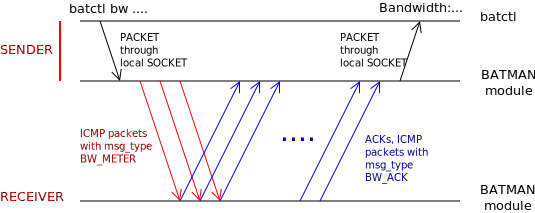

Bandwidth meter technical
=========================

The Protocol
------------

The protocol used by the bandwidth meter is TCP NewReno. More technical
details can be found in the following documents:

-  `RFC 5681 <https://tools.ietf.org/html/rfc5681>`__ (TCP)
-  `RFC 6582 <https://tools.ietf.org/html/rfc6582>`__ (NewReno
   extension)
-  `RFC 6298 <https://tools.ietf.org/html/rfc6298>`__ (Retransmission
   Timeout computation)

| Implementation of the BW meter took the TCP in-kernel module as
  example and some snippets of code are mostly indentical (e.g.
  SRTT/RTTVAR/RTO computation).
| In the code it is also possible to find several references to RFC
  sections which explain what the code is doing.

A define of note is the *Receiver/Advertised Window size*, which has
been fixed to **2^29** bytes. Common TCP implementations instead limit
this size to 2^16 bytes and can reach such high value only if using the
Window Scaling option. In the latter case the window size must be less
than 2^30 and this is why of the chosen value for this implementation.

This value is important because it represents the limit for the
*Transmit Window size* and so for the maximum amount of in-flight data.

Interaction between batctl and batman-adv
-----------------------------------------

The BW meter is started using batctl, in particular is started by the
batman-adv module when receiving a particular message on the ICMP
socket. Such socket is used for communications between batctl and
batman-adv which so far were limited to ICMP Echo Requests/Replies.

| To inctroduce the BW meter, a new particular ICMP packet has been
  introduced: the **ICMP USER packet**.
| Such packet is used to send **commands** from batctl to batman-adv.

For the BW Meter there are two available commands:

#. **bw\_start**: initiate a new a BW measurement towards a selected
   node
#. **bw\_stop**: halt the selected BW measurement

| The following picture depict the communication between batctl and
  batman-adv.
| |image0|

The **bw\_stop** command is used only when the user wants the test to be
stopped before the predefined time elapses.

| Once the test is finished, batman-adv will send back a particular
  packet, namely the **ICMP BW RESULT**, containing the *time spent for
  the test* and the *amount of bytes correctly acked by the receiver*.
| This information is then used by batctl to properly show the result to
  the user. The results are sent back in both the cases (test stopped by
  the user or test naturally ended because time is up).

The major difference between this ICMP operation and the old ones like
PING or TRACEROUTE is that the packet sent by batctl is not directly
forwarded to the network, but instead it is processed and consumed
directly on the local node.

Performance
-----------

Theoretically we expected the performance of the bw meter to overcome
iperf (when launched on the nodes themselves), but the experiments did
not gave us the results we thought about. In particular we saw mostly
the same throughput with both the bw meter and iperf.

In the [[Bandwitdh\_meter\_tests\|test page]] it is possible to see the
obtained values more in detail.

