Bridge loop avoidance II
========================

Further pages on this topic:

* [[Bridge-loop-avoidance-Testcases\|Bridge loop avoidance test case
  descriptions]]
* [[Bridge-loop-avoidance-Protocol\|Bridge loop avoidance protocol
  description]]
* [[Bridge-loop-avoidance\|Bridge loop avoidance user howto]]

Situation
---------

|image0|

This is the example we will use to discuss the concept: multiple mesh
nodes (called backbone gateways throughout the text) are connected to a
big, single LAN (the backbone) as well as mesh nodes which are not
connected to the backbone. backbone connections are drawn with solid
lines, mesh connections with dotted lines. You can see an internet
gateway connected through the LAN (this could be any other network
device as well) at the top and a client (e.g. your laptop)
connected/bridged through a mesh node in the bottom.

Definitions:
------------

* backbone gateway: A mesh node which is connected to both - a mesh
  network and a backbone (e.g. LAN).
* client: A non-mesh network participant which is sending data via
  the mesh. The client is always identified by the source MAC address of
  the payload Ethernet header.
* Originator: An originator is a mesh participant in batman. If we
  talk about the originator address in this document, we mean the
  hardware address of the primary interface.

Goals:
------

* The bridge loop avoidance should be able to scale to hundreds of
  gateways connected to the same backbone.
* Communication between the mesh nodes and the backbone should be via
  the best backbone gateway.
* Minimize broadcast traffic in the backbone.
* Roaming should still be possible.

Key Concepts:
-------------

Claiming clients:
~~~~~~~~~~~~~~~~~

Only one backbone gateway (out of possibly many gateways) should forward
traffic from a non-mesh client (coming via the mesh) to the backbone.
Every backbone gateway announces the mac addresses of the non-mesh
clients it feels responsible for in the form of "claim frames" on the
soft-interface bat0. Each backbone gateway will save a claim list of
other backbone gateways. By doing this, it can:

* see which clients are already tracked (claimed)
* see which other backbone gateways exist in the backbone

Note that backbone gateways may overwrite a claim of another backbone
gateway by simply claiming the same client. In this case, the newest
claim wins, and local databases are updated accordingly.

Backbone gateways can also "unclaim" their own clients. After doing
this, the client is not claimed anymore for this backbone.

Details and Cases:
------------------

The concept will be explained by discussing the different cases: unicast
and broadcast frames, both for the backbone\ [STRIKEOUT:mesh and
mesh]>backbone case. Loop cases are considered too:
backbone\ [STRIKEOUT:mesh]>backbone and mesh\ [STRIKEOUT:backbone]>mesh.
Furthermore, roaming (when a client changes from the backbone to another
mesh node and back) is discussed.

Broadcast, mesh->backbone:
~~~~~~~~~~~~~~~~~~~~~~~~~~

|image1|
If the originator of the broadcast is not known (not in the originator
table), don't forward it into the backbone.

If the originator of the broadcast is another backbone gateway from the
same backbone, don't forward.

If a backbone gateway has already claimed the client, only the
responsible backbone gateway will deliver the frame to the backbone/LAN.
Other backbone gateways will discard the packet.

If no backbone gateway has claimed the client, the first gateway
receiving the broadcast will claim it in the backbone by sending a claim
frame, and send the actual broadcast frame.

Unicast, mesh->backbone:
~~~~~~~~~~~~~~~~~~~~~~~~

|image2|

If the client is not claimed by the backbone gateway receiving the
unicast, a claim packet is sent out first. This backbone gateway is now
the (new) responsible backbone gateway for this client.

Then, the unicast packet is delivered to the soft interface.

Broadcast, backbone->mesh:
~~~~~~~~~~~~~~~~~~~~~~~~~~

|image3|

If a claim for the mesh-client exists:

* all not responsible backbone gateways should discard the frame -
  this might be a loop.
* if the responsible backbone gateway (which claimed this client)
  also receives the packet, "unclaim" this client by sending an
  according un-claim packet, and forward the packet into the mesh. This
  should only happen in the roaming case, but not in normal situations.

If the client is not claimed, all backbone gateways will send the
broadcast into the mesh. The mesh nodes will avoid duplicates by using
the duplicate lists (see section below)

Unicast, backbone->mesh:
~~~~~~~~~~~~~~~~~~~~~~~~

|image4|

Nothing fancy should happen here, as a switch should do the right thing.
If the sender (source of the Ethernet frame) is not claimed, the frame
is simply sent into the mesh.

However, when using hubs (or broken switches), also unicast packets
might loop. Therefore, if the sender is claimed by any backbone gateway,
don't forward.

mesh\ [STRIKEOUT:backbone]>mesh loop:
~~~~~~~~~~~~~~~~~~~~~~~~~~~~~~~~~~~~~

|image5|

A broadcast frame is only sent to backbone by the (yet to be)
responsible backbone gateway. Back from the backbone to the mesh, all
not responsible backbone gateways will not forward the frame. The
responsible backbone gateway should not receive it on normal switched
networks.

To avoid loops for hubs, unicast packets are not forwarded from backbone
to mesh if the client is claimed.

backbone\ [STRIKEOUT:mesh]>backbone loop:
~~~~~~~~~~~~~~~~~~~~~~~~~~~~~~~~~~~~~~~~~

|image6|

Although a broadcast frame is sent into the mesh, it won't loop back
into the backbone as a backbone gateway will not forward it if was sent
from another backbone gateway (from the same backbone).

backbone->mesh Roaming:
~~~~~~~~~~~~~~~~~~~~~~~

|image7|

This is the easy case: Sooner or later, a claim will be added for the
roamed client.

mesh->backbone Roaming:
~~~~~~~~~~~~~~~~~~~~~~~

|image8|

We assume that the client was already claimed by a backbone gateway
before, otherwise there is nothing to consider.

When a broadcast frame is sent, the responsible backbone gateway can
detect the roam and will unclaim the client. This first broadcast will
only be broadcasted by the (previously) responsible backbone gateway
into the mesh, later broadcasts will be sent by all backbone gateways
again.

Gateway selection:
~~~~~~~~~~~~~~~~~~

|image9|

All gateways announce the clients within their backbone and ignore
roaming messages from other gateways on the same backbone.

Other non-gateway mesh nodes may select their best gateway to the
backbone based on the TQ value.

Broadcasting by all backbone gateways
~~~~~~~~~~~~~~~~~~~~~~~~~~~~~~~~~~~~~

All backbone gateways send the broadcasts from backbone clients into the
mesh. We have to make sure that the duplicates are recognized and
ignored to deliver the broadcast packets only once within the mesh.

To do this, we use a `mesh duplicate list <>`__ This list is kept for
every backbone gateway mesh node which is connected to a backbone with
multiple backbone gateways. It checks broadcast packets which are sent
from the backbone into the mesh through multiple backbone gateways (and
thus multiple times).

If the client is not claimed by any backbone gateway, every backbone
gateway shall forward the packet into the mesh. This will lead to
duplicates of the broadcast with different meta information (different
originators, different sequence numbers). To avoid duplicates within the
mesh, every mesh node will use the `mesh duplicate list <>`__

* after the (old) seqno window check: match the frame to the "mesh
  duplicate list" of other backbone gateways to see if another backbone
  gateway from the same backbone has sent a broadcast with the same
  payload checksum.
* if true, drop the packet. Otherwise, add the checksum to the
  entries and re-forward it.

Discussion:
-----------

Features:
~~~~~~~~~

* no single "super" gateway => should scale better
* the only additional BATMAN backbone packets are claim packets,
  which are only sent for new claims and regular announcements
* no BATMAN packets on the backbone
* broadcasts are sent from all the gateways into the mesh
* nodes can select gateways, and change among them (gateways will
  automatically re-claiming)
* should not loop ;)

Limitations:
~~~~~~~~~~~~

\* loops in higher-level structures may not be avoided. For example, if
there are two meshes and two backbones are interconnected as in the
illustration below, a loop is formed which can't be detected, since the
claim frames of one mesh won't travel along the mesh network of the
other.

|image10|

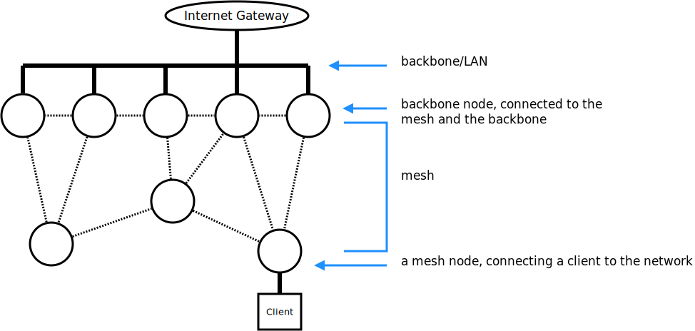
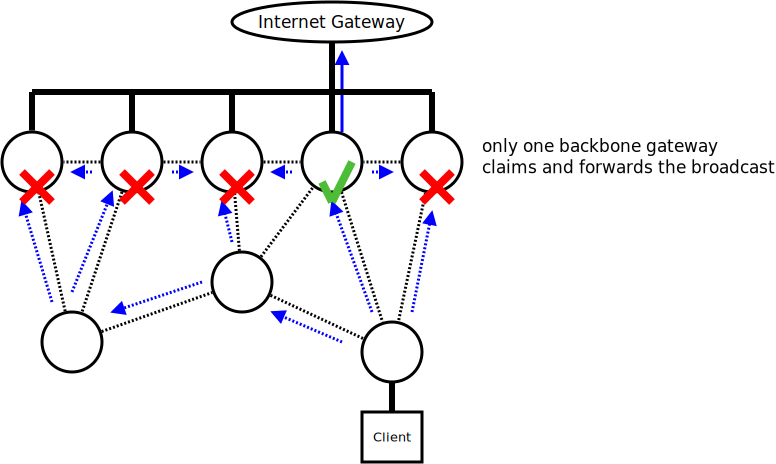
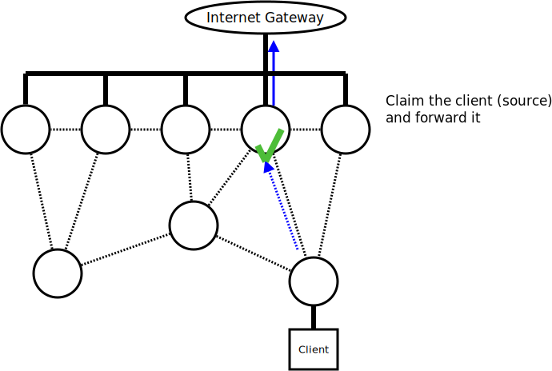
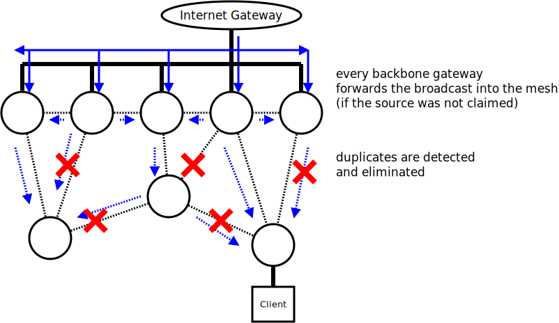
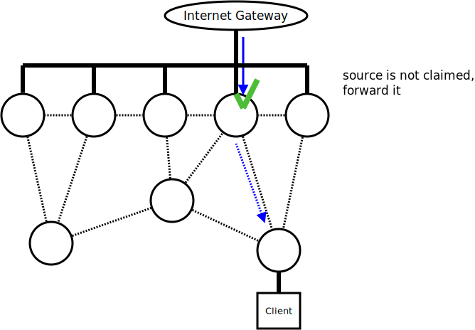
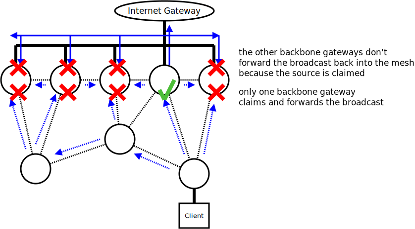
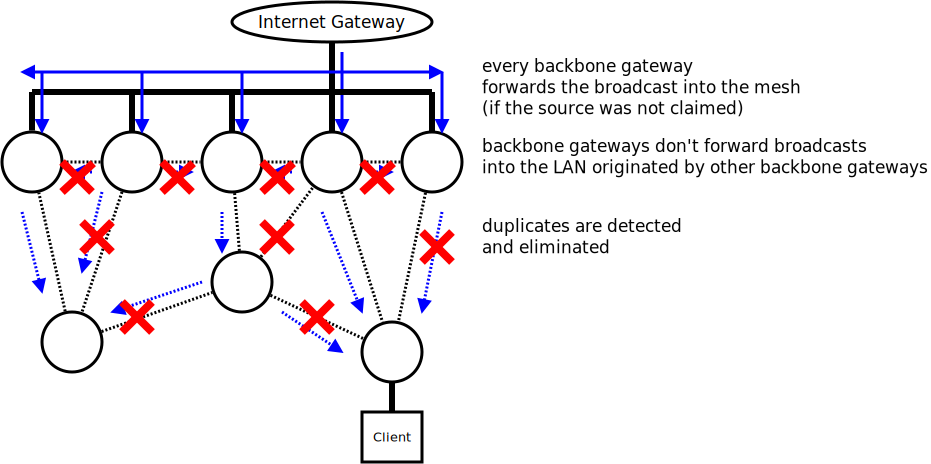
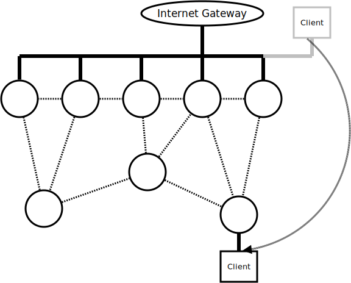
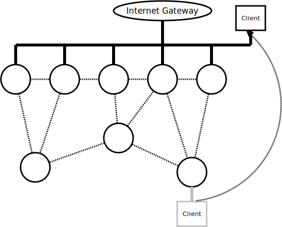
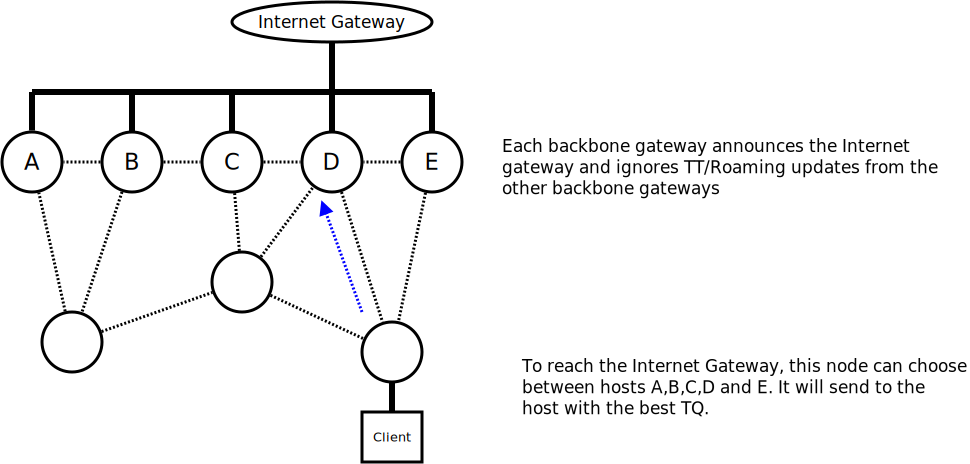
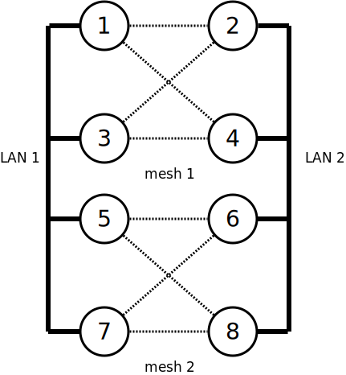

