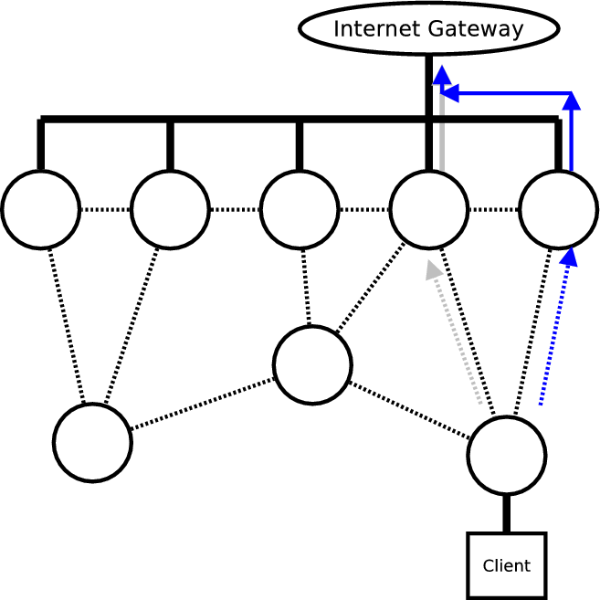
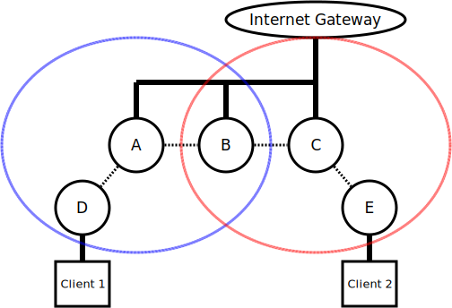
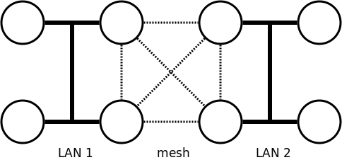
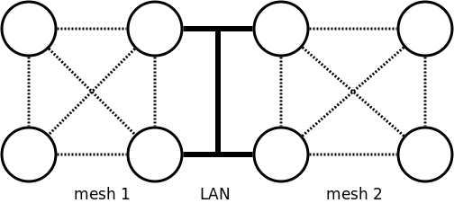

.. SPDX-License-Identifier: GPL-2.0

Bridge-loop-avoidance-Testcases
===============================

This page describes test cases for the bridge loop avoidance. For more
technical information and reference, please
have a look at :doc:`Bridge-loop-avoidance-II <Bridge-loop-avoidance-II>`.

Test Cases
----------

Roaming from backbone to mesh
~~~~~~~~~~~~~~~~~~~~~~~~~~~~~

|image0|

The client is connected to the backbone first and then roams to a mesh
node which is not connected to the backbone.

Ping the internet gateway or a mesh node continuously and see if the
connection is recovered.

Roaming from mesh to backbone
~~~~~~~~~~~~~~~~~~~~~~~~~~~~~

|image1|

The client is connected to a mesh node first and then roams the
backbone.

Ping the internet gateway or a mesh node continuously and see if the
connection is recovered.

A client switches its gateway (due to loss of link/better TQ)
~~~~~~~~~~~~~~~~~~~~~~~~~~~~~~~~~~~~~~~~~~~~~~~~~~~~~~~~~~~~~

|image2|

Continuously ping the internet gateway from the client, and change the
quality of the currently selected node (e.g. adding packet loss).

Limited Horizon tests
~~~~~~~~~~~~~~~~~~~~~

|image3|

In this test, the first node A can't reach the last one C due to a
limited horizon (the OGMs of A don't reach the OGMs of C and vice
versa).

* Test 1: Client 1 and Client 2 should be able to ping the internet
  gateway. There are are no bridge loops.
* Test 2: Client 1 and Client 2 should be able to ping each other.

*note1*: Test 2 will only work if BATMAN runs over the backbone, e.g.
by calling "batctl if add br0".
*note2*: Limited horizon may be easily simulated by increasing the
hop\_penalty, e.g. "echo 230 >
/sys/devices/virtual/net/bat0/mesh/hop\_penalty" will have a 3 hop
range in a network without packet loss.

VLAN support
~~~~~~~~~~~~

The clients are connected to local VLANs which are used on top of
BATMAN. All claim frames should then have a VLAN tag.

Two LANs connected by one mesh
~~~~~~~~~~~~~~~~~~~~~~~~~~~~~~

|image4|

Two LANs are connected by one mesh. The backbone gateways of each LAN
should find each other and claim only packets from each LAN.
Every node should be able to reach every other node.

Two meshes connected by one LAN
~~~~~~~~~~~~~~~~~~~~~~~~~~~~~~~

|image5|

Two meshes are connected to one LAN. The backbone gateways of each
mesh should find themselves and share their claims, but should
disregard claims for backbone gateways they are not part of (only
possible with the backbone gateway grouping optimization)
Every node should be able to reach every other node.

.. |image0| image:: Test_roaming_LAN_mesh.svg
.. |image1| image:: Test_roaming_mesh_LAN.svg

