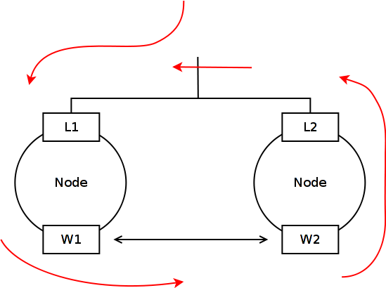
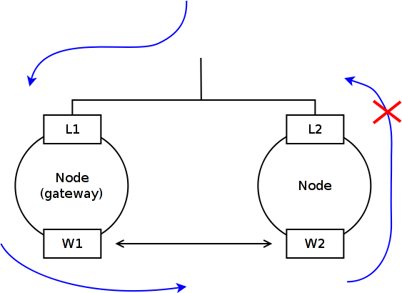

Batman-adv bridge loop avoidance
================================

This document explains how batman-adv is able to detect & avoid loops
that are created by bridging multiple batX interfaces on different hosts
into the same ethernet segment (e.g. LAN) that are outside of batman's
realm. If you don't intend to connect multiple batman-adv hosts to the
same ethernet segment or don't use bridging you can safely skip this
page.

*Note*: It is the normal traffic which loops around, not the protocol
traffic generated by batman-adv. Unsurprisingly, bridge loops are not
unique to batman-adv mesh networks but have been around for quite a
while. While this document discusses bridge loops in conjunction with
batman-adv in great detail it might be helpful to have some background
knowledge regarding bridge loops.

Where does the loop come from ?
-------------------------------

To better understand what creates the loop it is helpful to focus on a
sample topology. The simplest case involves only 2 nodes that are
connected via wifi and (Ethernet) LAN at the same time.

|image0|

Here, the wifi interfaces (W1 & W2) have a decent link quality and the
LAN interfaces (L1 & L2) are bridged with the batX interface. Let's
assume a simple ARP broadcast from the LAN arrives at node1 which then
floods the mesh with that new packet. Node2 receives the packet via the
mesh and forwards it to the LAN where node1 receives it ...

|image1|

If there wasn't the LAN connection this would not happen because
batman-adv provides a flood/loop protection inside the batman header for
every payload packet traveling through the mesh but as soon as the
packet gets bridged this information is stripped from the packet. Every
batman-adv node connected to the LAN will think: Hey, it is a new
packet!

How to avoid the loop ?
-----------------------

A common solution to avoid bridge loops is to deploy protocols like STP
or one of its derivatives. STP would detect the loop and close ports to
avoid it. Running STP over the mesh is not really what we want as STP
has no clue about the link qualities and who wants to run a spanning
tree over lossy links ?

Batman-adv needs its own mechanism to detect other batman nodes
connected to the same LAN (these nodes will be called ''backbone
nodes''), and avoid loops. Backbone nodes send special packets to find
out about other nodes in the LAN - the backbone nodes can then maintain
a list of other backbone nodes within the LAN. If they get a (broadcast)
packet via the mesh originated by another backbone node, they drop it -
no need to re-inject a packet from the LAN.

|image2|

Furthermore, the backbone node ''claim'' clients from other nodes of the
mesh network. The idea is that only the one backbone gateway who claimed
the client should forward packets from the mesh into the LAN. Also other
backbone gateways receiving packets via the LAN from the claimed client
will not send it back into the mesh - to avoid loops - as they know
another gateway got the packet from the mesh.

More detailed information about the concept can be found on the wiki
page :doc:`Bridge-loop-avoidance-II <Bridge-loop-avoidance-II>`.

How to activate the bridge loop avoidance ?
-------------------------------------------

As the bridge loop avoidance feature sends some own frames (the claim
frames, see :doc:`Bridge-loop-avoidance-Protocol <Bridge-loop-avoidance-Protocol>`), it must be explicitly
turned on. The feature is also a compile-time option, and might not be
compiled in.

Simple steps to see it in action:

\* add your wifi interface

::

    batctl if add wlan0

\* create a bridge for bat0 and your lan

::

    ip link add name br-lan type bridge
    ip link set dev eth0 master br-lan
    ip link set dev bat0 master br-lan
    ip link set up dev br-lan

\* activate bridge loop avoidance

::

    batctl bl 1

Batman-adv can also deal with vlans on top of batX. The list of claimed
clients is available as well (batctl cl).

.. |image0| image:: lanloop1.png

