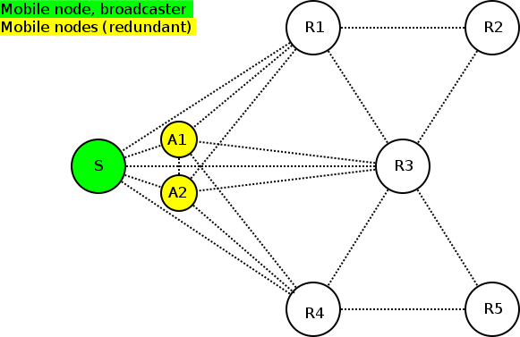
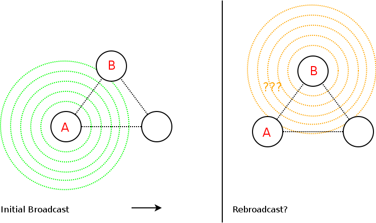
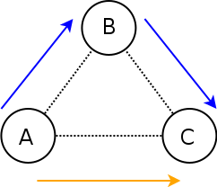
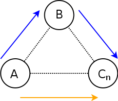

Broadcast Avoidances - Neighborhood Hash Assessment
===================================================

First follow evaluations of the two scenarios described before to check
if or when the neighborhood hashing approach successfully reduces
broadcast overhead in these targeted cases (section 1).

Afterwards, an evaluation follows to show that we do not avoid
rebroadcasts too often. That is that we do not hinder BATMAN from
finding or using best paths (section 2 + 3).

1) Example Scenario Evaluation
------------------------------

Scenario A)
~~~~~~~~~~~

|image0|

*Many mesh nodes wired to one, big switch*

Assuming all nodes have a 1GBit/s connection to the switch. Then a node
has for any neighbor:

::

    neigh->throughput
    = neigh->min_throughput
    = neigh->max_throughput
    = iface->min_throughput_other
    = iface->max_throughput_other
    = 1000MBit/s

That means the ingress TX, egress TX as well as ingress RX and egress RX
check evaluate to:

::

    fwd-penalty(1000) < 1000

Which is true as long as a hop penalty is configured (default).

This means, that a rebroadcast avoidance successfully takes place for
scenario A).

Scenario B)
~~~~~~~~~~~

|image1|

*Two mobile nodes clustering around a broadcast transmitter*

Assuming all nodes have a 100MBit/s connection to each other, except the
cluster of S, A1 and A2.

When S broadcasts, will A1/A2 refrain from rebroadcasting?

Neighborhood hash
^^^^^^^^^^^^^^^^^

First of all, even though not all neighbors see the same neighborhood -
in fact, all nodes S and R1 to R5 see different neighbors, some
neighbors still have the same neighborhood hash: S, A1, A2. This allows
for instance A1/A2 to check whether to rebroadcast packets from S or
not.

Case: S, A1, A2 have a 100MBit/s connection
^^^^^^^^^^^^^^^^^^^^^^^^^^^^^^^^^^^^^^^^^^^

Yes, see evaluation for scenario A).

Case: S, A1, A2 have a 150MBit/s connection
^^^^^^^^^^^^^^^^^^^^^^^^^^^^^^^^^^^^^^^^^^^

The evaluation will look as follows:

+-----------+----------------------+----------------------+
|           | TX                   | RX                   |
+-----------+----------------------+----------------------+
| ingress   | penalty(150) < 100   | penalty(150) < 100   |
+-----------+----------------------+----------------------+
| egress    | penalty(150) < 100   | penalty(150) < 100   |
+-----------+----------------------+----------------------+

Which is true for all cases with the half-duplex penalty: 75 < 100.

So yes, a rebroadcast avoidance would successfully take place here.

Case: S, A1, A2 have a 300 MBit/s connection
^^^^^^^^^^^^^^^^^^^^^^^^^^^^^^^^^^^^^^^^^^^^

The evaluation will look as follows:

+-----------+----------------------+----------------------+
|           | TX                   | RX                   |
+-----------+----------------------+----------------------+
| ingress   | penalty(300) < 100   | penalty(300) < 100   |
+-----------+----------------------+----------------------+
| egress    | penalty(300) < 100   | penalty(300) < 100   |
+-----------+----------------------+----------------------+

So no, A1/A2 will not detect a rebroadcast avoidance possibility as the
statement "150 < 100" is false.

Optimality Assessment
---------------------

Introduction / Concept
~~~~~~~~~~~~~~~~~~~~~~

Let's start with a simple, three node example:

|image2|

*Should B rebroadcast?*

Here, A is our initial broadcaster and B the node having to decide
whether or not to rebroadcast on the same, incoming interface.

To decide this, we will compare the direct path between A and C vs. the
path from A to C via B:

|image3|

*Is (AB ⊕ BC) a shortcut or a detour?*

With a simple throughput metric the path from A to C via B is a detour
exactly when either the connection from A to B or from B to C (or both)
is a bottleneck. That is if either AB or BC offers a smaller throughput
than AC.

That means B can perform an *ingress check* (AB < AC?) and an *egress
check* (BC < AC?) individually.

To make sure, that a rebroadcast is unnecessary, B would need to perform
such an ingress and egress check for any neighbor Cn (any neighbor other
than A):

|image4|

If B notices that for all these neighbors Cn it is a bottleneck and no
improvement then B can safely avoid a rebroadcast.

Simplification
~~~~~~~~~~~~~~

Instead of performing all the checks described above, the modified rules
are used in the implementation with the following goals:

| \* Less information to exchange
| \* Less computational overhead
| \* Supposed to work even with large neighborhoods

Performing the checks stated above has the following disadvantages: For
one thing, the computational overhead could be significant for
neighborhoods of a certain size. For another, B does not even know the
throughput from A to B or A to C (or C to A or C to B - we will see
later why we might need those). B only knows its own TX throughput
towards other neighbors and not the other way around.

Instead of every neighbor node frequently broadcasting a full list of TX
values and every neighbor performing all these checks for any neighbor
with any neighbor combination, the implemented neighbor hash approach
applies a huge simplification needing considerably less computations and
information exchange:

Instead of checking all (AB < ACn?) and (BCn < ACn?) combinations, it
tries to perform "one check that rules them all" (with the downside of
maybe not catching all potential rebroadcast avoidance cases).

Proofs
~~~~~~

We need to ensure that avoiding a rebroadcast does not break our
optimality promises. That is that we do not break that a route
eventually converges to its optimum path.

While the assessment above showed when optimality is not broken, the
following mathematic assessment shows that our slightly modified rules
still hold optimality.

Proof: Ingress TX (bcast)
^^^^^^^^^^^^^^^^^^^^^^^^^

We want to proof:

\* p(Amax) < Amin => p(AB) < ACn for any Cn.

One has:

| \* a ≤ b => p(a) ≤ p(b)
| \* AB ≤ Amax
| \* Amin ≤ ACn

::

    AB ≤ Amax
    => p(AB) ≤ p(Amax)

    p(Amax) < Amin
    => (p(AB) ≤ p(Amax)) < Amin
    => (p(AB) ≤ p(Amax)) < (Amin ≤ ACn)
    => p(AB) ≤ p(Amax) < Amin ≤ ACn
    => p(AB) < ACn

Proof: Egress TX (bcast)
^^^^^^^^^^^^^^^^^^^^^^^^

We want to proof:

\* p(Bmax) < Amin => p(BCn) < ACn

One has:

| \* a ≤ b => p(a) ≤ p(b)
| \* BCn ≤ Bmax
| \* Amin ≤ ACn

::

    BCn ≤ Bmax
    => p(BCn) ≤ p(Bmax)

    p(Bmax) < Amin
    => (p(BCn) ≤ p(Bmax)) < Amin
    => (p(BCn) ≤ p(Bmax)) < (Amin ≤ ACn)
    => p(BCn) ≤ p(Bmax) < Amin ≤ ACn
    => p(BCn) < ACn

Proof: Ingress RX (OGM2)
^^^^^^^^^^^^^^^^^^^^^^^^

We want to proof:

\* p(AB) < MIN(Amin, Cn-min) => p(AB) < CnA for any Cn.

One has:

| \* MIN(a, b) ≤ b
| \* Cn-min ≤ CnA

::

    p(AB) < MIN(Amin, Cn-min)
    => p(AB) < (MIN(Amin, Cn-min) ≤ Cn-min)
    => p(AB) < (MIN(Amin, Cn-min) ≤ (Cn-min ≤ CnA))
    => p(AB) < MIN(Amin, Cn-min) ≤ Cn-min ≤ CnA
    => p(AB) < CnA

Proof: Egress RX (OGM2)
^^^^^^^^^^^^^^^^^^^^^^^

We want to proof:

\* p(MAX(Amax, Cn-max)) < MIN(Amin, Cn-min) => p(AB) < CnA for any Cn.

One has:

| \* a ≤ b => p(a) ≤ p(b)
| \* MIN(a, b) ≤ b
| \* a ≤ MAX(a, b)
| \* AB ≤ Amax
| \* Cn-min ≤ CnA

::

    Amax ≤ MAX(Amax, Cn-max)
    => (AB ≤ Amax) ≤ MAX(Amax, Cn-max)
    => AB ≤ MAX(Amax, Cn-max)
    => p(AB) ≤ p(MAX(Amax, Cn-max))

    p(MAX(Amax, Cn-max)) < MIN(Amin, Cn-min)
    => (p(AB) ≤ p(MAX(Amax, Cn-max)) < MIN(Amin, Cn-min)
    => (p(AB) ≤ p(MAX(Amax, Cn-max)) < (MIN(Amin, Cn-min) ≤ Cn-min)
    => (p(AB) ≤ p(MAX(Amax, Cn-max)) < (MIN(Amin, Cn-min) ≤ (Cn-min ≤ CnA))
    => p(AB) ≤ p(MAX(Amax, Cn-max) < MIN(Amin, Cn-min) ≤ Cn-min ≤ CnA
    => p(AB) < CnA

Hash Collision Probability
~~~~~~~~~~~~~~~~~~~~~~~~~~

sha512 provides 256 bits of security against collision attacks. With
4.8e29 inputs, that is with 4.8e29 different neighborhoods, we would
have a collision probability of 1e-18.

This number of inputs would be reached if over 500 years a new
neighborhood were formed 3e10 times per nanosecond.

See also:

\* https://en.wikipedia.org/wiki/Birthday\_attack

.. |image0| image:: wired-aps.png

