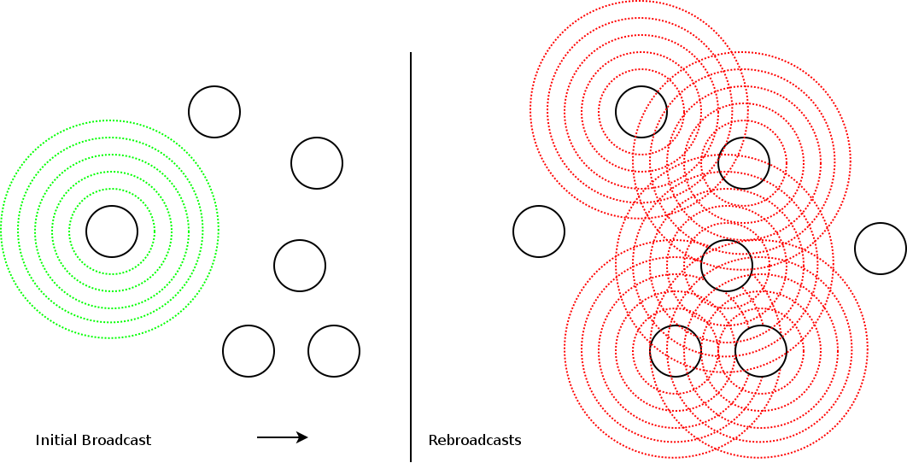
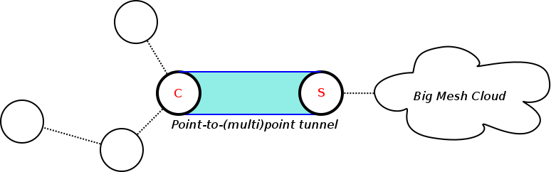
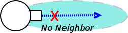
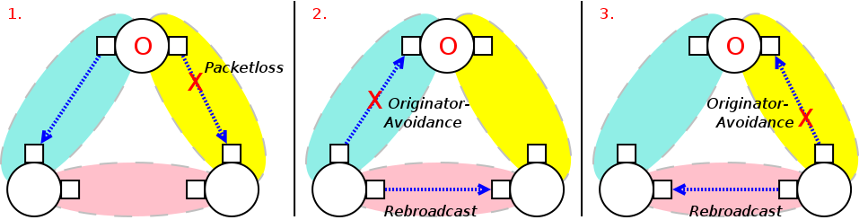
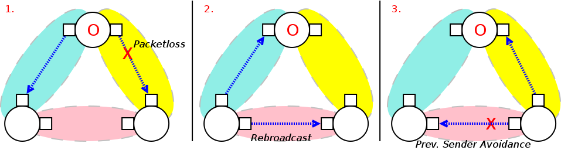

Broadcast Avoidances
====================

*Status:* Patches
`available <https://git.open-mesh.org/batman-adv.git/shortlog/refs/heads/linus/neighhash>`__,
not upstream yet

While the concept of rebroadcasting OGMs and broadcast packets is a
simple, resilient way to spread information, there are certain scenarios
where this approach can be suboptimal, leading to potential congestion.

|image0|

The main disadvantage of this approach is, that the number of such
messages / overhead increases significantly with every extra,
neighboring node on an interface. (O (m\*n), n = amount of direct
neighbors on an interface, m = amount of "originators" [approx.: m =
#nodestotal for OGMs, m = #clients for broadcast packets])

There are certain cases where rebroadcasts are unncessary. This page
describes mechanisms to detect some common ones to avoid rebroadcasts
and by that reducing the OGM and broadcast packet overhead. (O (m\*n) =>
O (m) )

Goal
----

-  Reducing OGM2 and broadcast packet overhead

Scenarios
---------

Here are a few scenarios that the protocol additions described later are
supposed to improve:

A) Large, Transitive Link Domains
~~~~~~~~~~~~~~~~~~~~~~~~~~~~~~~~~

|image1|

*Many mesh nodes wired to one, big switch*

Within buildings it is often easy to deploy at least some cables, or
several spots have cabling and patch panels already available. For
larger indoor setups it is often advantageous to use at least some cable
connections to increase throughput, reliability and available wifi
airtime, while keeping wireless mesh routing for difficult spots, mobile
nodes or flexibility purposes.

Thanks to the generic design of batman-adv, that is you can configure it
on any ethernet interface you like, you can do just that: Run batman-adv
on a mix of both wired and wireless interfaces. However, the current
rebroadcast approach bears some limitations:

A mesh network of 8 nodes all connected to each other via one 8 port
switch would create 16 times the OGM overhead compared to just two
nodes. For 24 nodes, this factor increases from 16 to 144 - thanks to
rebroadcasting.

However, in this scenario, actually no rebroadcast would be necessary:
On a switch a broadcast always reliably arrives on all attached devices.
All devices connected "see" each other on their network interface
directly, usually with the same full-duplex link speed even.

B) Gathering of Mobile Nodes
~~~~~~~~~~~~~~~~~~~~~~~~~~~~

| |image2|
| *Two mobile nodes clustering around a broadcast transmitter*

In scenarios involving personal mobile nodes and human interaction, it
can happen that a number of nodes gather temporarily. As described in
scenario A), depending on the number of nodes gathering, this can
significantly increase protocol overhead and by that reduce precious
wifi airtime.

Nodes close to each other involving similar wireless hardware usually do
not provide any better routing options. Therefore it might be
unnecessary or even undesirable to have nodes in close proximity to the
original sender to rebroadcast OGMs and broadcast packets. This is
especially true when taking the half-duplex nature of wireless
interfaces running on the same frequency into account, too.

C) Point-to-point and Point-to-Multi-Point Links
~~~~~~~~~~~~~~~~~~~~~~~~~~~~~~~~~~~~~~~~~~~~~~~~

|image3|

*A peer-to-peer tunnel over an asymmetric DSL link*

Some wireless community mesh networks try to interconnect their wireless
mesh clouds over common DSL connections. For that they provide tunnel
servers relaying the traffic.

Unfortunately, ADSL usually provides limited upstream bandwidth. And for
larger mesh communities, the protocol overhead can be quite significant.

Rebroadcasting the large amount of protocol messages coming from the
tunnel server on the tunnel client side can lead to a congested ADSL
upload.

Simple Broadcast Avoidances
---------------------------

When a node sees just one or no neighbor on a specific interface, then
the following, simple rules can be applied to avoid broadcasts on this
interface:

I.I) No Neighbor
~~~~~~~~~~~~~~~~

|image4|

-  If an interface has no neighbor, then no broadcast is necessary.

We can avoid sending a packet into the void.

I.II) Single Neighbor: Is Originator
~~~~~~~~~~~~~~~~~~~~~~~~~~~~~~~~~~~~

|image5|

*Three nodes with a single neighbor per interface each*

-  If an interface has just one neighbor and it matches the OGM2 or
   broadcast packets originator address, then no broadcast is necessary.

We can avoid echoing a packet back to the node it originally came from.

I.III) Single Neighbor: Is Previous Sender
~~~~~~~~~~~~~~~~~~~~~~~~~~~~~~~~~~~~~~~~~~

|image6|

*A node avoiding to echo back to its forwarder*

-  If an interface has just one neighbor and it matches the originator
   that forwarded this OGM2 or broadcast packet to us, then no broadcast
   is necessary.

We can avoid echoing a packet back to the originator node (not just
neighor) it was forwarded from.

Broadcast Avoidance: Neighborhood Hash
--------------------------------------

The following approach is supposed to mainly improve scenario A) (while
improving scenario B) in some specific cases).

Concept
~~~~~~~

-  Each node summarizes all neighbors it sees on an interface via one
   hash.
-  The hash, together with the minimum TX throughput value of this
   neighborhood is then distributed via an ELP TVLV on the according
   interface.
-  Other nodes compare the received neighborhood hash with their own. If
   it matches and throughput evaluations indicate no potential for
   better paths, then rebroadcasts of OGM2 or broadcast packets from the
   according neighbor on this interface are avoided.

Neighborhood Hash TVLV Format
~~~~~~~~~~~~~~~~~~~~~~~~~~~~~

| \* Packet type: 0x03 (BATADV\_ELP)
| \* TVLV type: 0x01 (BATADV\_TVLV\_NHH)
| \* Length: 68 bytes
| \* Fixed TVLV fields:
| **** minimum throughput: the worst of all TX throughputs to any
  neighbor a node sees on the according interface (4 bytes)
| **** maximum throughput: the best of all TX throughputs to any
  neighbor a node sees on the according interface (4 bytes)
| **** neighorhood hash: a sha512 hash summarizing all neighbors a node
  sees on the according interface; hash created from neighbor addresses
  sorted alphabetically, concatenated, binary (64 bytes)

\* Definition:

::

     0                   1                   2                   3
     0 1 2 3 4 5 6 7 8 9 0 1 2 3 4 5 6 7 8 9 0 1 2 3 4 5 6 7 8 9 0 1 2
     +-+-+-+-+-+-+-+-+-+-+-+-+-+-+-+-+-+-+-+-+-+-+-+-+-+-+-+-+-+-+-+-+
     |   TVLV 0x03   |    Version    |             Length            | 
     +-+-+-+-+-+-+-+-+-+-+-+-+-+-+-+-+-+-+-+-+-+-+-+-+-+-+-+-+-+-+-+-+
     |                       minimum throughput                      |
     +-+-+-+-+-+-+-+-+-+-+-+-+-+-+-+-+-+-+-+-+-+-+-+-+-+-+-+-+-+-+-+-+
     |                       maximum throughput                      |
     +-+-+-+-+-+-+-+-+-+-+-+-+-+-+-+-+-+-+-+-+-+-+-+-+-+-+-+-+-+-+-+-+
     |                       neighborhood hash...                    |
     +-+-+-+-+-+-+-+-+-+-+-+-+-+-+-+-+-+-+-+-+-+-+-+-+-+-+-+-+-+-+-+-+
     |                       ....................                    |
     +-+-+-+-+-+-+-+-+-+-+-+-+-+-+-+-+-+-+-+-+-+-+-+-+-+-+-+-+-+-+-+-+
     |                       ...neighborhood hash                    |
     +-+-+-+-+-+-+-+-+-+-+-+-+-+-+-+-+-+-+-+-+-+-+-+-+-+-+-+-+-+-+-+-+

Throughput Evaluation
~~~~~~~~~~~~~~~~~~~~~

II.I) Broadcast Packets
^^^^^^^^^^^^^^^^^^^^^^^

*Ingress Check:*

::

    if fwd-penalty(neigh->max_throughput) < neigh->min_throughput:
    -> no rebroadcast

*Egress Check:*

::

    if fwd-penalty(iface->max_throughput) < neigh->min_throughput:
    -> no rebroadcast

--------------

If either (or both):

| \* The best TX throughput of the neighbor we received the broadcast
  packet from with our forwarding penalty applied is smaller than the
  worst TX throughput of this neighbor (*ingress check*).
| \* Our best TX throughput with our forwarding penalty applied is
  smaller than the worst TX throughput of the neighbor we received the
  broadcast packet from (*egress check*).

Then a rebroadcast can be avoided.

II.II) OGM2 Packets
^^^^^^^^^^^^^^^^^^^

While for broadcast packets it is desirable to have them travel over the
best TX paths, OGMs propagate inversely. That is they travel along the
best RX path while establishing the best TX paths to the originator in
the process.

*Ingress Check:*

::

    if fwd-penalty(neigh->throughput) < iface->min_throughput_other:
    -> no rebroadcast

*Egress Check:*

::

    if fwd-penalty(iface->max_throughput_other) < iface->min_throughput_other:
    -> no rebroadcast

--------------

If either (or both):

| \* The TX throughput to the neighbor we received the OGM2 packet from
  with our forwarding penalty applied is smaller than the worst TX
  throughput of all our neighbors (*ingress check*).
| \* The best TX throughput of all our neighbors with our forwarding
  penalty applied is smaller than the worst TX throughput of all our
  neighbors (*egress check*).

Then a rebroadcast can be avoided.

Further readings:
^^^^^^^^^^^^^^^^^

\* [[Broadcast-Avoidances-NHH-Assessment\|Broadcast Avoidances -
Neighborhood Hash Assessment]]

Appendix
========

Limitations
-----------

| \* Many avoidance possibilities undetected in wireless scenarios (see
  "Future improvements" below or assessment page)
| \* In wired cases with a mix of 100MBit/s and 1000MBit/s interfaces:
  Only avoids broadcast packet rebroadcasts, not OGM2 rebroadcasts

Future Improvements
-------------------

Broadcast Avoidance: Neighborhood Table
~~~~~~~~~~~~~~~~~~~~~~~~~~~~~~~~~~~~~~~

For smaller neighborhoods an approach with a higher, computational
overhead might be feasible: The neighborhood hash rules are very broad,
incapable of detecting many common wireless topologies where
rebroadcasts could be avoided.

A more detailed knowledge and view of the local neighborhood allows
applying stricter rebroadcast avoidance rules.

A more detailed view could be achieved by every neighbor advertising its
full TX throughput list to other neighbors on the according interface.

Receiving neighbors would then have a full RX and TX table between
neighbors in the direct, one-hop vicinity.

.. |image1| image:: wired-aps.png
.. |image2| image:: mobile-clusters.png

