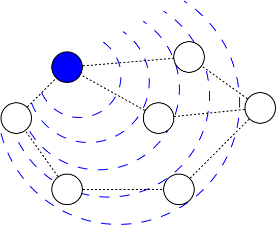
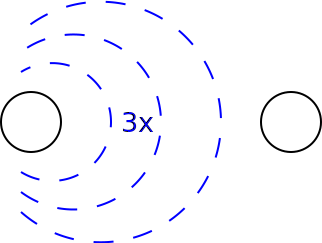
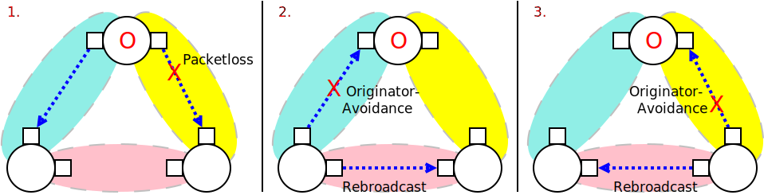
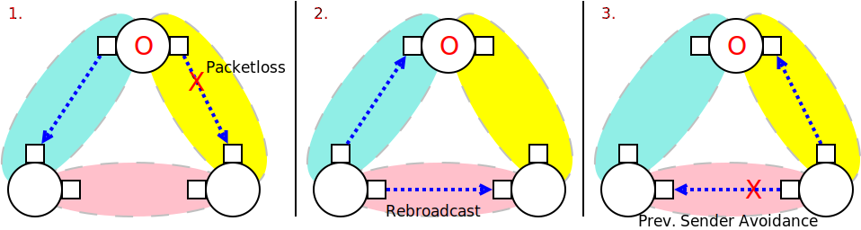

Broadcasts in B.A.T.M.A.N. Advanced
===================================

| *A node broadcasting through the mesh*
| |image0|

Broadcasting is a method in computer networks to distribute a packet to
all available nodes. batman-adv supports broadcast via its *classic
flooding* algorithm.

*Classic Flooding*
------------------

The basic algorithm used by batman-adv is *classic flooding*. Here every
node simply repeats a broadcast frame it received on all its available
interfaces. That way every node receives the broadcast frame eventually.

To avoid frames looping around forever (a broadcast storm) an
originating batman-adv node tags the frame with a sequence number which
increases with every new broadcast frame this node transmits. The
sequence number allows other nodes to detect whether it received a frame
before. Such duplicates will then simply be ignored.

Interface Type: WiFi vs. Others
-------------------------------

| *A broadcast frame transmitted three times by batman-adv*
| |image1|

In 802.11 based wireless networks broadcast transmissions have one
specific downside compared to unicast: While for unicast transmissions a
missing frame is detected and retransmitted
(`ARQ <https://en.wikipedia.org/wiki/Automatic_repeat_request)>`__ a
broadcast transmission is performed only once, with no acknowledgements.

To compensate for that batman-adv (re-)broadcasts a frame on a wireless
interface not just once but three times when classic flooding is used.

Furthermore, for the second and third broadcast a delay of 5ms is
applied for each to increase the probability that one of the broadcasts
arrives.

Last but not least 802.11 broadcasts are usually performed at the lowest
Wifi bitrate. If a high broadcast throughput is needed, it is therefore
usually recommended to increase the Wifi rate for multicast
transmissions in the wifi driver.

Broadcast Avoidances
--------------------

To reduce the number of (re-)broadcasts batman-adv tries to detect
whether in a particular scenario on a specific interface a broadcast can
be avoided.

The following three rules are currently checked and applied:

I.I) No Neighbor
~~~~~~~~~~~~~~~~

|image2|

-  If an interface has no neighbor, then no broadcast is necessary.

We can avoid sending a packet into the void.

I.II) Single Neighbor: Is Originator
~~~~~~~~~~~~~~~~~~~~~~~~~~~~~~~~~~~~

|image3|

*Three nodes with a single neighbor per interface each*

-  If an interface has just one neighbor and it matches the broadcast
   packet’s originator address, then no broadcast is necessary.

We can avoid echoing a packet back to the node it originally came from.

I.III) Single Neighbor: Is Previous Sender
~~~~~~~~~~~~~~~~~~~~~~~~~~~~~~~~~~~~~~~~~~

|image4|

*A node avoiding to echo back to its forwarder*

-  If an interface has just one neighbor and it matches the originator
   that forwarded this broadcast packet to us, then no broadcast is
   necessary.

We can avoid echoing a packet back to the originator node (not just
neighor) it was forwarded from.

Non-flooding Optimizations
--------------------------

Broadcast flooding comes with a cost: It bothers every node in the mesh
and especially in larger mesh networks this can add up quickly.
Therefore if the number of nodes interested in a specific frame is
actually just a small subset of all nodes then it is usually desirable
to use a more specialized approach.

Currently, batman-adv applies such specialized treatment for DHCP, ARP
and general IP multicast:

Gateway Feature: DHCP via Unicast
~~~~~~~~~~~~~~~~~~~~~~~~~~~~~~~~~

-  See: :doc:`Gateway support <Gateways>`

Distributed ARP Table: DHT and Caching
~~~~~~~~~~~~~~~~~~~~~~~~~~~~~~~~~~~~~~

-  See: :doc:`Distributed ARP Table <DistributedArpTable>`

IP Multicast Optimizations
~~~~~~~~~~~~~~~~~~~~~~~~~~

-  See: :doc:`Multicast Optimizations <Multicast-optimizations>`

