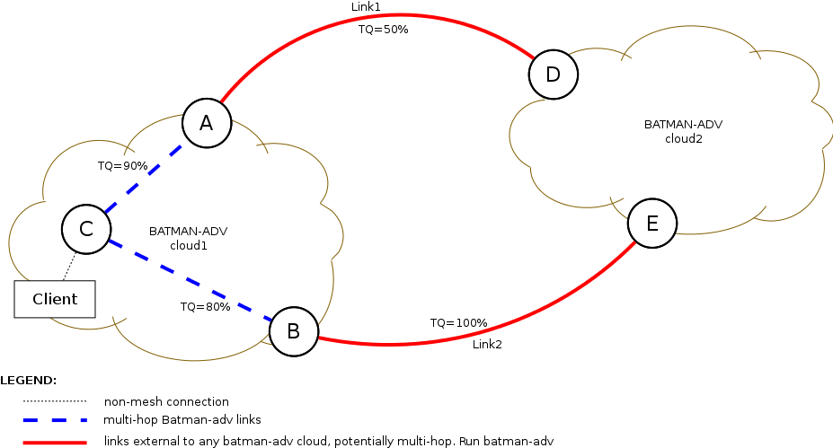

How to Interconnect different Batman-adv clouds (DRAFT)
=======================================================

Overview
--------

| A scenario which is becoming more and more common in mesh deployments
  is the existance of two or more batman-adv clouds interconnected via
  Layer3 routing.
| This is a normal consequence of the hierarchy introduced into a
  network in order to make it scale.

A batman-adv cloud is a set of nodes which are all using batman-adv and
so they are all sharing the same broadcast domain (meaning they are all
in the same subnet). Many of these clouds can then be interconnected by
means of Layer3 gateways which do usualy run a different routing
protocol aimed to find the best Layer3 path between the source and the
destination cloud.

A very common situation can be the one depicted in the following
picture, where one cloud may have more than one Layer3 exit point with
different costs towards the final destination.

|image0|

Node A and B are the two possible exit points from cloud1 towards
cloud2, while D and E are the two cloud2 entry points. In the normal
[[batman-adv:Gateways\|Gateway]] scenario batman-adv would choose the
gateway which is reachable through the path with the Best TQ. In the
picture node C would choose A because the TQ towards it is 90% while
towards B it is 80%. This seems to be the best choice because this way
batman-adv is minimizing the probability of packet loss till the
gateway, but it is not considering the rest of the path behind it
towards the real destination: cloud2.

Looking at the scenario with more attention it is possible to understand
that choosing B as exit point is better because the resulting overall
qualities are the following:

-  C -> A -> D : TQ = 90% \* 50% = 45%
-  C -> B -> E : TQ = 80% \* 100% = 80%

| Given these results it is possible to understand that the best local
  choice (node A) would result in a worse overall path towards cloud2.
| This conclusion lead to the problem that the local available
  information in a batman-adv cloud is not enough to make a proper
  decision at the source (node C).

The idea
--------

Injecting into the batman-adv cloud information about the external links
can result in the possibility for any batman-adv node to compute the
overall metric towards the selected destination (e.g. cloud2) and so to
choose the "real best" exit point .

Imagine that in the scenario shown in the previous picture node C knows
about the TQ between A and D and between B and E: it would have chosen
node B because it minimize the **overall** packet loss towards its
destination (cloud2).

To implement this concept batman-adv needs:

#. a border gateway selection
#. a metric injection and combination mechanism
#. a layer3 metric propagation

| For 1 we use L2 anycast, a particular GW tvlv with subnets
  announcement, a TT\_CLIENT\_GW flag, a virtual GW table, possibly DHCP
  and L3 routing daemon interaction.
| For 2 and 3 we use batman-adv on the external link as well. This give
  as a metric which can be easily combined into the batman-adv cloud
  (the metric inside and outside the cloud are the same and can be
  combined with the classic batman-adv schema).

Layer-2 Anycast
---------------

| L2 Anycast consists in assignng the same MAC address to two
  **different** non-mesh clients and in leaving to batman-adv the
  decision of which one should be contacted.
| Batman-adv will choose the best path towards the client (which looks
  like being one only since the two hosts have the same MAC address) on
  a metric basis.

| This mechanism works thanks to the Bridge Loop Avoidance II component
  which allows the same client to be reachable via different
  originators. The L2 Anycast exploits this feature by placing several
  non-mesh clients in the network having the same MAC address.
| The result will be again that **batman-adv will try to contact the
  client behind the best path**.

| The macvlan kernel module can be used to create several virtual
  interfaces on top of an already existing one. The new interfaces can
  have a user defined MAC address and will not apply any tagging, this
  way it is possible to create as many non-mesh clients as the user
  wants on the same node.
| This is an example on how to create a virtual interface on top of
  another one:

::

    # ip link add link bat0 name veth0 type macvlan

Border Gateway Advertisement
----------------------------

Once the Layer2 Anycast has been settled each batman-adv node needs to
know which are the external costs to be able to choose the "overall
best" exit point. To do so batman-adv uses a new GW advertisement
message which will contain the destination subnet, the MAC address used
by the GWs and the cost towards the destination. This information is
encapsulated in a proper TVLV, the **Border GW TVLV**.

Each border gateway sends **one Border GW TVLV per subnet** that it can
reach via Layer3. The TVLVs are appended to the OGMs as already done for
other capabilities, so that each node in the network can acquire such
information.

All the information stored in the TVLV are stored in proper internal
structures, in particular the MAC address is added to the Global
Translation Table and marked with the TT\_CLIENT\_GW flag, while the
cost to reach the network is appended to a Border GW table, specific for
this subnet, where each entry represents a different GW with its own L3
cost.

This information is used by the selection mechanism explained later.

MAC Generation
~~~~~~~~~~~~~~

A first consequence of this mechanism is that each border gateway which
is able to route packets towards a given subnet has to create a client
configured with a MAC address which has to be the same on all the gws. A
client can be created as a virtual interface on top of the canonical
bat0: to do this the administrator can use the *macvlan module* as
explained in the Layer2 Anycast section above.

The MAC address to assign to the virtual interface can be computed by a
function *SubMAC(Subnet)* so that, given a subnet S1, SubMAC(S1) gives
the same result on all the nodes. It is also important that, given two
subnets S1 and S2, SubMAC(S1) is different from SubMAC(S2) for every
pair S1 - S2, therefore SubMAC must be built on top of a robust hash.

**Example function for MAC generation**:

::

    SubMAC(a.b.c.d/x) = 02:HEX(x):HEX(a):HEX(b):HEX(c):HEX(d)

Setting the second LSB in the first octect of the MAC to 1 (meaning
Locally administered address) should ensure that no standard client
device should have such MAC address (unless manually configured).

However, this is not really important from the batman-adv point of view,
because it only needs that all the border GW routing traffic towards a
given network share the same MAC.

Border Gateway Selection
------------------------

Assumption: Route installation
~~~~~~~~~~~~~~~~~~~~~~~~~~~~~~

| For each external subnet reachable by a batman-adv cloud, there must
  be a unique IP which has to be used as GW by all the clients to route
  traffic towards such network.
| This unique IP is used by the Anycast setup, therefore each border GW
  able to route traffic towards the given subnet must use **the same
  couple IP:MAC** (L3/L2 Anycast). This means that, whatever the number
  of border GW, the clients will install only one route per network.

Mechanism
~~~~~~~~~

A client willing to contact an host in a subnet different than its own
tries to send its traffic to the GW defined in its routing table for
that network. Given the assumpion explained above, the client gets the
anycast IP from its routing table, converts it to a MAC using ARP,
prepares the Ethernet frame using the latter address as destination and
passes the packet to batman-adv.

Batman-adv at this point queries its Translation Table to get the
address of the originator serving the destination client. In this case,
thanks to the Anycast setup, there are more than one matching originator
and therefore a decision must be taken.

As explained in the Anycast section, this situation is not new to
batman-adv because when two or more nodes are connected through a
batckbone LAN there are always shared clients reachable via all of them
and this scenario is supported since the integration of the Bridge Loop
Avoidance 2. In this case the best path is preferred and the orignator
with the highest TQ is chosen as destination in the mesh.

Instead in this scenario the Translation Table knows that the client
that batman-adv matches the MAC address of a border GW and therefore,
instead of choosing the originator with the highest TQ, choses the
originator which maximises the "overall path quality" towards the
destination subnet by **combining the TQ towards the GW and the cost
towards the other network**. This is possible because for each MAC
address there is exactly one announced subnet and therefore the function
in charge of picking the originator can look at the advertised costs
(information that the local node got thanks to the Border GW TVLV) by
each border GW and return the best.

The traffic is then routed to the chosen border Gateway and it will
forward its over its external link.

Layer3 metric combination
-------------------------

| As explained in the section before, a node willing to choose one of
  the available border gateways has to combine the TQ towards the GW
  with the cost from the GW to the network to be contacted.
| This is not trivial since the semantic of the metric used by the L3
  protocol might be totally different from the TQ.

To help in this direction the solution proposed here consists in **using
batman-adv on each external link** connecting the border GW to any other
node/network. This means that another instance of batman-adv can compute
the TQ for those links. This information is then passed to the L3
routing protocol by means of a plugin so that it can use the TQ as its
own metric (and possibly combine it with the TQ of all the links
traversed between 2 different clouds).

At this point another plugin/script should push into batman-adv the
information gathered by the L3 routing daemon (subnet - TQ) and so
create the different Border GW TVLVs.

