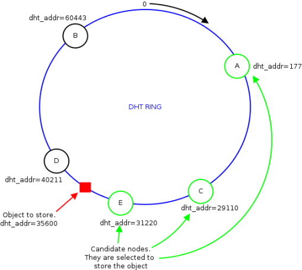

DistributedArpTable: technical documentation
============================================

The target of this page is to explain the inner details of the
implementation of [[DistributedARPTable\|DAT (Distributed ARP Table)]].
For the general idea and the problem that it is trying to solve, please
refer to the [[DistributedARPTable\|DAT]] page.

DAT is a `Distributed Hash
Table <https://en.wikipedia.org/wiki/Distributed_hash_table>`__ aimed to
store ARP entries and to allow nodes to perform fast lookup operations.
All the operations in the DHT (get and store) are performed on a set of
nodes computed by means of a distributed hash function which input value
is an **IPv4 address**.

Snooping mechanism
------------------

In order to let DAT work correctly, the batman-adv module has to
analyze ARP messages going to and coming from the mesh network,
therefore a snooping mechanism has been provided.
A node uses ARP **replies** issued by the clients it is serving to
populate its local cache and the distributed table. Any ARP
**request** going to the mesh network, instead, is blocked in order to
ask DAT for the reply. If DAT is not able to provide an answer then
the messages is delivered to the clients.

The snooping mechanism is actually made up of 4 events, which trigger
different actions.
The 4 possibilities are the following:

#. *Outgoing ARP Request*: The packet is intercepted and the source
   entry [MAC,IP] (contained in the packet) is stored for caching
   purposes, then the node checks if the requested IP is in the local
   cache:

   #. if yes: the node drops the request and immediately generates a
      reply that is delivered to the client
   #. if no: the node queries the DHT table using the requested IP as
      search key. If no answer is received within a fixed amount of time
      (currently is 250ms) the ARP request is broadcasted like it is
      usually done.

#. *Incoming ARP Request*: The packet is intercepted and the source
   entry [MAC,IP] (contained in the packet) is stored for caching
   purposes, then the node checks if the requested IP is in the local
   cache:

   #. if yes: the node drops the request and immediately generates a
      reply that is sent over the mesh towards the requester.
   #. if no: the request is delivered to the local soft interface (thus
      to the local clients)

#. *Incoming ARP Reply*: The packet is inspected, the node will save
   both the source and the destination entries in its local cache and
   then the message is delivered to the to the clients (only if the
   destination is one of them).
#. *Outgoing ARP Reply*: The packet is inspected, the node will save
   both the source and the destination entries in its local cache and
   then the message is sent to the DHT in order to populate it following
   the storing schema.

Fallback mechanism
------------------

It is also possible that DAT does not have the entry for a particular IP
(like described in the previous section), e.g. the first time this IP is
asked or because the entry has been purged out due to missing activity.
In this case DAT will not be able to provide any answer for the
requested IP address. The "blocked ARP request" is therefore sent as
broadcast packet (like a normal ARP request) after a timeout of 250ms is
hit (during this period the node will wait for the answer from the DHT).
This way the client can get the reply it was looking for through the
normal ARP mechanism and DAT can learn the new entry by inspecting the
incoming messages.

The new UNICAST\_4ADDR packet type
----------------------------------

In order to distinguish own DAT messages from classic unicast packets, a
new packet type has been introduced: the UNICAST\_4ADDR. This new packet
type has both the source and the destination address (the classic
unicast carries only the destination) and a sub-packet-type field.
Thanks to the latter, DAT is able to exactly distinguish different
packets and to provide appropriate debugging information if needed.

Backward compatibility
----------------------

In order to prevent backward compatibility breakage, several measures
have been taken:

-  the fallback mechanism prevent a DAT-enabled node to get stuck in
   case of no DAT nodes at the location where it was expecting them;
-  if an ARP request is coming through as a normal unicast packet, it
   means that the node sending it is not DAT-enabled, therefore also the
   reply will be sent by means of a standard unicast packet instead of
   using the unicast\_4address packet type.

Debug
~~~~~

To simplify debugging operations a specific log level has been added:
the dat log level. Enable it by typing the following command:

::

    # batctl ll dat

This log level makes it possible to see all DAT/ARP related operation,
including ARP messages parsing and DHT messages sending (with candidate
election mechanism).

The Theory and the high-level mechanism
---------------------------------------

DHT basics
~~~~~~~~~~

The DHT which D.A.T. is based on is actually inspired by
`CHORD <https://en.wikipedia.org/wiki/Chord_(peer-to-peer)>`__, which is
one of the earliest Peer-to-Peer algorithm based on a DHT.
B.A.T.M.A.N.-Advanced inherits the shape of the key space and the rule
used to allocate objects onto participant nodes.

Going a bit deeper into the details, the key space is represented by a
ring on which the 2^16 keys are equally distributed. Being a ring means
that arithmetic operations in the key space are modulo 2^16.

As in CHORD, either the objects to distribute into the DHT and the
participant nodes are mapped (by means of an hash function) to keys in
the same space. Therefore, while scrolling the ring it is possible to
find either keys mapping to an object and keys mapping to a node. This
mechanism is definitely useful in order to decide which key is allocated
on which node. In particular whenever there is a new object that we want
to store in the DHT, the steps to follow are:

#. compute the key of the object by means of the hash function
#. locate the key on the ring
#. identify the 3 nodes with the closest (from the left) key on the ring
#. distribute the object content on these 3 nodes

In this way, as soon as all the nodes shares the same vision of the
ring, given a generic object, whatever node can identify the 3
participants that are storing the object content and query them.

|image0|

In the figure above, it is possible to see a DHT ring populated with
some participants. At some point a generic node in the network wants to
retrieve the content for the red object. The node computes the key of
the latter and then identifies the 3 nodes that store the content (the
green ones in the figure). Now the node looking for the object content
can directly query the selected participants and retrieve the data.

How D.A.T. merges ARP and the DHT
~~~~~~~~~~~~~~~~~~~~~~~~~~~~~~~~~

Once the DHT concept has been introduced into B.A.T.M.A.N.-Advanced, the
next step is to merge the ARP protocol and let D.A.T. born.

D.A.T. actually exploits the DHT mechanism to store ARP entries of the
form **[IP, MAC]** (this object is shaped like a normal ARP entry). The
IP is used as input for the hash function as it is the always known part
of the entry. In particular, whenever a node detects an ARP entry in the
network (because of an ARP request/reply being sent/received by one of
its clients) it simply activates the previously explained mechanisn and
stores such entry into the DHT.

Whenever a node wants to retrieve a MAC address (e.g. due to an ARP
request issued a client of its own) it will directly use the DHT to
retrieve the ARP entry, and only if the DHT cannot provide the wanted
answer (e.g. this entry has never been seen in the network) then the
node fallbacks to the classic broadcast mechanism. As it is possible to
understand, using the DHT will make the nodes avoid to use broadcast
packets as much as possible and will make them rely on unicast packets
sent to the node storing the data in the DHT directly.

Limitations
~~~~~~~~~~~

-  DAT has been implemented to work with the **Address Resolution
   Protocol** (ARP) only. Such protocol was made to resolve IPv4 into
   MAC Addresses, therefore DAT does not currently support IPv6. However
   the DHT caching mechanism has been designed to be general enough so
   that it could be re-used in a IPv6-enabled version of DAT. But in
   order to implement it a new snooping mechanism needs to be written
   (e.g. batman-adv needs proper NDP/RA packets inspection...).
   [STRIKEOUT:The IPv6 extension of DAT is currently work in progress].

