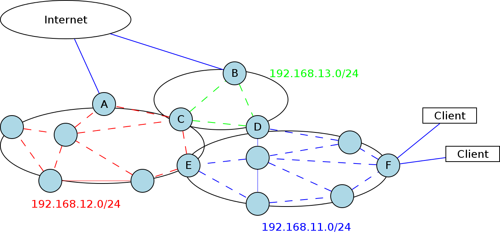

.. SPDX-License-Identifier: GPL-2.0

FAQ
===

Below you can see a list of frequently asked questions and answers. If
your question is not listed below, please contact us. You can contact us
via IRC: `#batman
channel <https://webchat.freenode.net/?channels=batman>`__ on
Freenode.org or by sending an e-mail to: b.a.t.m.a.n@lists.open-mesh.org
(only plain-text).

If you got any problems? See: the :doc:`Troubleshooting <Troubleshooting>`
page.

.. _batman-adv-faq-batman-general-questions:

B.A.T.M.A.N. General questions
------------------------------

Does B.A.T.M.A.N. have simulator (NS2, Omnet, etc) support?
~~~~~~~~~~~~~~~~~~~~~~~~~~~~~~~~~~~~~~~~~~~~~~~~~~~~~~~~~~~~~~~

**Q:** Does B.A.T.M.A.N. have his own simulator?

**A:** At this point no, but B.A.T.M.A.N. implementation (we know of)
supports simulators like the ones mentioned above. However, some
people experiment with B.A.T.M.A.N. using emulators (UML/Qemu/etc). If
you are looking for step-by-step instructions to install such a system
you can :doc:`read our emulation document </open-mesh/Emulation>`.

How to make my mesh network secure ?
~~~~~~~~~~~~~~~~~~~~~~~~~~~~~~~~~~~~

**Q:** Can I make my mesh network secure?

**A:** This depends on the security you want or need. Security is a
big field. Probably you mean encryption and authentication.

When you only want to make the whole WLAN stuff unreadable for the
outside, you could just use WPA\_NONE or IBSS RSN. But this doesn't
resolve the problem that the key could leak and make the mesh attackable
- but that is something which could always happen. So it is probably not
a solution for WiFi community projects, but for mesh networks controlled
by a company.

There are other ideas for traffic over batman-adv. Just forget about
encrypting your data on the WiFi layer, but instead do everything some
layers above. Some people experimented with the idea of implementing the
needed authentication and encryption over IPsec.

And most of the encryption and authentication stuff has to be resolved
by the user and not by the network provider. This means HTTPS for
sensible data instead of HTTP, SSH instead of Telnet, pop3s instead of
pop3 and so on.

So it really depends what you want and cannot be resolved in a "security
for everything, against any attack and for every purpose" blob.

Why does batman need so much time to detect a "dead" node?
~~~~~~~~~~~~~~~~~~~~~~~~~~~~~~~~~~~~~~~~~~~~~~~~~~~~~~~~~~

**Q:** Why can I see a node in the originator table a long time after
it died? *Or:* Does batman really need 200 seconds (PURGE\_TIMEOUT) to
switch the route?

**A:** Batman switches the route as soon as it learns about a better
path towards a destination which can take a fraction of a second up to
several seconds very much depending on the settings and situation.

When no more new originator messages are sent by a node (because it
died), no more routing updates regarding this node are exchanged. Batman
will not immediately delete this node from its database because the
connection could just have a temporary problem and might recover. Only
after a timeout period of (currently) 200 seconds the node is removed
entirely from batman's internal database. It does not hurt to give the
node a little extra time to recover from a connection loss as it speeds
up the resume process. All routes using this "lost" node as intermediate
hop will have changed towards another path in the meantime and are of no
concern.

.. _batman-adv-faq-batman-advanced-questions:

B.A.T.M.A.N. Advanced Questions
-------------------------------

What can B.A.T.M.A.N. Advanced do? And can't do?
~~~~~~~~~~~~~~~~~~~~~~~~~~~~~~~~~~~~~~~~~~~~~~~~

**Q:** What offers batman-adv? And what are the 'limitations'?

**A:** The batman-adv kernel module can only be used to route the
packages within a mesh network, it only simulates OSI layer 2 (data
link layer). It does that as fast as possible and in a smart way. Just
like a switch.

Batman has no security implemented. Also assigning IP addresses to the
node(s) is not Batman's task.
You may want to use underlying security mechanisms, like: IBSS RSN.

Read more about :doc:`BATMAN <Wiki>`.

Can batman-adv run on interfaces in AP / Station / etc mode ?
~~~~~~~~~~~~~~~~~~~~~~~~~~~~~~~~~~~~~~~~~~~~~~~~~~~~~~~~~~~~~

**Q:** Can BATMAN advanced run on interfaces in AP / Station mode?

**A:** Yes, because batman-adv doesn't know anything about stuff below
the ethernet interface. So you could also use it over layer 2 ethernet
tunnels, wifi ap, wifi sta, wifi adhoc, ethernet or even write a
virtual interface which prints everything on paper and scans the paper
on the remote machine (but you should be fast or increase the ogm
interval).

How can I connect non-mesh clients to my batman-adv network ?
~~~~~~~~~~~~~~~~~~~~~~~~~~~~~~~~~~~~~~~~~~~~~~~~~~~~~~~~~~~~~

**Q:** How can I connect non-mesh clients to batman-adv network?

**A:** The :doc:`batman-adv quick-start-guide </batman-adv/Quick-start-guide>` explains how to bridge your standard AP / Ethernet
interfaces with bat0 which can be problematic if you only possess one
WiFi card. In these cases it might be desirable to run adhoc mode and
AP mode at the same time. Fortunately, some WiFi chips / drivers
support a so-called "multi VAP" (virtual AP) or "multi SSID" mode to
have multiple WiFi networks on the same WiFi interface.

How big networks does batman-adv support?
~~~~~~~~~~~~~~~~~~~~~~~~~~~~~~~~~~~~~~~~~

**Q:** How big networks (maximum nodes) does batman-adv support?

**A:** That is a good question. It is not possible to give an exact
answer, but there are several parameters limiting the number of nodes
in your network:

#. **Capacity of the wireless network**
   Usually, the performance of the wireless network renders unusable if
   you add too many nodes (huge delay and low throughput).
#. **Memory footprint**
   Each node in the mesh network holds information in memory about every
   other node, so little memory might limit the number of nodes.
#. **Protocol overhead**
   Each node sends "here-I-am" messages to the entire network at a
   regular interval. These messages are aggregated when possible, to
   reduce the overhead.

How do I announce IP subnets using batman-adv?
~~~~~~~~~~~~~~~~~~~~~~~~~~~~~~~~~~~~~~~~~~~~~~

**Q:** Can I setup differnt IP subnets using batman-adv?

**A:** Batman-adv is a OSI layer 2 routing protocol and it does not
handle IP subnets at all. If you want to do IP subnetting, the
suggestion is to split the mesh network in different sub-meshes (e.g.
different ESSID/BSSID), and run a batman-adv instance in each of them.

|image0|

As shown in the picture, the result consists in having multiple meshes
working independently from each other. In particular the border nodes
like C, D and E will participate in more than one mesh network and will
consequently have more than one batman-adv interface (e.g. bat0 and
bat1): each of them assigned an IP belonging to a different subnet.

At this point the border nodes can run an instance of any dynamic IP
routing protocol (e.g. OSPF or BGP, both implemented in
`Quagga <http://www.quagga.net/)>`__ which will see each of the
batman-adv mesh network like a single link towards the other (border)
nodes in that network.

Note that also nodes connected to the Internet like A and B can be
considered border nodes (this is configuration dependant) and can
eventually run the IP routing protocol instance too.

It is extremely important to do not run any layer3 mesh routing protocol
on top of nodes using batman-adv: this would result in wrong link
quality computation by the overlying protocol which will see the whole
batman-adv network as a single link (even if a path to a node is made up
by multiple hops).

However the interaction of Quagga with the mesh network will be
"batman-adv-agnostic" since there is no way to exchange information
between the two. The creation of a batman-adv plugin for Quagga could
help in this direction by letting Quagga extract TQ (the metric used by
batman-adv) information to compute link qualities towards other border
nodes in the mesh network. This would avoid the IP routing protocol to
choose bad mesh nodes as next hop in the IP routing. As extracting/using
TQ in other protocols is just an idea/proposal right now, please contact
us if you want to do that.

Log file doesn't exists in trace-cmd?
~~~~~~~~~~~~~~~~~~~~~~~~~~~~~~~~~~~~~

**Q:** The trace-cmd shows now log messages for batman-adv?

**A:** You need to compile the batman-adv with logging support.

* Linux tree

  - go to ``Networking support ---> Networking options ---> B.A.T.M.A.N. Advanced Meshing Protocol``
    and select ``B.A.T.M.A.N. debugging`` and
    ``B.A.T.M.A.N. tracing support``

* external module

  - compile with make parameter ``CONFIG_BATMAN_ADV_DEBUG=y CONFIG_BATMAN_ADV_TRACING=y``

batctl must also be used to set the relevant loglevel

How to setup B.A.T.M.A.N. so it automatically assign IP addresses?
~~~~~~~~~~~~~~~~~~~~~~~~~~~~~~~~~~~~~~~~~~~~~~~~~~~~~~~~~~~~~~~~~~

**Q:** How to assign IP addresses automatically?

**A:** Batman-adv is not responsible for assigning IP addresses.
However, you can use for example a DHCP server.

What about assigning IP addresses in a decentralized way?
~~~~~~~~~~~~~~~~~~~~~~~~~~~~~~~~~~~~~~~~~~~~~~~~~~~~~~~~~

**Q:** How to assign IP addresses automatically in a decentralized
way?

**A:** IPv6 will help you to do this easier by using `Unique local
address <https://en.wikipedia.org/wiki/Unique_local_address>`__ (ULA).

What if I want to have a decentralized DNS solution?
~~~~~~~~~~~~~~~~~~~~~~~~~~~~~~~~~~~~~~~~~~~~~~~~~~~~

**Q:** I like to setup a decentralized mesh network and would like to
have a DNS solution. I don't want to use the internet (WWW), but I do
want to have a human readable 'domains' names, just like DNS. What are
the options?

**A:** Take a look at
`KadNode <https://github.com/mwarning/KadNode>`__. *Note:* This
software is still in beta.

.. _batman-adv-faq-batman-advanced-bridge-loop-avoidance-questions:

B.A.T.M.A.N. Advanced - Bridge Loop Avoidance questions
-------------------------------------------------------

What is Bridge Loop Avoidance?
~~~~~~~~~~~~~~~~~~~~~~~~~~~~~~

**Q:** What can you do with BLA?

**A:** Bridge Loop Avoidance is used to detect and avoid loops due to
multiple batX interfaces. :doc:`Read more... <Bridge-loop-avoidance>`

Why do we need BLA II if we can just use mesh on Ethernet?
~~~~~~~~~~~~~~~~~~~~~~~~~~~~~~~~~~~~~~~~~~~~~~~~~~~~~~~~~~

Under Discussion -> Features you say "no BATMAN packets on the
backbone".

**Q:** Why would you want to use the mesh (which never has enough
bandwidth anyway) if you have a fast, reliable backbone link between
some of the nodes (eg. LAN)?
*Or:* Wouldn't it make more sense to get as much done through the
backbone as possible?

**A:** You can explicitly use batman-adv on the mesh if you want to -
batman-adv allows adding Ethernet interfaces as well. This is a good
idea if you have full control over your LAN. However, there are users
who don't want to see batman-adv ethernet frames (with its special
ethertype 0x4305) on their LAN, because some firewalls recognize it as
malicious traffic. Therefore, one design goal of blaII was to keep
batman-adv packets out of the backbone LAN in the default case.

What about two meshes interconnected by a LAN?
~~~~~~~~~~~~~~~~~~~~~~~~~~~~~~~~~~~~~~~~~~~~~~

**Q:** Can I setup two meshes and connect them by LAN? *Or:* So, does
this mean that with current blaII, two meshes connected solely by
ethernet backbone (which can't overhear each other OGMs through wifi)
only know which macs are "on the other side of the ethernet backbone" so
as to keep the single broadcast domain united, but are fragmented in
terms of VIS data, gw, TT, and orig table?

**A:** Yes, there are two separate meshes, and the only stuff which is
supposed to be shared is the users payload traffic.

What about DHCP server for separate meshes?
~~~~~~~~~~~~~~~~~~~~~~~~~~~~~~~~~~~~~~~~~~~

**Q:** I would like to setup a DHCP server in separate meshes? *Or:*
How can I make two separate meshes use a single DHCP server (using
gw\_mode feature) in current blaII design?

**A:** Each node at the edge to the wired network may announce itself
as a gateway, provided that a DHCP server is available in the LAN (or
any network behind it, e.g. a mesh). From a concept view, a gateway
(or maybe even multiple gateways) in mesh2 will not automatically
announced in mesh1 - this must be configured manually, or let batman
use Ethernet if this is explicitly required.

B.A.T.M.A.N. Advanced - VLAN questions
--------------------------------------

VLAN forwarding doesn't work
~~~~~~~~~~~~~~~~~~~~~~~~~~~~

**Q**: When I have a bridge which connects an ethernet devices with bat0, VLAN
frames from the ethernet interfaces are not forwarded by batman-adv. Instead a
warning like ``batman_adv: bat0: adding TT local entry xx:xx:xx:xx:xx:xx to
non-existent VLAN 23`` is printed periodically. How is it possible to forward
these frames

**A**: batman-adv since 2014.0.0 is VLAN-aware. It is only able to forward VLAN
frames when it knows about the VLAN. This can either be done by creating a VLAN
device with the correct VID on top of the batadv (bat0) device::

  ip link add link bat0 name bat0.23 type vlan id 23

Or in case of a VLAN-aware bridge, it is better to add the correctly add the
VLANs as required to the specific ports::

  bridge vlan add vid 23 dev bat0

