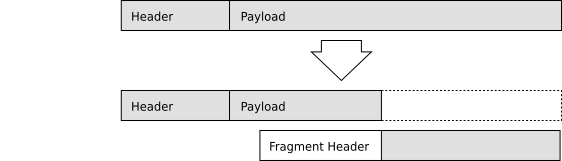
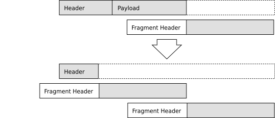
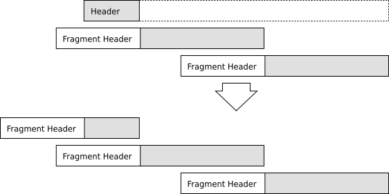

.. SPDX-License-Identifier: GPL-2.0

Fragmentation
=============

To transport packets through the mesh network, batman-adv prepends its
own header to packets entering the mesh. Since clients and other sources
of packet don't know about this additional header, packets are often
optimized for the usual MTU of 1500 bytes, meaning that the additional
header increases the size to e.g. 1528 bytes. To handle this, batman-adv
recommends users to increase the MTU of the wireless interface to at
least 1528 bytes. However, some drivers/hardware don't support an MTU
larger than 1500 bytes, or batman-adv might need to transmit big
protocol packets, and for this we need fragmentation.

Protocol Header
---------------

The fragment header contains several fields:

-  **Batman-adv common header**
   Compatibility version, packet type, and time-to-live
-  **Destination**
   Used to route fragments if it wouldn't make sense to merge them.
   (E.g. when the merged packet larger than the intermediate MTU and
   thus would be fragmented again anyways.)
-  **Originator**
   Used to group fragments in the buffer. This and the sequence number
   makes the original packet identifiable.
-  **Fragment number**
   Used to sort the fragments before merging them.
-  **Sequence number**
   Used to identify the group of fragments.
-  **Total size**
   Used to determine whether a fragment should be merged before
   forwarding and also to determine if all fragments are received.

Creating Fragments
------------------

Any type of unicast packet (e.g. ``struct unicast_packet``,
``struct tt_response``, ``struct vis_packet``, etc) can be fragmented.

|image0|

The size is checked in ``send_skb_to_orig()`` and if larger than the MTU
of the selected outgoing interface (selected by
:doc:`bonding </batman-adv/Multi-link-optimize>`) the packet
is passed to ``frag_send_packet()``. Here, fragments are created and
sent from the tail of the original packet, so that the first fragment
contains the end of the original packet:

|image1|

The first fragment is passed to ``send_skb_packet()`` to be transmitted
and if the size of the remaining part of the original packet is also
larger than the MTU, another fragment is created:

|image2|

Now the remaining part is small enough to transmit in one piece, so the
fragment header is added and the packet is passed to
``send_skb_packet()``:

|image3|

These completes the creation of fragments.

Merging Fragments
-----------------

Fragments are identified by the packet type in the batman-adv common
header.

|image4|

When receiving a fragment, it is passed to ``recv_frag_packet()`` in
``routing.c``, where it is either forwarded, buffered, or merged. Merged
packets are passed to the primary receive function again and processed
by its original handler.

#. **Check total size**
   If destination fields contains another originator and the size of the
   original packet is greater than the MTU, the fragment is forwarded
   without merging.
#. **Buffer fragment**
   The fragment is buffered (in reverse order) in a list of fragments
   with equal sequence numbers from the same originator.
#. **Check for complete fragments**
   If the accumulated size of the received fragments equals the total
   size given in the fragment header, the list moved out of the buffer
   and handed to the merge function.
#. **Merge fragments**
   The first fragment in the list (which is the last fragment, see item
   no. 2) is expanded to contain the payload of the rest of the
   fragments, which are then copied into the first fragment.
#. **Handle original packet**
   The merged packet is passed to ``batman_skb_recv()`` where it is
   processed as usual.

Configuration
-------------

First of all, fragmentation shouldn't be needed (except for tt-tables,
see below). It is a fix for drivers/hardware that is unable to handle
MTU's greater than 1528 bytes, it is slow (due to increase is packets),
and is susceptible to packet loss.

It can be enabled and disabled via batctl:

::

    % batctl meshif bat0 fragmentation 1 # enable (default)
    % batctl meshif bat0 fragmentation 0 # disable

Limitations
-----------

If an intermediate node with an unexpectedly lower MTU exists, this
scheme breaks. In the scenario "A <-> B <-> C", where A and C have
MTU=1550 and B has MTU=1000 bytes, B cannot respond with nor forward
very-big-full-tables from A to C. At the moment, batman-adv simply
forwards the requests and hopes for the best.

Future Improvements
-------------------

-  Checking total size of original packet uses the MTU of the incoming
   interface. In case of bonding, the fragment might be transmitted on
   another interface.
-  The fragment buffer in ``struct orig_node`` should only be allocated
   on demand, as most networks don't need fragmentation.

