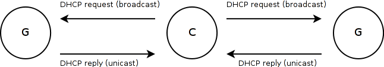

.. SPDX-License-Identifier: GPL-2.0

Batman-adv gateways
===================

Often batman-adv is used to cover a bigger area with wireless access to
the internet where several nodes have internet access while the other
nodes try to find the best route towards one of the gateways. In this
case it is desirable that the routing protocol helps with the decision
to find the best path since it already knows the topology of the
network.

Announcements
-------------

To make the internet uplink known in the mesh network, batman-adv
allows to enable the so-called 'gateway mode'. The user specified
internet uplink bandwidth is propagated in the mesh network using the
:ref:`gateway TVLVs <batman-adv-TVLV-Gateway-announcement>`. All other
mesh participants receive these announcements and maintain a list of
internet gateways in the network (see:
:ref:`gateway table <batman-adv-Understand-your-batman-adv-network-Gateway-table>`).
To take advantage of this knowledge, each batman-adv node without an
internet connection needs to enable the 'gateway client mode' by
choosing one of the available gateway selection strategies (check the
`batctl
manpage <https://downloads.open-mesh.org/batman/manpages/batctl.8.html>`__
for details). If no gateway selection strategy is configured the
gateway announcements have no effect on any routing or forwarding
decision.

Routing towards the best internet uplink
----------------------------------------

Assuming a batman-adv gateway has been chosen batman-adv needs to 'help'
each connected non-mesh client to follow its suggestion concerning the
best available internet uplink by tricking the DHCP requests coming from
those non-mesh clients into believing that there is only one gateway
(the one batman-adv already picked).

As the whole gateway functionality is based on DHCP, the protocol
assumes each gateway runs its own DHCP server and each client runs a
DHCP client. When a DHCP client is started it will issue a DHCP request
which is broadcasted in the entire network. Every DHCP server will send
a reply via unicast back to the client which then has to choose one of
the responding DHCP servers as its gateway.

**Standard DHCP behavior**:

|image0|

Which gateway will be selected by the client depends on the number of
DHCP servers / packet loss / delay / DHCP client software / etc.

**DHCP behavior with batman-adv gateway client mode enabled**:

|image1|

DHCP requests issued by non-mesh clients will not be broadcasted by
batman-adv but only sent to the chosen batman-adv gateway via unicast.
The DHCP client will then select the gateway batman-adv prefers as only
this gateway replied to the request.

To inform clients possessing a valid DHCP release about a gateway change
(the link quality to the gateway could have dropped or the client is
roaming around) batman-adv will also inspect incoming DHCP renewal
packets. If their destination is not the currently selected gateway and
below a certain TQ threshold (currently defaulting to a TQ of 50), the
DHCP renewal packet is not forwarded, thereby forcing the client to
request a new DHCP lease from a better connected gateway.

The configuration
-----------------

gateway server
~~~~~~~~~~~~~~

Activate the gateway announcements on a node that has a DHCP server
running:

::

    batctl gw_mode server

Batman-adv always announces the gateway's internet bandwidth, so that
clients can base their decision on the link quality towards the gateway
as well as on the available bandwidth. Per default a bandwidth of
10MBit/2MBit is assumed. To configure a download bandwidth of 5Mbit with
an upload of 1Mbit run the following command:

::

    batctl gw_mode server 5mbit/1mbit

Details regarding the syntax of the bandwidth setting can be found in
the `batctl
manpage <https://downloads.open-mesh.org/batman/manpages/batctl.8.html>`__.

gateway client
~~~~~~~~~~~~~~

The client can be activated with the following command:

::

    batctl gw_mode client

If multiple gateways are available batman-adv selects its best gateway
based on certain criteria such as link quality / bandwidth / etc. The
selection algorithm can be changed by appending the appropriate gateway
selection class to the aforementioned command. To make batman-adv switch
the gateway as soon as any gateway becomes 20TQ points better than the
currently selected gateway:

::

    batctl gw_mode client 20

All available gateway selection classes are thoroughly explained in the
`batctl
manpage <https://downloads.open-mesh.org/batman/manpages/batctl.8.html>`__.

gateway status
~~~~~~~~~~~~~~

To see all available gateways and their announced throughput run:

::

    batctl gwl

The mode of the current node can be seen by running:

::

    batctl gw_mode

Controversy
-----------

The subject of manipulating the IP (layer 3) default route with a layer
2 routing protocol has stirred up controversy between those who believe
in a clean network layer separation and those who need this
functionality. The former claim that a well-designed protocol should not
mess with other layers but instead collaborate with tools made for
higher layers. The latter group has pointed out that the rule of network
layer separation can be bent in real world applications to improve
usability. To achieve a compromise the gateway mechanism is disabled per
default and only operates on top of DHCP (details below). Feel free to
contact us in case you want to propose alternative ideas.

.. |image1| image:: gateway2.png

