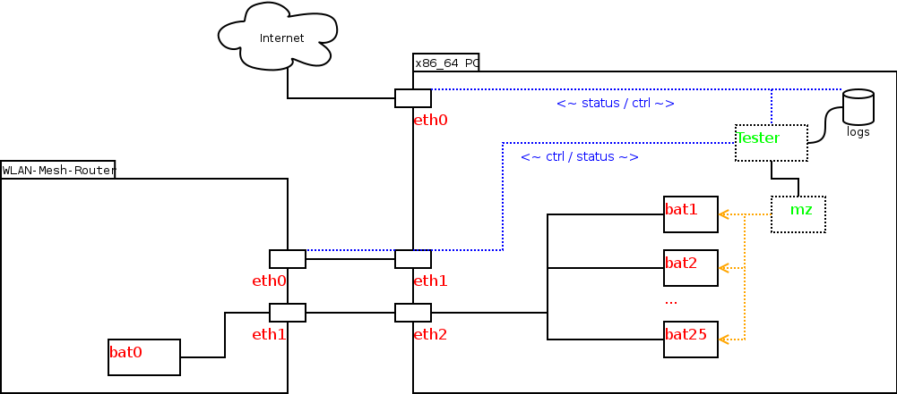
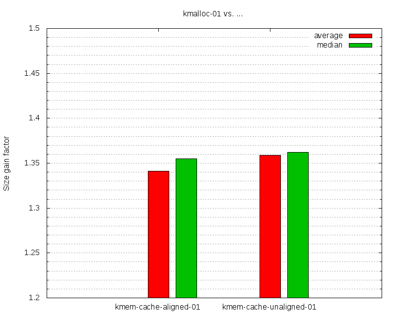

Kmalloc vs. Kmem-cache Tests
============================

1) Abstract
-----------

In various, larger Freifunk mesh communities some issues happening after
a certain broadcast domain size threshold occured. 32MB of RAM devices
start to have load issues and reboot frequently with a `Gluon
2016.1.3 <https://github.com/freifunk-gluon/gluon/>`__ (batman-adv
2015.1) firmware `once they reach about 3100
clients <https://github.com/freifunk-gluon/gluon/issues/753>`__ (3100
entries in the global translation table).

While several other changes probably introduced a higher memory usage
(e.g. switch to FQ-Codel with OpenWRT Chaos Calmer, larger kernel, ...),
too, the possibilities to increase efficiency of the translation table
by kmem-cache-alloc() instead of kmalloc() was considered and is the
focus and primary motivation of this article.

Some information about kmem-cache can be found
`here <https://static.lwn.net/images/pdf/LDD3/ch08.pdf>`__. General
information about kmem-caches can usually be found in /proc/slabinfo (if
the kernel was compiled with slabinfo support).

--------------

The idea of these tests is to feed one 32MB RAM, embedded device with as
many global TT entries as possible from a second, more powerful device.
The test scripts continuously fetch the number of global TT entries
until the embedded device reboots due to an Out-of-Memory error.

We then compare this count with various configurations, for instance
with kmalloc() vs. kmem-cache-alloc() vs.
kmem-cache-alloc(SLAB\_HWCACHE\_ALIGN). But also with wifi
enabled/disabled or full global TT dump + count vs. direct, global TT
count access.

2) Test setup
-------------

2.1) Hardware & Connectivity
~~~~~~~~~~~~~~~~~~~~~~~~~~~~

|image0|

The test setup consists of two machines:

-  WLAN-Mesh-Router: TP-Link TL-WR841ND v8, 32MB RAM, MIPS, ar71xx
-  x86\_64 PC: 3x ethernet interfaces, 8GB RAM

Those two devices are connected via two network cables. One dedicated
for polling the status from and controlling the embedded device. The
other one dedicated for the batman-adv mesh. Finally the x86 PC has a
third ethernet interface for external access to control and monitor the
tests.

2.2) Software & Configuration
~~~~~~~~~~~~~~~~~~~~~~~~~~~~~

-  WLAN-Mesh-Router:

| \* Gluon v2016.1.3
| \* Gluon site config from Freifunk Rhein-Neckar, v0.5.4
| \* batman-adv v2016.1

-  x86\_64 PC:

| \* Debian Sid
| \* 3.16.7 Linux kernel
| \* batman-adv v2016.1
| \* Mausezahn v0.40

For the embedded device, WLAN-Mesh-Router, two patches were added to
Gluon/batman-adv:

-  Upgrade to batman-adv v2016.1 (Gluon / OpenWRT CC currently provides
   v2015.1 for the package feed)
-  Global translation table count patch (outputs the number of global TT
   objects via debugfs directly)

Next to these two patches, three variants for the image for the embedded
device were created:

-  kmalloc (vanilla, uses kmalloc() for TT)
-  kmem-cache-aligned (Sven's original patch, with SLAB\_HWCACHE\_ALIGN
   flag)
-  kmem-cache-unaligned (Sven's patch but with no SLAB\_HWCACHE\_ALIGN
   flag)

3) Test runs
------------

The following configurations were tested.

3.1) kmalloc vs. kmem-cache-alloc ("kmalloc" vs. "kmem-cache-aligned" vs. "kmem-cache-unaligned" runs)
~~~~~~~~~~~~~~~~~~~~~~~~~~~~~~~~~~~~~~~~~~~~~~~~~~~~~~~~~~~~~~~~~~~~~~~~~~~~~~~~~~~~~~~~~~~~~~~~~~~~~~

Currently, batman-adv uses kmalloc() to allocate memory for a global
translation table. This option tries using dedicated kmem-caches for
local and global TT entries, as well as global TT orig entries via
Sven's patch.

This test configuration also both tries using kmem-cache-alloc() with
and without setting the SLAB\_HWCACHE\_ALIGN flag.

3.2) Wifi (hidden) vs. No Wifi ("nowifi" run)
~~~~~~~~~~~~~~~~~~~~~~~~~~~~~~~~~~~~~~~~~~~~~

Gluon, by default, provides both a mesh interface (either IBSS or
802.11s w/o fwd.; here: IBSS) for the mesh routing protocol. And a wifi
AP interface for clients to connect.

Tests were performed once with these two wifi interfaces enabled, but
hidden. And once with no wifi interfaces (UCI wifi interface sections
disabled).

3.3) Bridge FDB (Forwarding Database) enabled vs. disabled ("nofdb" run)
~~~~~~~~~~~~~~~~~~~~~~~~~~~~~~~~~~~~~~~~~~~~~~~~~~~~~~~~~~~~~~~~~~~~~~~~

By default, the bridge keeps track of behind which bridge port which MAC
address can be found. This information is stored in the so called
forwarding database, or FDB for short.

This is similar to how batman-adv stores which client and according MAC
address can be found on which mesh node. And by that also not strictly
necessary for a bridged mesh network to function correctly.

The bridge allows to disable the FDB learning on specific ports as well
as to configure on which ports ethernet frames with an unknown
destination MAC should be flooded.

The "nofdb" test run disables learning on the bat0 bridge port and lets
the bridge simply flood frames with unknown destination to bat0. Then
batman-adv will determine via its global translation table if an
appropriate host in the mesh exists and if so, forwards the frame
further.

3.4) Full Global Translation Table Dump vs. Count Dump only ("notg" run)
~~~~~~~~~~~~~~~~~~~~~~~~~~~~~~~~~~~~~~~~~~~~~~~~~~~~~~~~~~~~~~~~~~~~~~~~

Currently batman-adv exports the global translation table via debugfs
(patches for netlink exports are currently work-in-progress). For the
export, one buffer to store the full, human-readable, ASCII-encoded
table is created where translation table information is copied into.

Due to the human-readable format, a translation table with about four
thousand clients can easily need a 256KB buffer. Additionally, once the
buffer is full, the kernel will try to create a new buffer of double the
size and copy things over. This leads to noticeable, discrete jumps in
load and memory usage every time the number of mesh clients roughly
doubles.

Further more, buffer allocations are first tried via kmalloc(), which
needs a consecutive memory area, which might be tricky for a 256KB or
512KB bulk on an embedded device without much spare RAM. Current kernel
versions (including Gluon v2016.1.3) will try to fallback to vmalloc()
which will allocate several smaller, scattered memory regions instead
once a kmalloc() fails with an -ENOMEM.

Still, even with the recent vmalloc()-fallback patch, this debugfs
behaviour might create high loads or memory usage temporarily.

Therefore a small, custom patch for batman-adv was added to provide just
the count of the global translation table via debugfs. The "notg" test
run then uses this new trans\_table\_global\_count instead of a line
count of the full trans\_table\_global.

4) Overview Test Procedure
--------------------------

All combinations of the test runs described above (in total: 24) were
performed. They were run 30 times each to lower the standard error.

The x86 PC performing the test runs creates 25 batman-adv instances.
Then the tool mausezahn sends 1500 frames with a random source MAC
address over each batman-adv instance, one by one with a short delay.
This will create about 25 times 1500 = 37500 global translation table
entries maximum.

While mausezahn runs and the embedded device is reachable, the global
translation table size and /proc/meminfo is collected once every second
over ssh through the network interface dedicated for monitoring.

5) Results (short)
------------------

5.1) Raw/Text
~~~~~~~~~~~~~

 describes the average number of global TT entries of 30 test rounds
which could be created on a run until the node rebooted due to being
out-of-memory.

 is similar to the average number of TT entries, but filters out
outliers in the measurements. And can be an indicator on how convincing
the average is.

Similarly, the is an indicator regarding whether the number of test
rounds was sufficiently large.

::

    $ ./eval-all.sh
    :     <# of Test Rounds>

    ## logs/kmalloc-01:
      logs/kmalloc-01/_: 11366.666667 11466.000000 1286.673109 234.913295 30
      logs/kmalloc-01/nofdb: 11744.366667 12175.000000 1588.274567 289.977936 30
      logs/kmalloc-01/notg: 13318.066667 13486.500000 1613.411767 294.567340 30
      logs/kmalloc-01/notg-nofdb: 14900.266667 15748.500000 2565.820998 468.452680 30
      logs/kmalloc-01/nowifi: 15402.933333 15265.500000 1698.790804 310.155348 30
      logs/kmalloc-01/nowifi-nofdb: 16616.733333 16221.500000 1250.387751 228.288526 30
      logs/kmalloc-01/nowifi-notg: 19189.800000 19199.500000 857.763270 156.605431 30
      logs/kmalloc-01/nowifi-notg-nofdb: 21919.766667 22328.500000 840.369311 153.429743 30
    ## logs/kmem-cache-aligned-01:
      logs/kmem-cache-aligned-01/_: 14849.133333 14631.000000 2521.004558 460.270355 30
      logs/kmem-cache-aligned-01/nofdb: 16657.200000 17596.500000 3056.207818 557.984654 30
      logs/kmem-cache-aligned-01/notg: 16289.800000 16961.500000 5142.746046 938.932672 30
      logs/kmem-cache-aligned-01/notg-nofdb: 21636.333333 23740.000000 4241.577987 774.402648 30
      logs/kmem-cache-aligned-01/nowifi: 21737.300000 21781.500000 1034.813386 188.930211 30
      logs/kmem-cache-aligned-01/nowifi-nofdb: 24014.933333 23901.000000 788.844130 144.022575 30
      logs/kmem-cache-aligned-01/nowifi-notg: 24083.300000 23984.500000 586.224084 107.029385 30
      logs/kmem-cache-aligned-01/nowifi-notg-nofdb: 26726.700000 26897.000000 1354.035971 247.212015 30
    ## logs/kmem-cache-unaligned-01:
      logs/kmem-cache-unaligned-01/_: 14592.266667 14951.500000 3087.529724 563.703226 30
      logs/kmem-cache-unaligned-01/nofdb: 16375.633333 16065.500000 2291.323846 418.336586 30
      logs/kmem-cache-unaligned-01/notg: 16511.766667 17114.000000 3959.415493 722.887060 30
      logs/kmem-cache-unaligned-01/notg-nofdb: 22112.066667 23868.500000 3473.455781 634.163361 30
      logs/kmem-cache-unaligned-01/nowifi: 22368.566667 22648.500000 1172.829504 214.128392 30
      logs/kmem-cache-unaligned-01/nowifi-nofdb: 24047.266667 23558.500000 1195.256038 218.222898 30
      logs/kmem-cache-unaligned-01/nowifi-notg: 24636.566667 24545.500000 698.748915 127.573514 30
      logs/kmem-cache-unaligned-01/nowifi-notg-nofdb: 28171.033333 28426.500000 1802.042313 329.006408 30

5.2) kmalloc vs. kmem-cache
~~~~~~~~~~~~~~~~~~~~~~~~~~~

The following diagram shows the gain factor for the number of global TT
entries between kmalloc and kmem-cache-aligned/unaligned. It is an
average of all test types (\_, nofdb, notg, ... nowifi-notg-nofdb) and
rounds. So an average gain factor of various combinations with 240
rounds in total.

The median chart uses the median values from 5.1 instead of its average
values.

|image1|

::

    $ ./eval+plot-kmalloc_vs_kmem-cache.sh
    Size gain factor kmalloc-01 vs kmem-cache-aligned-01:
      ave: 1.34133, med: 1.35506

    Size gain factor kmalloc-01 vs kmem-cache-unaligned-01:
      ave: 1.35879, med: 1.36195

6) Results (extended)
---------------------

7) Conclusion
-------------

8) Appendix
-----------

-  Logs
-  Test scripts
-  `Images <http://metameute.de/~tux/batman-adv/kmalloc_vs_kmem-cache/images.tar.xz>`__

