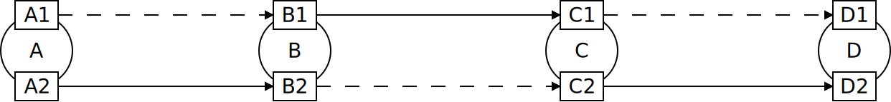
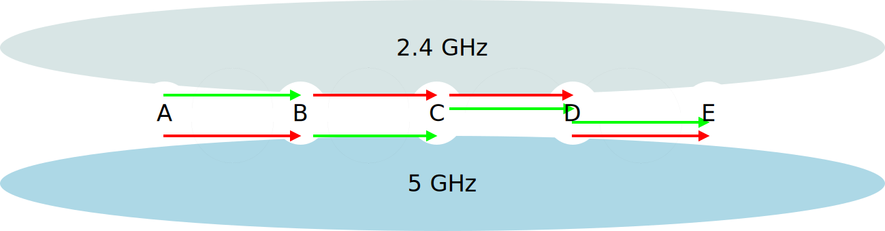
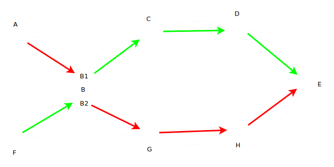
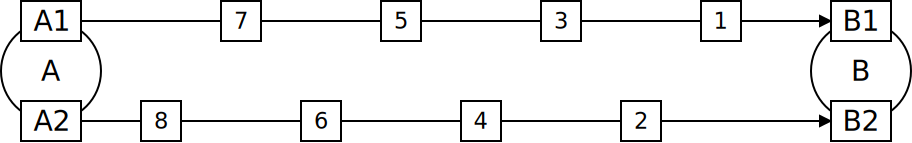
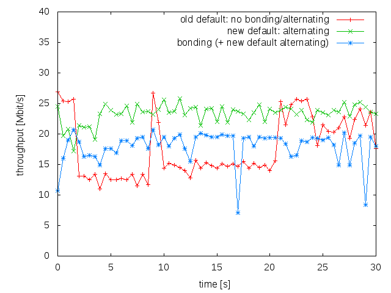

.. SPDX-License-Identifier: GPL-2.0

Multi-link Optimizations
========================

batman-adv is able to work on different interfaces - multiple WiFi
interfaces, but also Ethernet interfaces. If two or more nodes are
interconnected through batman-adv on multiple interfaces, they may
leverage some features to increase throughput, which are explained here.

For more technical information, please see our
:doc:`technical network wide multi-link documentation <Network-wide-multi-link-optimization>`

Interface alternating
---------------------

With Interface alternating, batman-adv forwards frames on a different
interface than on which the frame was received. The purpose of this
alternation is to reduce interference (we can either send or receive on
a WiFi interface at one time) and to balance the network load better on
the available interfaces, and eventually increases throughput. The
mechanism is illustrated below for a chain of nodes with two interfaces.

|image0|

Interface alternating is performed by considering the interface where a
packet has been received, and selecting the best neighbor of the
available outgoing interfaces. On half-duplex interfaces like WiFi
interfaces, a penalty is applied on the metric, and therefore forwarding
decisions where sending and receiving interfaces are the same are
considered worse. This feature is enabled by default and does not have
to be enabled manually.

network wide interface alternating
----------------------------------

Unlike the previous interface alternating feature in batman-adv which
worked on a local level, the interface decision is now performed
considering the whole mesh network. For example, consider some dual
radio mesh nodes where most nodes have both a 2.4 GHz and a 5 GHz link
to the next hop, except for the connection between node C and D which
only has a 2.4 GHz. Based on the information propagated, A will now
choose the 2.4 GHz link first to reach node E. This way, it can avoid
using the same frequency at node C, compared to starting with 5 GHz.

|image1|

Another example: path diversity
~~~~~~~~~~~~~~~~~~~~~~~~~~~~~~~

|image2|

With the network wide multi interface optimization, multi-interface node
can act as a routing splitting point which can lead to a first attempt
of multipath-routing. Considering the scenario illustrated above and
assuming all paths to be perfect, node B will route the packets via C if
they are coming from F (green path) and route the packets via G if they
are coming from A (red path) for the destination E. This is different
from the previous implementation, where all packets would have been
routed via same path from B, as it now depends on which interface the
packets are received.

Interface bonding
-----------------

When multiple paths on different interfaces with similar quality are
available, batman-adv may distribute the frames to be sent over these
available paths. The individual frames are sent over the paths in a
round robin fashion as illustrated below. Using this technique, the
throughput may be increased by the number of interfaces involved in the
bonding. In practical tests over two WiFi links, we have seen more than
50%25 of throughput gain.

|image3|

However, if the paths have different speeds (B.A.T.M.A.N IV won't detect
that), the throughput may even decrease due to the slower link slowing
down the whole bonding. Therefore, this feature must be explicitly
enabled. One may enable it for certain nodes in a known environment, the
same setting does not have to be applied mesh wide.

To enable bonding, use batctl:

::

    batctl bonding enable

Throughput gain
---------------

NOTE: these are old graphs showing throughput gain from the previous
bonding implementation. However the new mechanism is similar enough to
keep this graph for reference until new measurements have been
performed:

At the `WirelessBattleMesh v3 <https://www.open-mesh.org/news/14>`__
we performed throughput tests to measure the gain of the various modes:

|image4|

This graph shows a 3 node setup each with 2 802.11abg wifi interfaces
connected to the mesh network (1x 2.4GHz and 1x 5.8GHz). As you can see
the alternating mode is able to maintain the performance. The old
default behavior sometimes manages to maintain a similar level of
performance but is rather unstable.

