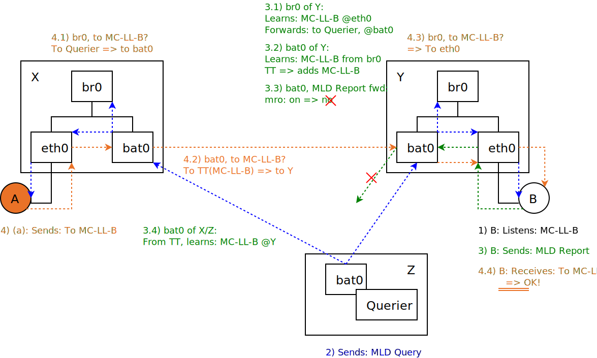
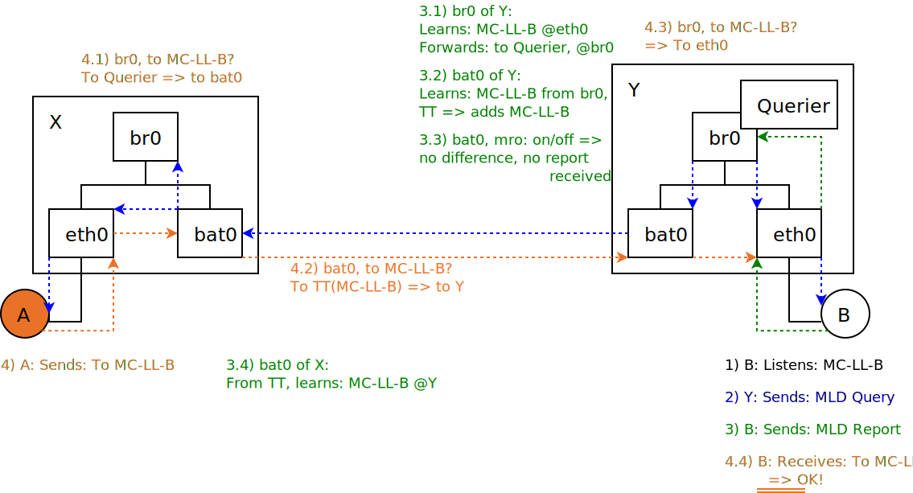
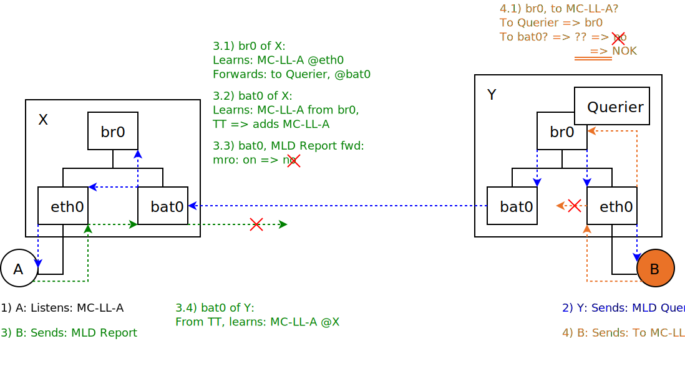
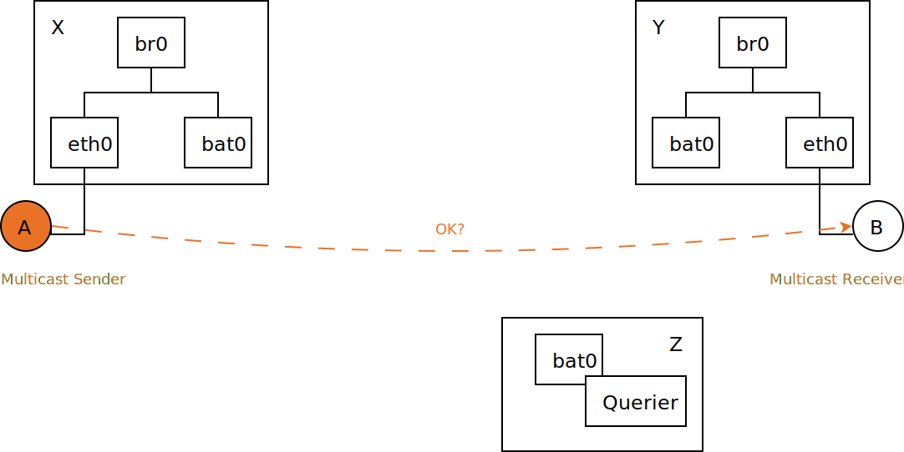
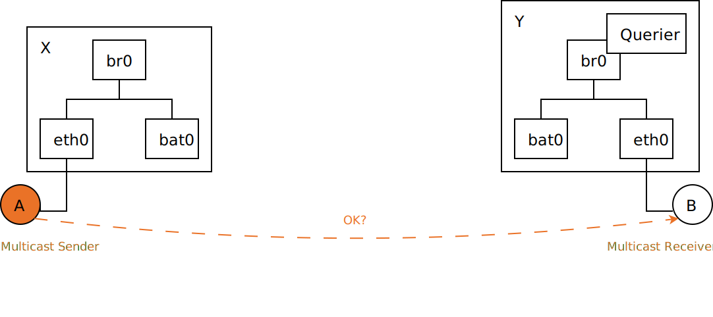
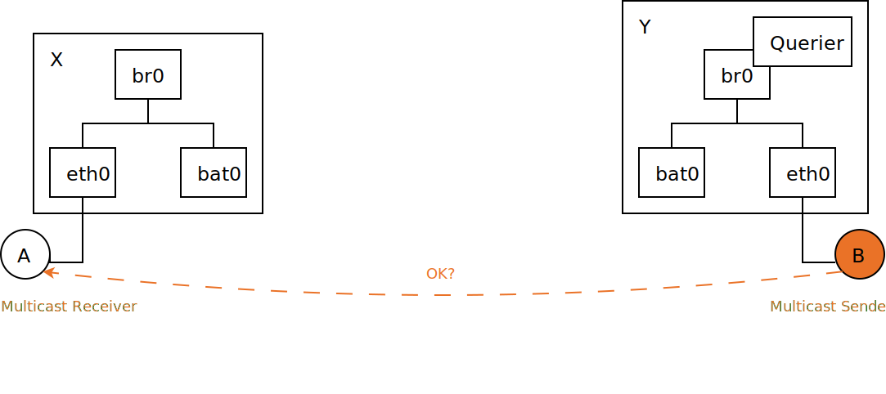

.. SPDX-License-Identifier: GPL-2.0

======================================
Multicast - IGMP/MLD Report Forwarding
======================================

Patches:

* `batman-adv <https://git.open-mesh.org/batman-adv.git/shortlog/refs/heads/linus/multicast-mld-rtr-only>`__
* `batctl <https://git.open-mesh.org/batctl.git/shortlog/refs/heads/linus/multicast-rtr-only>`__

WIP/Draft - not yet upstream

Introduction
============

Currently batman-adv forwards/floods an IGMP/MLD Report to all other
nodes by default. The *multicast_mld_rtr_only* option allows to change
this behavior to only forward IGMP/MLD Reports to nodes with a multicast
router, to reduce IGMP/MLD overhead in the mesh. However this option is
not always safe to use, so this page illustrates the scenarios where
this option can and cannot be used.

Scenario A: Multicast to host on node without querier
-----------------------------------------------------

Scenario A, Overview:
~~~~~~~~~~~~~~~~~~~~~

| |image1|
| *Can bridged-in host A send multicast to bridged-in host B?*

Scenario A, Analysis:
~~~~~~~~~~~~~~~~~~~~~

Answer: yes

**Learning:**

| 1) Bridged-in host B listens to a link-local multicast address
| 2) Node Z floods an MLD Query through the mesh
| 3) Host B replies to the MLD query with an MLD Report for
| 3.1) br0 on node Y learns that a listener for is behind eth0 and then
  forwards the MLD Report further towards the querier on bat0, as
  required by RFC4541
| 3.2) batman-adv on node Y learns about the listener for through the
  export of the bridge and then adds it to TT, which gets distributed to
  other nodes.
| 3.3) With the batman-adv multicast_rtr_only option enabled batman-adv
  on node Y will refrain to forward the MLD Report further into the mesh
| 3.4) batman-adv on nodes X and Z learn about through the TT

**Multicast packet forwarding:**

| 4) Bridged-in host A sends a multicast packet to the multicast address
| 4.1) br0 on node X has not heard of , but will forward the multicast
  packet towards the MLD Querier, as required by RFC4541
| 4.2) batman-adv on node X had previously learned through the TT that
  has a listener on node Y and batman-adv will therefore forward the
  multicast packet to node Y
| 4.3) br0 on node Y has previously learned about through the MLD
  Report, so it forwards the multicast packet on eth0 to host B
| 4.4) Host B successfully receives the multicast packet from host A!

Scenario B: Multicast to host on node with a querier
----------------------------------------------------

Scenario B, Overview:
~~~~~~~~~~~~~~~~~~~~~

| |image2|
| *Can bridged-in host A send multicast to bridged-in host B?*

Scenario B, Analysis:
~~~~~~~~~~~~~~~~~~~~~

Answer: yes

**Learning:**

| 1) Bridged-in host B listens to a link-local multicast address
| 2) Node Y floods an MLD Query through the mesh
| 3) Host B replies to the MLD query with an MLD Report for
| 3.1) br0 on node Y learns that a listener for is behind eth0 and then
  forwards the MLD Report further towards the querier on br0 - but not
  to bat0 - as required by RFC4541
| 3.2) batman-adv on node Y learns about the listener for through the
  export of the bridge and then adds it to TT, which gets distributed to
  other nodes.
| 3.3) No matter if enabling or disabling the batman-adv
  multicast_rtr_only option bat0 on node Y will not have received an MLD
  Report
| 3.4) batman-adv on node X learns about through the TT

**Multicast packet forwarding:**

| 4) Bridged-in host A sends a multicast packet to the multicast address
| 4.1) br0 on node X has not heard of , but will forward the multicast
  packet towards the MLD Querier, as required by RFC4541
| 4.2) batman-adv on node X had previously learned through the TT that
  has a listener on node Y and batman-adv will therefore forward the
  multicast packet to node Y
| 4.3) br0 on node Y has previously learned about through the MLD
  Report, so it forwards the multicast packet on eth0 to host B
| 4.4) Host B successfully receives the multicast packet from host A!

Scenario C: Multicast from host on node with a querier
------------------------------------------------------

Scenario C, Overview:
~~~~~~~~~~~~~~~~~~~~~

| |image3|
| *Can bridged-in host B send multicast to bridged-in host A?*

Scenario C, Analysis:
~~~~~~~~~~~~~~~~~~~~~

Answer: **no!**

**Learning:**

| 1) Bridged-in host A listens to a link-local multicast address
| 2) Node Y floods an MLD Query through the mesh
| 3) Host A replies to the MLD query with an MLD Report for
| 3.1) br0 on node X learns that a listener for is behind eth0 and then
  forwards the MLD Report further towards the querier on bat0, as
  required by RFC4541
| 3.2) batman-adv on node X learns about the listener for through the
  export of the bridge and then adds it to TT, which gets distributed to
  other nodes.
| 3.3) With the batman-adv multicast_rtr_only option enabled batman-adv
  on node X will refrain to forward the MLD Report further into the mesh
| 3.4) batman-adv on node Y learns about through the TT

**Multicast packet forwarding:**

| 4) Bridged-in host B sends a multicast packet to the multicast address
| 4.1) br0 on node X has not heard of , but will forward the multicast
  packet towards the MLD Querier - but not to bat0 - as required by
  RFC4541
| 4.2) batman-adv on node X had previously learned through the TT that
  has a listener on node Y and batman-adv will therefore forward the
  multicast packet to node Y
| 4.3) br0 on node Y has previously learned about through the MLD
  Report, so it forwards the multicast packet on eth0 to host B
| 4.4) Host B successfully receives the multicast packet from host A!

**Potential Workarounds:**

| A) Set bridge port *multicast_router* setting for bat0 to 2 (e.g.: *$
  echo 2 > /sys/class/net/bat0/brport/multicast_router*) => always
  forwards multicast packets to bat0
| B) Run a multicast router on br0 of node Y (disadvantage: receives all
  multicast packets)
| C) Run a bridged-in multicast router (which supports MRD) on node Y
  (disadvantage: receives all multicast packets)
| D) Send report not just to multicast routers, but also to queriers
  (not implemented)
| E) Export batman-adv TT-global to bridge MDB (not implemented)

Scenario D: Multicast to/from host on node with a bridged-in querier
--------------------------------------------------------------------

WIP

Scenario D, Overview:
---------------------

*Can bridged-in host A send multicast to bridged-in host B?*

Scenario D, Analysis:
---------------------

Answer: yes

