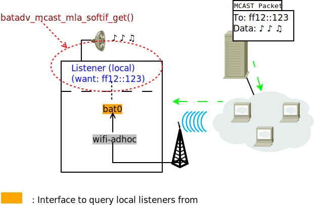
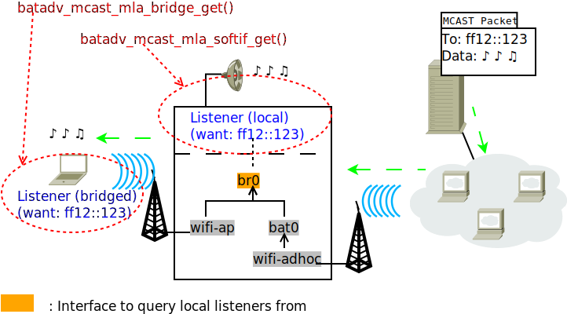

Multicast Optimizations - Bridges
=================================

Prior Readings:

\* :doc:`Multicast Optimizations <Multicast-optimizations>`

For the multicast optimizations to work, potential receivers need to be
known by batman-adv nodes sending multicast packets. To avoid any loss
of multicast packets, *all* such listeners need to be announced. If a
batman-adv node is not able to announce its multicast listeners then it
needs to receive all multicast packets. Topologically multicast
listeners can spawn in two places:

Local Multicast Listeners
-------------------------

The multicast listeners being present on the node itself, on the same
kernel, can easily be fetched: We can directly ask the network subsystem
of our own Linux kernel to tell us about any registered multicast
listener. For instance your userspace audio application capable of
receiving its music over multicast could register such a listener at its
kernel:

|image0|

So far, the batman-adv multicast optimizations were only enabled if no
bridges were involved in the whole mesh network. This is because until
now batman-adv was not able to detect multicast listeners on foreign
kernels somewhere behind its bridge.

Bridged-in Multicast Listeners
------------------------------

Now it is also possible to use this feature with bridges (on kernels >
3.15). A batman-adv node is able to detect any multicast listener on a
foreign, non-mesh device behind a bridge, too:

|image1|

For this batman-adv interacts with the IGMP/MLD snooping feature of the
Linux bridge. IGMP/MLD are protocols to announce and detect multicast
listeners on a link, even between different operating systems. A Linux
bridge already detects multicast listeners through snooping IGMP and MLD
messages, which a multicast listener regularly sends on the according
link.

batman-adv is capable of fetching that information from a Linux bridge
in kernels newer or equal to 3.16. With older kernels a batman-adv node
will inform other nodes that it needs any multicast data and will
receive such packets.

Note that as pictured in the diagrams above you should run your local
multicast receiving applications on the bridge instead of the bat0
device (just like you would use the bridge instead of the enslaved
interface for IP address and route configuration, too).

Further Readings
----------------

-  :doc:`Multicast Optimizations – Technical Description <Multicast-optimizations-tech>`
-  :doc:`Multicast Optimizations – Flags Explained <Multicast-optimizations-flags>`

