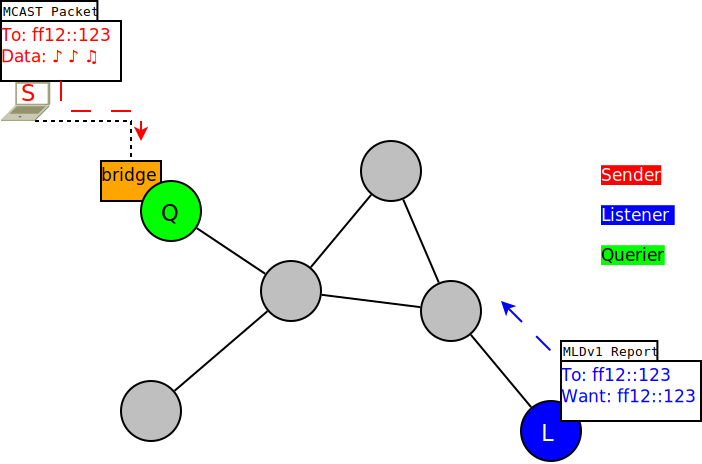
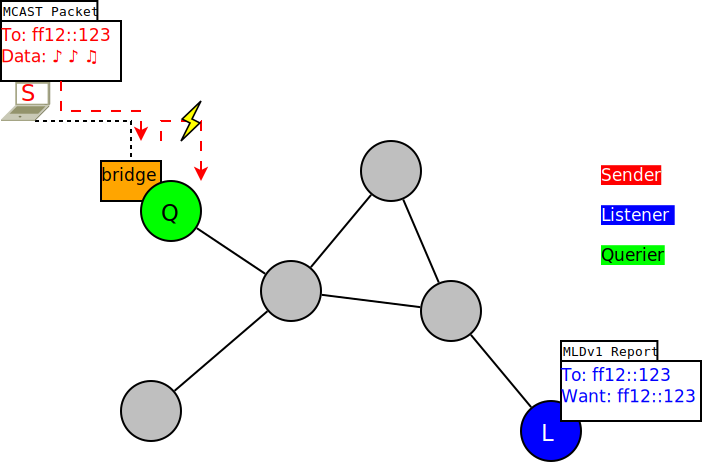
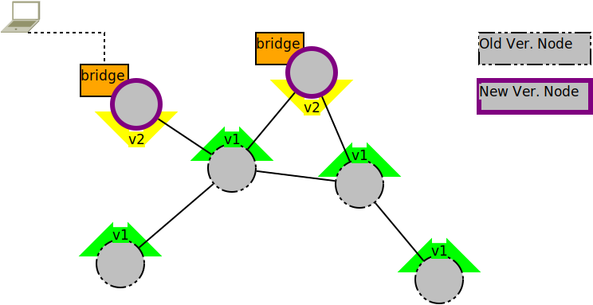
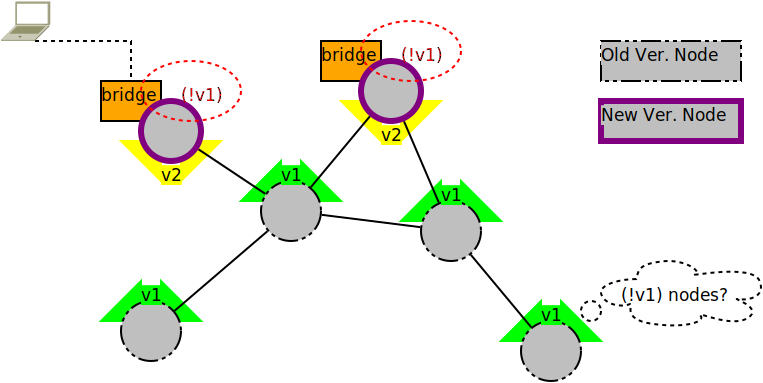
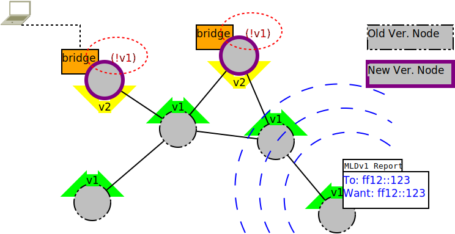
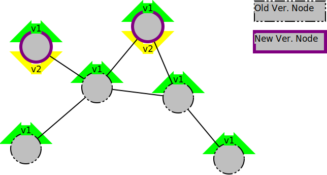

Multicast Optimizations - Considerations for IGMP/MLD Reports
=============================================================

Scenario
--------

|image0|

*A multicast listener announcing it's presence via a MLDv1 report*

Hosts wanting to receive multicast traffic of a specific group announce
this via IGMP/MLD reports. This way multicast routers and snooping
switches/bridges are able to learn where which multicast packets are
wanted.

Goals
~~~~~

-  Preventing packetloss on bridges (once multicast-bridge-support is
   implemented)

The Problem
~~~~~~~~~~~

-  MLD/IGMP reports not arriving at bridges, bridges dropping multicast
   packets

The destination address of MLDv1/IGMPv2 reports (in this example
"ff12::123") is usually one a multicast router or snooping switch/bridge
is not listening to: They are not able to actively join every possible
multicast group. So only checking the multicast addresses in the
translation table and forward the report to nodes matching the
destination address would not be enough in the scenario described above.
Node L needing to send a report after the querier (here: on the node
with the bridge) asked for it would simply drop the report.

|image1|

*Neither the Querier nor the Sender are listening to "ff12::123"*

This in turn would result in the bridge not forwarding the multicast
data from the sender behind its bridge port even though a listener
exists:

|image2|

*Bridge dropping packets bc. of missing reports*

Note that even though MLDv2/IGMPv3 require listeners to report to the
all-multicast-routers destination address (ff02::16, 224.0.0.22) the
querier implementation in the Linux bridge code does not listen to them
which creates the same problem as with MLDv1/IGMPv2.
`RFC4541 <https://tools.ietf.org/html/rfc4541>`__ ("Considerations for
Internet Group Management Protocol (IGMP) and Multicast Listener
Discovery (MLD) Snooping Switches") leaves it open whether snooping
switches/bridges (with or without a querier) should listen to the
all-multicast-routers destination address.

Solution
~~~~~~~~

Flooding Report Messages
^^^^^^^^^^^^^^^^^^^^^^^^

One easy approach is to simply flood multicast reports to all other
batman-adv nodes.

*Advantages:*

* Simplicity:

  - No multicast query snooping needed, only multicast report snooping
  - No state for querier

*Disadvantages:*

* Multicast report overhead for every node (both throughput and
  memory)
* Might cause issues for switches if more than 4k hosts on the
  network: Usually the MAC table of hardware switches only allows up to
  4k clients (there are batman-adv networks with 1.5k hosts already).
* Central querier(s)

(Yet another simple approach to tackle these disadvantages could be
through segmenting the IGMP/MLD domain. The OpenWRT-based firmware
framework "Gluon", aiming at wireless community mesh networks, currently
has a patchset for this pending:
https://github.com/freifunk-gluon/gluon/pull/402)

--------------

Side note 1: Why does the current implementation without bridge support have no such issues?
^^^^^^^^^^^^^^^^^^^^^^^^^^^^^^^^^^^^^^^^^^^^^^^^^^^^^^^^^^^^^^^^^^^^^^^^^^^^^^^^^^^^^^^^^^^^

There are usually two parties interested in multicast listener reports.
For one thing, bridges ("software switches") and snooping switches
(enterprise hardware switches). For another thing, multicast routers
want IGMP/MLD reports. If the former, a bridge, exists then multicast
optimizations are disabled at the moment, so the issue can't occure. For
the latter, reports to multicast routers, let's consider the following
two cases:

a) Multicast listeners joining a link-local address
b) Multicast listeners joining a non-link-local address

Multicast routers need reports to learn and tell other routers about
multicast traffic their part of the network is interested in. Link-local
multicast is not routed, so multicast routers aren't actually interested
in reports of case a). For b), the current implementation in batman-adv
is flooding multicast packets with a routable destination everywhere
unconditionally. IGMPv2/MLDv1 reports for routable traffic have a
routable multicast destination, so every node and therefore any
potential multicast router will receive them.

Side note 2: Compatibility Concerns
^^^^^^^^^^^^^^^^^^^^^^^^^^^^^^^^^^^

As described above, while there is no issue for the current
implementation as is it faces compatibility issues with any upcoming
bridge integration. Bridged nodes need to be able to rely on any other
node, including non-bridged / "old" ones, to forward its own reports
properly.

To avoid packet loss, bridged nodes will force any old node to hand over
any reports. This is done by increasing the multicast tvlv version
number to two:

|image3|

*Mesh consisting of both old (mcast tvlv v1) and new (mcast tvlv v2)
nodes*

From the perspective of an old node with insufficient report handling
and multicast tvlv version one the bridged node will then appear to be
incapable of announcing its own listeners.

|image4|

*An old node looking for nodes without an mcast v1 tvlv*

The old node will turn off its own multicast optimizations and flood any
multicast packet, including reports:

|image5|

*An old node flooding its reports*

To avoid regressions for non-bridged setups currently relying on
multicast optimizations, the following is done: Any node *without* a
bridge but capable of proper report handling will register both a
multicast tvlv version one and two:

|image6|

*A mesh without bridges: New nodes announcing both v1 and v2*

