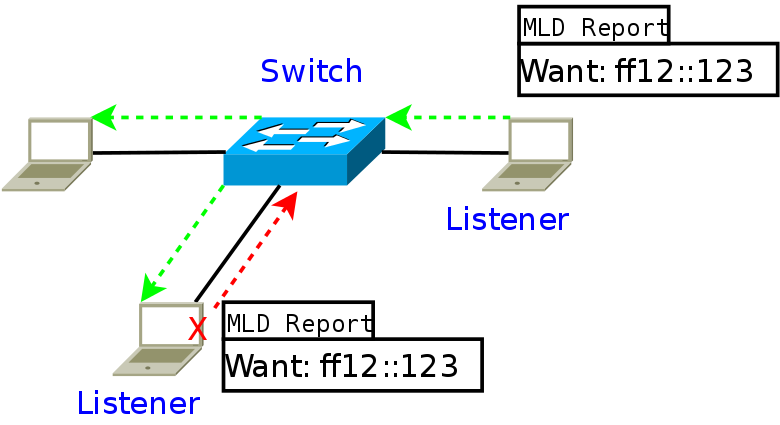
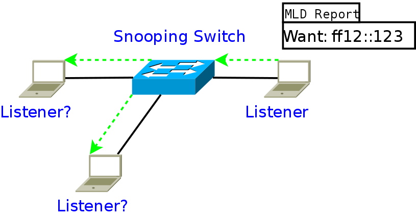
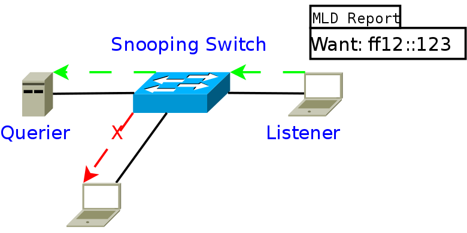
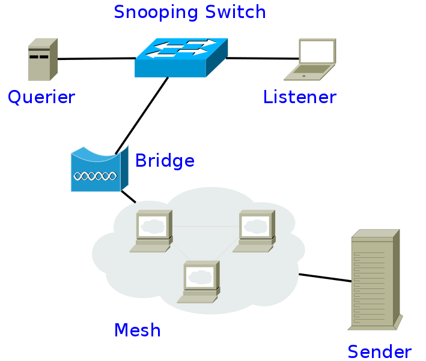
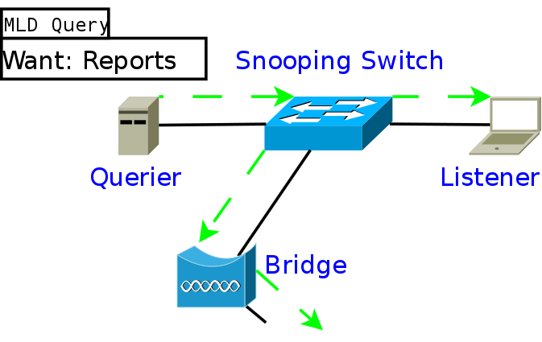
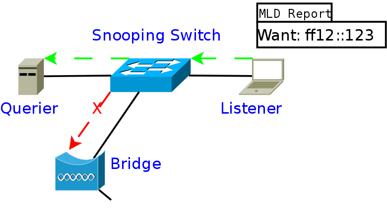
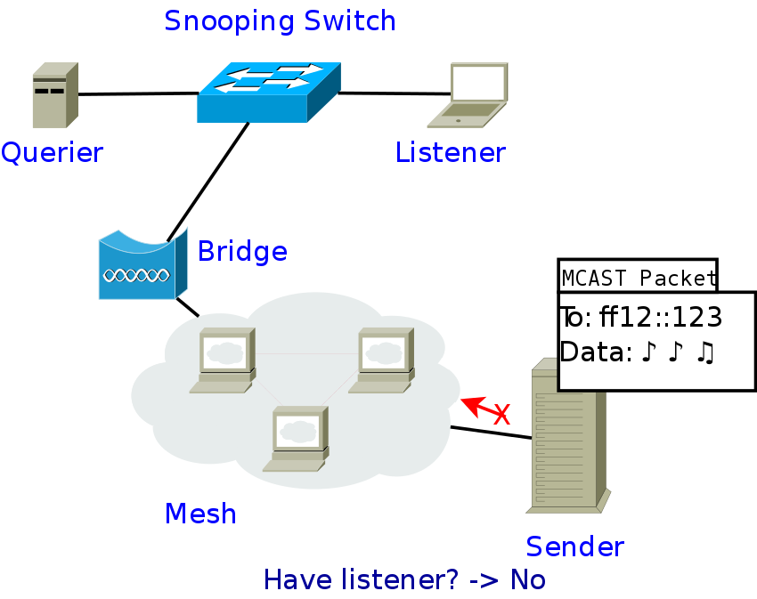
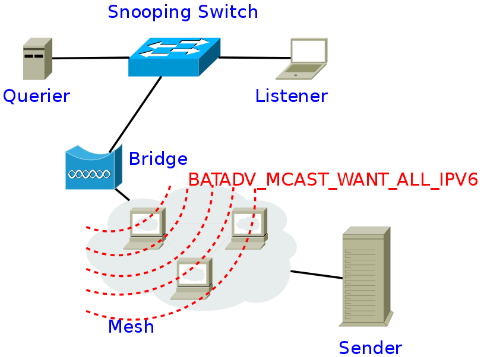
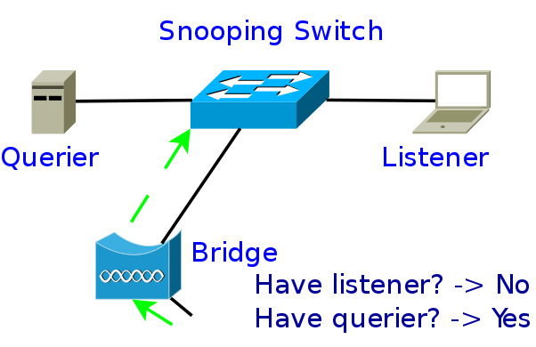
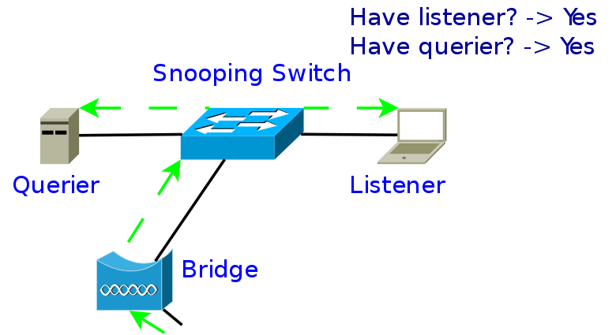

Multicast Optimizations – IGMP/MLD Report Suppresion
====================================================

Prior Readings:

| \* [[multicast-optimizations\|Multicast Optimizations]]
| \* [[multicast-optimizations-tech\|Multicast Optimizations – Technical
  Description]]
| \* [[multicast-optimizations-flags\|Multicast Optimizations – Flags
  Explained]]

Scenario
--------

|image0|

*A Querier behind a bridge potentially shadowing a multicast listener*

When an IGMP or MLD Querier is not run on a batman-adv node directly but
instead on a foreign device behind a bridge then reports from multicast
listeners behind that bridge might potentially only reach the querier
but not the bridge / batman-adv node.

Cause: Report Suppression
-------------------------

The reason for this is a mechanism called "Report Suppression", defined
by standards of MLD and IGMP in their old version (MLDv1, IGMPv1,
IGMPv2):

|image1|

\* IGMPv2: `RFC2236 <https://tools.ietf.org/html/rfc2236>`__, section 3:

> [...] If the host receives another host's Report (version 1 or 2)
while it has a timer running, it stops its timer for the specified group
and does not send a Report, in order to suppress duplicate Reports.
[...]

\* MLDv1: `RFC2710 <https://tools.ietf.org/html/rfc2710>`__, section 4:

> If a node receives another node's Report from an interface for a
multicast address while it has a timer running for that same address on
that interface, it stops its timer and does not send a Report for that
address, thus suppressing duplicate reports on the link.

This on its own, not getting to know all listeners behind a bridge port,
is not an issue as such as a batman-adv node would receive the according
listener reports from a single listener behind a bridge port at least
which would be sufficient.

However, if snooping switches were simply flooding such listener
reports, then they themselves would not be able to notice all listeners
anymore:

|image2|

Therefore another RFC mandates an additional report suppression for
snooping switches:

|image3|

\* `RFC4541 <https://tools.ietf.org/html/rfc4541>`__, section 2.1.1.1)

> A snooping switch should forward IGMP Membership Reports only to those
ports where multicast routers are attached. [...]

Which in turn can potentially lead to a batman-adv node not receiving
any MLD/IGMP report for a certain multicast address from a bridge port
even though a listener behind that port exists. For instance in the
following scenario:

Report Suppression in a Mesh
----------------------------

|image4|

| \* ***Querier:*** An IGMP or MLD querier (i.e. a multicast router
  requesting IGMP/MLD Reports)
| \* ***Snooping Switch:*** A multicast aware layer 2 switch
| \* ***Listener:*** An IPv4 or IPv6 multicast listener (using IGMPv1,
  IGMPv2 or MLDv1)
| \* ***Bridge:*** A Linux kernel bridge on top of a bat0 device of a
  batman-adv node
| \* ***Mesh:*** A mesh network consisting of batman-adv nodes
| \* ***Sender:*** An IPv4 or IPv6 multicast sender

#. In the beginning the selected querier sends its query message to all
   hosts and therefore through the whole mesh, asking any multicast
   listener to reval themselves:
   |image5|
#. The listener behind the snooping switch will respond, but as
   previously described, the snooping switch will only forward this
   report to the querier:
   |image6|
#. The batman-adv node will not receive the report on its according
   bridge and therefore is not able to detect the listener. Any other
   node in the mesh, including the multicast sender is not able to sense
   this listener either:
   |image7|

The Solution
------------

Therefore batman-adv has to not only forward multicast packets to the
according listeners, but also IGMP/MLD Queriers (regardless of their
version) behind bridges – even if the multicast packets actually have a
link-local scope and therefore will never be routed on layer 3.

#. A batman-adv node noticing an IGMP/MLD Querier *behind* its bridge
   (i.e. by snooping the query message shown above) signalizes this by
   setting the
   BATADV\_MCAST\_WANT\_ALL\_IPV4/BATADV\_MCAST\_WANT\_ALL\_IPV6
   multicast TVLV flag accordingly:
   |image8|
#. The multicast sender is now able to have its multicast packet
   forwarded to the batman-adv node with this flag set even though it
   did not notice any according multicast listener:
   |image9|
#. The receiving batman-adv node will decapsulate and forward the
   multicast frame to its Linux bridge. The Linux bridge, which has
   snooping support too, will forward the frame even though it did not
   sense the listener either. Similar to batman-adv only having sensed
   the querier, the Linux bridge will forward towards the sensed,
   selected querier as well:
   |image10|
#. The snooping switch on the other hand was able to detect the querier
   and the listener and will therefore forward the frame to both:
   |image11|

Since the active, selected Querier is the root of a tree for all
IGMPv1/IGMPv2/MLDv1 Listener Reports, the solution described above will
ensure despite suppression mechanisms that all multicast listeners will
receive the multicast packets they signed up for.

Although we are not supporting bridges yet, the recognition of this flag
on the sender side was implemented already to avoid a future
compatibility break.

.. |image0| image:: basic-multicast-snoopables-shadowing-querier.png

.. |image9| image:: basic-multicast-querier-want-#1.png

