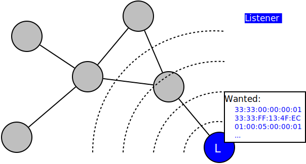
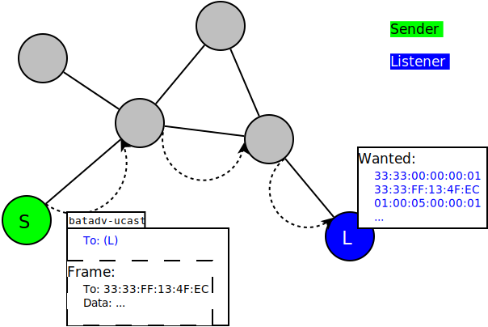

Multicast Optimizations – Technical Description
===============================================

Prior Readings:

\* :doc:`Multicast Optimizations <Multicast-optimizations>`

Multicast Listener Announcements
--------------------------------

|image0|

The IPv4/IPv6 multicast code in the Linux kernel keeps track of any of
its applications requesting to receive multicast packets for a certain
group.

batman-adv queries this local database and announces these so called
multicast listeners, more precisely the according multicast MAC
addresses, to the rest of the mesh network via the
:doc:`translation table infrastructure </open-mesh/2012-05-13-translation-table-in-a-nutshell>`.

Multicast TVLV
--------------

A node capable of performing Multicast Listener Announcements signalizes
this by attaching a Multicast TVLV to its OGMs.

Multicast TVLV format
~~~~~~~~~~~~~~~~~~~~~

::

     0                   1                   2                   3
     0 1 2 3 4 5 6 7 8 9 0 1 2 3 4 5 6 7 8 9 0 1 2 3 4 5 6 7 8 9 0 1 2
     +-+-+-+-+-+-+-+-+-+-+-+-+-+-+-+-+-+-+-+-+-+-+-+-+-+-+-+-+-+-+-+-+
     | MCAST Flags   |                 Reserved                      | 
     +-+-+-+-+-+-+-+-+-+-+-+-+-+-+-+-+-+-+-+-+-+-+-+-+-+-+-+-+-+-+-+-+

BATADV\_MCAST\_WANT\_ALL\_UNSNOOPABLES (Bit 0):
^^^^^^^^^^^^^^^^^^^^^^^^^^^^^^^^^^^^^^^^^^^^^^^

Signalizes that this node wants all unsnoopable multicast traffic, that
is traffic destined to the all-nodes address for IPv6 (ff02::1) and to
link-local addresses for IPv4 (224.0.0.0/24). This is usually the case
when a node uses a bridge device on top of bat0 and is therefore unable
to detect potential bridged-in listeners.

(not used by listeners yet, but implemented for senders already to
ensure backwards compatibility later, see
:ref:`Multicast-optimizations-flags#BATADV\_MCAST\_WANT\_ALL\_UNSNOOPABLES <batman-adv-Multicast-optimizations-flags-BATADV\_MCAST\_WANT\_ALL\_UNSNOOPABLES>`
for details)

BATADV\_MCAST\_WANT\_ALL\_IPV4 (Bit 1):
^^^^^^^^^^^^^^^^^^^^^^^^^^^^^^^^^^^^^^^

Signalizes that this node wants all IPv4 multicast traffic. This is
usually the case when a node uses a bridge device on top of bat0, has an
IGMP querier (no matter if IGMPv2 or IGMPv3) behind it and is therefore
not able to reliably determine all of its IGMPv2 listeners.

(not used by listeners yet, but implemented for senders already to
ensure backwards compatibility later, see
:ref:`multicast-optimizations-flags#BATADV\_MCAST\_WANT\_ALL\_IPV4-BATADV\_MCAST\_WANT\_ALL\_IPV6 <batman-adv-Multicast-optimizations-flags-BATADV\_MCAST\_WANT\_ALL\_IPV4-BATADV\_MCAST\_WANT\_ALL\_IPV6>`
for details)

BATADV\_MCAST\_WANT\_ALL\_IPV6 (Bit 2):
^^^^^^^^^^^^^^^^^^^^^^^^^^^^^^^^^^^^^^^

Signalizes that this node wants all IPv6 multicast traffic. This is
usually the case when a node uses a bridge device on top of bat0, has an
MLD querier (no matter if MLDv1 or MLDv2) behind it and is therefore not
able to reliably determine all of its MLDv1 listeners.

(not used by listeners yet, but implemented for senders already to
ensure backwards compatibility later, see
:ref:`multicast-optimizations-flags#BATADV\_MCAST\_WANT\_ALL\_IPV4-BATADV\_MCAST\_WANT\_ALL\_IPV6 <batman-adv-Multicast-optimizations-flags-BATADV\_MCAST\_WANT\_ALL\_IPV4-BATADV\_MCAST\_WANT\_ALL\_IPV6>`
for details)

Bits 3 to 7:
^^^^^^^^^^^^

reserved for future extensions

Multicast Sender
----------------

|image1|

Optimization for IPv4 or IPv6 multicast packets is performed by
considering a few special cases. First, the number of nodes interested
in a group is counted. Interest has been announced by either including
the multicast group in TT entries, or setting the
BATADV\_MCAST\_WANT\_ALL\_IPV4 or BATADV\_MCAST\_WANT\_ALL\_IPV6 flags
or the BATADV\_MCAST\_WANT\_ALL\_UNSNOOPABLES flag in case of
unsnoopable ranges in the Multicast TVLV flag.

If the total number of nodes interested in a group is:

* ... 0, then this frame can be safely dropped.
* ... 1, then this frame is encapsulated in and forwarded via a
  batman-adv unicast packet to the according destination.
* > 1, then this frame is encapsulated in a batman-adv broadcast
  packet and forwarded via classic flooding to all nodes.

The latter case is the general fallback to broadcast, which is also used
when the the multicast optimization is turned off.

Handling rules depending on multicast address
~~~~~~~~~~~~~~~~~~~~~~~~~~~~~~~~~~~~~~~~~~~~~

Depending on the IP destination of the multicast packet and the flags of
other nodes, there are various limitations and exceptions. If multicast
optimization is not supported for whatever reason, the packets will be
sent as broadcast as a fallback solution.

.. list-table::
   :stub-columns: 1
   :header-rows: 2

   * - address range
     - address family
     - address family
   * - 
     - IPv4
     - IPv6
   * - all nodes link-scope
     - supported without bridges¹
       Example: 224.0.0.1 (all nodes)
     - supported without bridges¹
       Example: ff02::1 (all nodes)
   * - link-local
       (excl. all nodes addr.)
     - supported without bridges¹
       Example: 224.0.0.251 (mDNS)
     - supported²
       Example: ff12::39 (locally administrated)
   * - routable
     - support planned³
       Example: 239.1.2.3 (locally administrated)
     - support planned³
       Example: ff0e::101 (NTP)

¹: These addresses cannot be considered for optimization towards nodes
which have a bridge interface on top of their batman interface as they
are not snoopable. See
:ref:`multicast-optimizations-flags#BATADV\_MCAST\_WANT\_ALL\_UNSNOOPABLES <batman-adv-Multicast-optimizations-flags-BATADV\_MCAST\_WANT\_ALL\_UNSNOOPABLES>`
for details.

²: In bridged scenarios, an IGMP/MLD querier needs to be present in the
mesh. Also, a 3.17 kernel or newer is required.

³: Routable multicast addresses are not supported yet. See
:ref:`multicast-optimizations-tech#routable-multicast-addresses <batman-adv-Multicast-optimizations-tech-routable-multicast-addresses>` for
details.

For details on IPv4 and IPv6 multicast address ranges check out this
detailed article on
`Wikipedia <https://en.wikipedia.org/wiki/Multicast_address>`__.

.. _batman-adv-multicast-optimizations-tech-routable-multicast-addresses:

Routable multicast addresses
~~~~~~~~~~~~~~~~~~~~~~~~~~~~

For routable multicast addresses, further consideration has to be given:
The according multicast packets not only need to be forwarded to any
multicast listener on the local link, but to any multicast router, too.
Otherwise off-link listeners, which are only reachable via a layer 3
multicast router, would not receive these multicast packets anymore. To
be on the safe side, batman-adv currently simply floods these address
ranges. To support these address ranges later, too, `Multicast Router
Discovery <https://tools.ietf.org/search/rfc4286>`__ needs to be
implemented in batman-adv (which was not done yet).

Limitations
-----------

* groups with two or more listeners don't get optimized
* the whole mesh must have multicast support enabled
* optimization for traffic of scope greater than link-local (routable
  addresses) is not supported yet
* optimization for link-local IPv4 (224.0.0.0/24) or all-nodes IPv6
  multicast (ff02::1) is only done if no node announces
  BATADV\_MCAST\_WANT\_ALL\_UNSNOOPABLES, that is no node configures a
  bridge on batman-adv.
* high multicast join/leave latency in setups with slow OGM intervals
* no awareness for source-specific multicasts
* multcast packets over VLANs are always flooded

Next Steps / Roadmap
--------------------

* optimization for groups with two or more members:

  - many-to-some: implement batman-adv multicast packet type
    supporting a list of destination addresses (to reduce ICMPv6 overhead
    like Neighbor Solicitation Messages, Router Solicitation Messages, MLD
    Reports, ...)
  - some-to-many / streaming: implement path tracking and use these
    patches (see :doc:`Multicast-ideas-updated <Multicast-ideas-updated>`)

* implement `Multicast Router
  Discovery <https://tools.ietf.org/search/rfc4286>`__ to support scopes
  greater than link-local, too
* implement some faster listener roaming mechanism for bridged in
  hosts (for instance announce (multicast-address, source address) pairs
  and use general TT roaming mechanism)
* perform multicast listener adition/reduction via TT immediately
  instead of every OGM interval to reduce join/leave latency in setups
  with a slow OGM interval
* implement source-specific multicast in Linux bridge and batman-adv
* multicast TT announcements and forwarding have to be performed per
  VLAN
* ...

Further Readings
----------------

-  :doc:`Multicast Optimizations – Flags Explained <Multicast-optimizations-flags>`

