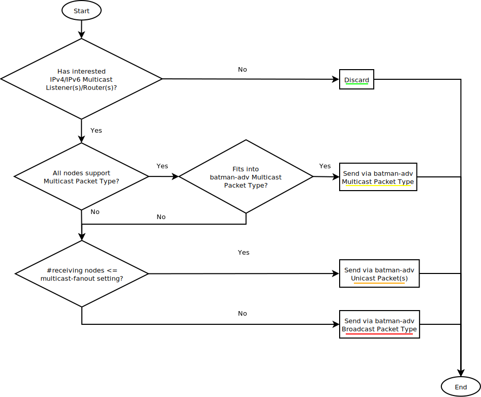
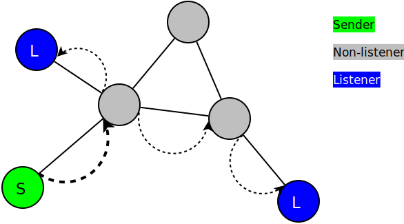

.. SPDX-License-Identifier: GPL-2.0

=======================
Multicast Optimizations
=======================

.. image:: Multicast.svg

`Multicast <https://en.wikipedia.org/wiki/Multicast>`__ allows to
transmit data to a group of receivers, unlike unicast which transmits to
just one receiver and broadcast which transmits to everyone. Multicast
is used for applications like IPTV, internet radio or group
communication and more. Also IPv6 relies on multicast for its basic
services.

Without optimization, switches (including batman-adv) typically
implement multicast as broadcast. If everyone gets the packet, all group
members get it too. Consequently, all layer 2 switches are multicast
capable, but that comes with a cost: Even if there are only a few
multicast listeners interested, the whole mesh network is unnecessarily
bothered with these multicast packets. Considering that broadcast
transmissions are particularly expensive operations on WiFi in general
and wireless mesh networks (in terms of bandwidth) reducing the amount
of multicast traffic by only forwarding traffic to its multicast group
members will greatly improve performance for these services.

The first step in optimizing multicast is to find out who is in which
multicast group. Fortunately, IP multicast provides mechanisms to learn
about the presence and number of these so called multicast listeners.
This is interesting for layer 3 IP multicast routers, but also
professional layer 2 switches make use of this to reduce multicast
overhead, advertising these products as “multicast aware” or “IGMP/MLD
snooping switches”.

In the field observations revealed that a typical multicast session is
actually only having one, two or even zero hosts interested in it.
Therefore, optimizing these cases is the first step, with more
sophisticated optimizations to be implemented later.

Overview
========

The current multicast optimizations in batman-adv provide a basic
infrastructure for multicast awareness. So far, this optimization
reduces overhead for IPv4/IPv6 packets through the following forwarding
decisions on the initial hop:

A) No multicast listener/router: Discard
----------------------------------------

.. image:: basic-multicast-no-receiver.svg

batman-adv detects whether there are any potential IPv4/IPv6 multicast
listeners or multicast routers interested in traffic to the given
multicast destination address. If not then the packet is never forwarded
into the mesh network.

B) batman-adv multicast packet
------------------------------

If all nodes support the :doc:`batman-adv multicast packet type <Multicast-Packet-Type>`
and encapsulating the IP packet in it, with all its
destination node entries included, would fit into a 1280 bytes frame
(excluding outer ethernet frame header) then this packet type is chosen
for forwarding.

C) batman-adv unicast packet(s)
-------------------------------

.. image:: basic-multicast-multiple-receivers.svg

If the batman-adv multicast packet type cannot be used and if there is
an amount of interested multicast listeners/routers smaller or equal to
the (configurable) multicast-fanout parameter (default: 16) then the
packet is forwarded via individual unicast transmissions.

Limitations
-----------

In the following cases multicast packets are still distributed via
:doc:`classic flooding <Broadcast>`:

* If the multicast packet/frame is not an IPv4/IPv6 packet
* If the :doc:`batman-adv multicast packet type <Multicast-Packet-Type>` is
  not applicable
* If there are more than #multicast-fanout (default: 16)
  listeners/routers for a specific multicast group.

Additionally, in *bridged* scenarios multicast packets are still flooded
in the following cases:

* If there is no IGMP/MLD querier.
* If the packet has an IPv4 multicast destination.
* If the IPv6 multicast destination is ff02::1.

How to deactivate the multicast optimizations?
==============================================

By default multicast optimizations are activated. You can force the old
behaviour, :doc:`classic flooding <Broadcast>` of all multicast frames, on a
certain node via the following command, executed as root (here: bat0):

::

  batctl meshif bat0 multicast_forceflood 1

Note: This only affects multicast traffic originating from this specific
node.

How to tune the multicast fanout limit?
=======================================

By default the multicast fanout limit is 16. You can change this limit
via:

::

  batctl meshif bat0 multicast_fanout <num>

Note: This only affects multicast traffic originating from this specific
node.

Further Readings
================

* :doc:`Multicast Optimizations – Technical Description <Multicast-optimizations-tech>`
* :doc:`Multicast Optimizations – Flags Explained <Multicast-optimizations-flags>`
