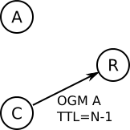

Network Coding: technical documentation
=======================================

When forwarding packets in a wireless mesh network, airtime can be saved
by exploiting the information already present at the destinations of a
forward. One way of doing this is *Network Coding*, where two packets
are XOR'ed together before transmission. To extract one of the included
packets, the destination must simply XOR the network coded packet with
the other included packet:

::

      (p1 XOR p2) XOR p2 = p1

For more information about the concept, read the
:doc:`NetworkCoding introduction <NetworkCoding>`.

Implementation Details
----------------------

The implementation is based on 5 steps:

#. **Detect neighbors that are in range of each other**: This enables
   the relay to determine if a neighbor is likely to overhear packets
   from another neighbor.
#. **Hold back unicast packets before forwarding**: To get two packets
   to code, one must be buffered until the next arrives.
#. **Code and transmit combined packets**: This step searches the buffer
   with packets to be forwarded and checks if the destinations will be
   able to decode.
#. **Save overheard and transmitted packets**: To decode a a packet, the
   receiver must know one of the two combined packets, which can either
   originate from the receiver itself or be sniffed from another
   neighbor.
#. **Receive and decode network coded packets**: When receiving a coded
   packet, the overheard and saved packets are searched for the packet
   needed to decode.

Each step is explained in detail in the following sections.

1. Detect neighbors in range of each other
~~~~~~~~~~~~~~~~~~~~~~~~~~~~~~~~~~~~~~~~~~

A relay node exploits the TTL field of OGMs to detect when two neighbors
are in range of each other:

Node A emits an OGM, which is received by Node C and Node R.

|image0|

Node C decreases the TTL retransmits the OGM from Node A. The OGM is
again received by Node R, who compare the TTL of the two received OGMs.

> |image1|

If the difference if only 1, Node R can conclude that Node C is in range
of Node A.

2. Hold back unicast packets before forwarding
~~~~~~~~~~~~~~~~~~~~~~~~~~~~~~~~~~~~~~~~~~~~~~

Whenever a unicast packet is ready to be forwarded, it is passed to the
network coding system, where it added to a buffer (only if not coded
with an already existing packet). The buffer is organized as a hash
table with entries of src-dst pairs. Each entry has a linked list with
packets that all come from a specific previous hop and are directed to a
specific next hop (which is decided by the routing part of batman-adv).
The linked list works as a FIFO:

|image2|

A worker function traverses the list periodically and transmits timed
out packets. The timeout is by default 10ms.

3. Code and transmit combined packets
~~~~~~~~~~~~~~~~~~~~~~~~~~~~~~~~~~~~~

Before adding packets to the forward buffer, the buffer is searched for
opportunities to network code. The algorithm to find such opportunities
takes its starting point in the packet currently being added to the
buffer, say /p1/:

#. The destination of a potentially network coded packet must be in
   range of the **source** of /p1/, so we loop nodes in range of the
   source of /p1/.
#. Since we also need the **destination** of /p1/ to be in range of
   another node, we loop the nodes that the destination is in range of.
#. For each pair of nodes in the two loops, we check of buffered packets
   and network code if any.

4. Save overheard and transmitted packets
~~~~~~~~~~~~~~~~~~~~~~~~~~~~~~~~~~~~~~~~~

To be able to decode network coded packets, a node must possess one part
of the coded packet. This is achieved by buffering both packets
originating at the node and packets overheard by the node. The buffer is
structured in the same way as the forward buffer in step 2, which makes
is fast to search for decoding packets. To overhear packets from other
nodes, the wireless interface must be put in promiscuous mode.

5. Receive and decode network coded packets
~~~~~~~~~~~~~~~~~~~~~~~~~~~~~~~~~~~~~~~~~~~

To transmit a network coded packet to two destinations, the address of
the additional receiver is put the batman-adv header, and thus this
receiver is required to use promiscuous mode. Furthermore, the header
contains information needed to identify the id of the original packets
contained in the network coded packet.

To identify the packet needed to decode, the receiver uses the source of
the network coded packet, and a field in the header with the address of
the sender of the original packet. These addresses are used to create a
src-dst pair, which is used to locate the correct entry in the hash
table, in which the packet list is searched for a matching CRC, which is
also given in the header of the network coded packet.

When the needed packet is located, its data is XOR'ed with the network
coded packet, and the original unicast header is restored so that it can
be processed as usual by batman-adv.

Packet Format
-------------

The header of a coded packet is rather large, as it has to carry the
information needed to identify the packet needed to decode and restore
the headers of the two decoded unicast packets:

::

      0                   1                   2                   3
      0 1 2 3 4 5 6 7 8 9 0 1 2 3 4 5 6 7 8 9 0 1 2 3 4 5 6 7 8 9 0 1
     +-+-+-+-+-+-+-+-+-+-+-+-+-+-+-+-+-+-+-+-+-+-+-+-+-+-+-+-+-+-+-+-+
     | Packet Type   |    Version    |   First TTL   |  First TTVN   |
     +-+-+-+-+-+-+-+-+-+-+-+-+-+-+-+-+-+-+-+-+-+-+-+-+-+-+-+-+-+-+-+-+
     |                         First Source                          |
     +-+-+-+-+-+-+-+-+-+-+-+-+-+-+-+-+-+-+-+-+-+-+-+-+-+-+-+-+-+-+-+-+
     |         First Source          |    First Orig Destination     |
     +-+-+-+-+-+-+-+-+-+-+-+-+-+-+-+-+-+-+-+-+-+-+-+-+-+-+-+-+-+-+-+-+
     |                    First Orig Destination                     |
     +-+-+-+-+-+-+-+-+-+-+-+-+-+-+-+-+-+-+-+-+-+-+-+-+-+-+-+-+-+-+-+-+
     |                          First CRC32                          |
     +-+-+-+-+-+-+-+-+-+-+-+-+-+-+-+-+-+-+-+-+-+-+-+-+-+-+-+-+-+-+-+-+
     |  Second TTL   | Second TTVN   |      Second Destionation      |
     +-+-+-+-+-+-+-+-+-+-+-+-+-+-+-+-+-+-+-+-+-+-+-+-+-+-+-+-+-+-+-+-+
     |                       Second Destination                      |
     +-+-+-+-+-+-+-+-+-+-+-+-+-+-+-+-+-+-+-+-+-+-+-+-+-+-+-+-+-+-+-+-+
     |                         Second Source                         |
     +-+-+-+-+-+-+-+-+-+-+-+-+-+-+-+-+-+-+-+-+-+-+-+-+-+-+-+-+-+-+-+-+
     |        Second Source          |    Second Orig Destination    |
     +-+-+-+-+-+-+-+-+-+-+-+-+-+-+-+-+-+-+-+-+-+-+-+-+-+-+-+-+-+-+-+-+
     |                    Second Orig Destination                    |
     +-+-+-+-+-+-+-+-+-+-+-+-+-+-+-+-+-+-+-+-+-+-+-+-+-+-+-+-+-+-+-+-+
     |                          Second CRC32                         |
     +-+-+-+-+-+-+-+-+-+-+-+-+-+-+-+-+-+-+-+-+-+-+-+-+-+-+-+-+-+-+-+-+
     |        Coded Length           |          Payload ...          |
     +-+-+-+-+-+-+-+-+-+-+-+-+-+-+-+-+-+-+-+-+-+-+-+-+-+-+-+-+-+-+-+-+

Explanations of each field:

-  header: The usual header required for all batman-adv packets. It has
   the TTL of the first of the two combined packets.
-  first\_ttvn: Version number of the used translation table for the
   first combined packet.
-  first\_source: Address of the node who sent the first of the two
   combined packets to the relay.
-  first\_orig\_dest: Address of the originator that the first of the
   two combined packets should to routed to.
-  first\_crc: CRC checksum of the first of the two combined packets.
-  second\_ttl: TTL of the second combined packets.
-  second\_ttvn: TTVN of the second combined packets.
-  second\_dest: Address of the second of the two nodes that should
   receive this packet.
-  second\_source: Address of the node who sent the second of the two
   combined packets to the relay.
-  second\_orig\_dest: Address of the originator that the second of the
   two combined packets should to routed to.
-  second\_crc: CRC checksum of the second of the two combined packets.
-  coded\_len: Length of the shortest of the two combined packets.

A field "first\_dest" (address of the first receiver of the network
coded packet) is not needed because it is already present in the mac
header following the network coding header.

The header can be logically divided into two main parts: One part for
each of the combined packets. For each packet, the header specifies the
destination (although the first destination is given in the MAC header),
the previous source, the final originator destination and a CRC32
checksum of the packet.

To identify the packet needed to decode the network coded packet, the
receiver must reconstruct a unique identifier, consisting of source,
destination and packet checksum, from the received network coded packet.
The first field (source) is the original source, which is given as
either first\_source of second\_source in the header. The second field
(destination) is the source of the relay, which is found as the source
field in the MAC header. The third field (checksum) is found as either
first\_crc or second\_crc in the header of the network coded packet.

After identifying the right packet and decoding, the receiver
reconstructs the original unicast header with the fields from the
network coded header. E.g. mac\_dest, mac\_src, ttl, ttvn, orig\_dest.

The field coded\_len is needed when the packets of different length are
network coded, as only a part of the resulting packet will actually be
coded. The coded\_len field tells the receiver the length of the
shortest combined packet, as the receiver of this only knows the length
of the longer packet.

Todo
----

There are few ideas that could make the implementation of network coding
perform even better:

-  Support setups with multiple interfaces. (Need to make sure that
   nc\_nodes are on the same interface.)
-  Configure interfaces to promiscuous mode automatically.
-  Hold back packets only if the network is congested.
-  Determine allowed holding times based on the tick time of the system.
-  Support fragmented unicast packets.
-  Construct a better algorithm to select which receiver to put in the
   MAC header destination field (weighted TQ).

Limitations
-----------

Although network coding can provide a significant gain in throughput,
there are a few limitations, which should be known:

-  To see a gain, two flows must intersect at a relay, who can network
   code packets.
-  Relays hold back packets for up to 10 ms to wait for other packets to
   be coded.

.. |image0| image:: ogm_step1.png

