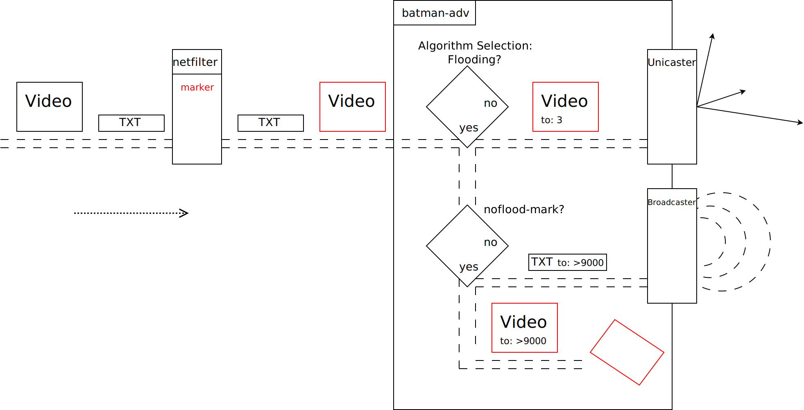

Prior Readings:

* :doc:`Broadcasts in B.A.T.M.A.N. Advanced <Broadcast>`

“Noflood”-mark: Broadcast Flood Prevention
==========================================

|image0|

B.A.T.M.A.N. Advanced tries to forward a multicast frame via one of its
non-flooding features first. If none of them is applicable then
batman-adv falls back to *classic flooding*.

However, with some applications dropping a packet might be more
desirable than flooding. For instance if flooding a frame would lead to
a high burden for disinterested nodes in the mesh, up to congestion in
the worst case.

The noflood mark feature allows a user to tag frames via netfilter by
custom criteria. batman-adv will then avoid flooding such frames.

Example Application
-------------------

*Video vs. Text*

|image1|

In this example we have three kinds of multicast packets:

#. *Bulky video* frames to *many* recipients
#. *Bulky video* frames to *some* recipients
#. *Slim text* messages to *many* recipients

For the small text messages we do not mind if they are flooded. However
for the bulky, high throughput video frames, we do: If they have only a
few recipients so that batman-adv can forward the frame via a few
unicast transmissions we are ok. But if the only way batman-adv could
forward them is via broadcast flooding then we would rather like to drop
the packet to avoid placing too much stress on the overall mesh.

We cannot simply block those video frames with netfilter because
netfilter does not know which algorithm batman-adv would choose.
Therefore netfilter only gives a hint by adding a specific mark to every
video frame, our cases 1) and 2). While leaving the text messages, case
3), unmarked.

In the second step batman-adv will determine how it would like to
forward the frame. Depending on the number of recipients in this example
batman-adv will either choose individual unicast transmissions or
broadcast flooding.

Finally, before broadcast flooding a frame it will check whether the
frame has a “noflood” mark set. If so then it will drop the packet
instead of flooding.

Ebtables Example
----------------

*Preventing flooding of routeable IPv6 multicast:*

::

   $ batctl noflood_mark 0x4/0x4    # VALUE/MASK
   $ ebtables -A FORWARD --logical-in br0 -o bat0 \
     -p IPv6 --ip6-dst ff02::/ff0f:: \
     -j ACCEPT
   $ ebtables -A FORWARD --logical-in br0 -o bat0 \
     -p IPv6 --ip6-dst ! ff02::/ff0f:: \
     -j mark --set-mark 0x4 --mark-target ACCEPT

The batctl command configures the value and mask batman-adv should watch
out for for the noflood feature. Here it is the third bit selected by
the mask and only if it is set then batman-adv will match and will avoid
flooding it.

The first ebtables command makes sure that link-local IPv6 multicast is
never matched for flood prevention. If this rule matches then the
firewall will hand over the frame without a mark.

The second ebtables rule marks any IPv6 multicast frame which is not a
link-local one. For instance multicast packets with a global destination
scope.

batman-adv will then drop such multicast packets with a global
destination scope if for example it is unable to distribute it via
individual unicast transmissions and would fall back to broadcast
flooding.

Crucial Multicast
-----------------

Here is a list of packet types which utilize multicast and which are
essential to establish IP communication. Unless you know exactly what
you are doing you usually should *not* set a noflood-mark on such
packets.

-  *ARP:* IPv4 address resolution
-  *DHCP:* IPv4/IPv6 address assignment
-  *ICMPv6:* esp. IPv6 address resolution + assignment (but many more)
-  *IGMP:* multicast listener announcements

