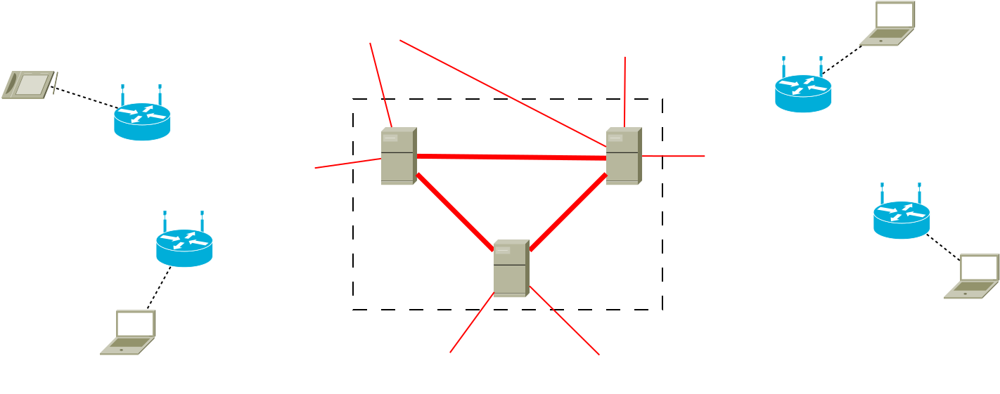

.. SPDX-License-Identifier: GPL-2.0

**WIP - WIP - WIP**

OGMv2 Permeability
==================

Goal
----

Reducing BATMAN V OGMv2 overhead in VPN connected network topologies, by
not forwarding all OGMs.

Scenario
--------

*Independent WLAN mesh clouds, interconnected by gateways via VPNs.*

Idea
----

With BATMAN V do not necessarily forward all OGMv2 messages from other
nodes, but only forward an OGMv2 if a certain, configurable amount of
sequence numbers has passed.

Over the horizon of VPN gateways a timely update should not be that
necessary.

Permeability Parameter
~~~~~~~~~~~~~~~~~~~~~~

::

  batctl <meshif bat0|hardif wlan0> permeability [0-65535]</code>

Permeability OGMv2 TVLV
~~~~~~~~~~~~~~~~~~~~~~~

With BATMAN V it is easier to drop OGMv2 messages than with BATMAN IV.
In BATMAN IV it was necessary to forward all OGMs as they were necessary
to calculate the link metric.

As is the hard limit for skipped sequence numbers would either be after
BATADV_PURGE_TIMEOUT (200s). Or BATADV_TQ_GLOBAL_WINDOW_SIZE (5)
sequence numbers, as otherwise if a mesh cloud is connected to two
gateways, this could lead to route flapping. With packetloss involved,
the potential, useable skipping range would further be reduced: 50%
packetloss -> 2.5 sequence numbers.

To allow a wider range of sequence numbers to skip a *Permeability OGMv2
TVLV* can signalize other nodes on how many sequence numbers were
skipped. This in turn allows others nodes receiving this TVLV *to adjust
their BATADV_TQ_GLOBAL_WINDOW_SIZE* for this specific originator.

Examples:

* Permeablity 0 = no TVLV/default -> global window: 5, 100% forwarded OGMv2’s
* Permeability 5 -> global window: 10, 50% forwarded OGMv2’s
* Permeability 10 -> global window: 15, 33% forwarded OGMv2’s

Downsides
~~~~~~~~~

…

Implementation
--------------

Permeability OGMv2 TVLV Format
~~~~~~~~~~~~~~~~~~~~~~~~~~~~~~

::

   <code>    0                   1                   2                   3
       0 1 2 3 4 5 6 7 8 9 0 1 2 3 4 5 6 7 8 9 0 1 2 3 4 5 6 7 8 9 0 1
      +-+-+-+-+-+-+-+-+-+-+-+-+-+-+-+-+-+-+-+-+-+-+-+-+-+-+-+-+-+-+-+-+
      | TVLV Type     | TVLV Version  | TVLV Length                   |
      +-+-+-+-+-+-+-+-+-+-+-+-+-+-+-+-+-+-+-+-+-+-+-+-+-+-+-+-+-+-+-+-+
      | Permeability                  | Reserved                      |
      +-+-+-+-+-+-+-+-+-+-+-+-+-+-+-+-+-+-+-+-+-+-+-+-+-+-+-+-+-+-+-+-+
   </code>

* Permeability: The maxmimum number of sequence numbers that were
  skipped by nodes along the OGMv2’s path.
