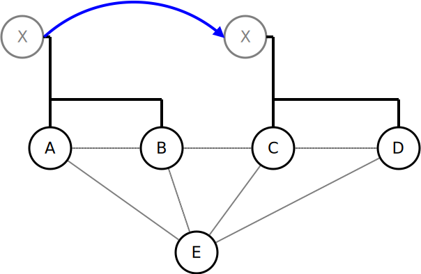

.. SPDX-License-Identifier: GPL-2.0

TT-Flags
========

*Note: This page documents internal stuff of batman-adv. It describes
the internal state representation of client entries in translation
tables. Read with care*

Flags overview
--------------

This section describes the flags used in the TT code, what they mean and
where they are used. There are 3 possible locations where the flags
field is used:

* OGM: there is a flag field within each of the tt\_change structs
  which are sent along with the OGM frames.
* tt\_global: these structs are stored in the global hash table and
  represent the mapping which originator hosts which client.
* tt\_local: these structs are stored in the local hash table and
  represent the the clients which the own node hosts.

.. list-table::
   :stub-columns: 1
   :header-rows: 1

   * - Name
     - used in
     - Description
   * - TT\_CLIENT\_DEL
     - OGM
     - The TT\_CLIENT\_DEL flag is used in the OGM tt\_change entries to distinguish whether the entry should be added (no DEL flag set) or deleted (DEL flag set).
       It is also set to pass add/deletion information between functions internally.
   * - TT\_CLIENT\_ROAM
     - OGM, tt\_global
     - The TT\_CLIENT\_ROAM flag is used to announce in an OGM tt\_change entry that a client is deleted because of roaming. The node which receives this entry may still send traffic to this node, which will re-route it to the new destination, until an OGM from the new node now hosting the client is received. The tt\_global entry with the old node for this client is then replaced with the new entry.
       Other than thise case, whenever a node receives a Roaming\_Advertisement packet, it will add a new tt\_global entry which will create a new route to this client. This tt\_global entry is marked with the TT\_CLIENT\_ROAM flag so that it can be eventually deleted if no node will claim the client afterwards (with an ADD event)
   * - TT\_CLIENT\_WIFI
     - OGM, tt\_local, tt\_global
     - The TT\_CLIENT\_WIFI flag is used to announce that this client is a WiFi client. This information is used for the AP isolation feature.
   * - TT\_CLIENT\_ISOLA
     - OGM, tt\_local, tt\_global
     - The TT\_CLIENT\_ISOLA flag is used to announce that packets sent by this client were marked with the isolation mark when received on the mesh-interface. A node receiving packets from this client has to mark the related skbs with the configured isolation mark before delivering them to its own mesh-interface. Moreover two clients marked with this flag cannot exchange packets over the mesh network (this behavior is part of the :doc:`extended isolation <Extended-isolation>`).
   * - TT\_CLIENT\_NOPURGE
     - tt\_local
     - The private TT\_CLIENT\_NOPURGE is used to mark a local client to not be purged. This is only used for the address of the mesh interface, which should always be announced and never deleted/purged.
   * - TT\_CLIENT\_NEW
     - tt\_local
     - The private TT\_CLIENT\_NEW flag is used to mark clients which have been added to the local list, but not yet announced within an OGM.
   * - TT\_CLIENT\_PENDING
     - tt\_local
     - The private TT\_CLIENT\_PENDING flag is set for local entries which should be removed. These entries are not removed immediately, but when the next OGM is sent, to keep the information sent with the OGM or tt\_requests consistent.
   * - TT\_CLIENT\_TEMP
     - tt\_global
     - This flag is used to mark a client that has not been advertised by any node yet, but it has already been detected to be part of the network.

Changes within in bridge loop avoidance II
------------------------------------------

In blaII, a tt\_global struct is extend to not only contain one
originator entry which announces the client, but a list of originators.
Each originator in this list announces the same client, which may happen
if these originators are connected to the same backbone network where
this client is located.

Mesh nodes on the same backbone gateway ignore each others tt
announcements (tt updates, roaming advertisements, etc) and can
therefore have the same local list.

This extension also affects the flag handling, which will be explained
for each flag in detail in this section.

The tt\_local as well as the tt\_global struct keep their flag fields as
before. The flags in the tt\_global struct are valid for all originators
within its list.

TT\_CLIENT\_DEL
~~~~~~~~~~~~~~~

As this flag is only used in OGM and for internal function handling,
there is no change.

TT\_CLIENT\_ROAM
~~~~~~~~~~~~~~~~

For OGM handling, there is no change - the TT\_CLIENT\_ROAM flag is sent
along with a TT\_CLIENT\_DEL flag when a client has been removed because
of roaming.

For internal use, there are some changes: If we receive a
TT\_CLIENT\_DEL change with TT\_CLIENT\_ROAM flag set, we remove the
originator from the tt\_global originator list if there is another entry
left - we can still use the other originator to reach our client. If
there is only one originator left in the tt\_global originator list, we
set the TT\_CLIENT\_ROAM flag and start the timeout procedure. If we
receive an ADD for this client in time, we remove the previous
originator and add the new originator in the list. If no ADD is received
and the timeout is hit, the tt\_global entry is deleted.

**Example:**

|image0|

Client X moves from LAN 1 (nodes A and B) to LAN 2 (nodes C and D). Node
C and node D will send roaming advertisements to node A and B
respectively. Node A and B will then send a tt\_change with
TT\_CLIENT\_DEL and TT\_CLIENT\_ROAM flag for X. Nodes C and D will send
a tt\_change without TT\_CLIENT\_DEL (therefore an ADD) to announce that
they added X.

Depending on the order of arrival of the OGMs at node E, we have
different behaviours.

*Example1: order of arrival: DEL from A, ADD from C, DEL from B, ADD
from D*

* DEL from A: A is removed from the tt\_global originator list for X,
  only B remains.
* ADD from C: C is added to the tt\_global originator list for X, now
  containing B and C
* DEL from B: B is removed from the tt\_global originator list for X,
  only C remains.
* ADD from D: D is added to the tt\_global originator list for X, now
  containing C and D

*Example2: order of arrival: DEL from A, DEL from B, ADD from C, ADD
from D*

* DEL from A: A is removed from the tt\_global originator list for X,
  only B remains.
* DEL from B: B is NOT removed from the tt\_global originator list
  for X, it remains but TT\_CLIENT\_ROAM flag is set for this tt\_global
  entry, and the timer is started.
* ADD from C: C is added to the tt\_global originator list for X, B
  is deleted, the TT\_CLIENT\_ROAM flag is cleared and the timer is
  stopped. The list now contains C.
* ADD from D: D is added to the tt\_global originator list for X, now
  containing C and D

TT\_CLIENT\_WIFI
~~~~~~~~~~~~~~~~

The flag is added whenever a node announced this client as WIFI client.
In a backbone gateway, it might be possible that only one node sees this
client as WiFi client where as the other nodes receive its frames only
via Ethernet through the bridge. However, this client is still to be
treated as WiFi client.

As a WiFi client can never become an Ethernet client again (the MAC
address is connected to the NIC), we never clear this flag even if a
node can not see this client directly as WiFi client.

TT\_CLIENT\_NOPURGE, TT\_CLIENT\_NEW, TT\_CLIENT\_PENDING
^^^^^^^^^^^^^^^^^^^^^^^^^^^^^^^^^^^^^^^^^^^^^^^^^^^^^^^^^

No changes here.

