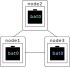
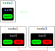
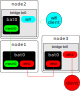

.. SPDX-License-Identifier: GPL-2.0

B.A.T.M.A.N. advanced
=====================

B.A.T.M.A.N. advanced (often referenced as batman-adv) is an
implementation of the B.A.T.M.A.N. routing protocol in form of a linux
kernel module operating on layer 2. The rest of this document will
explain the conceptual details and their implications. If you are
looking for explanations on how to use the module, please consult our
:doc:`quick start guide <Quick-start-guide>`.

Layer 2 ?
---------

Most other wireless routing protocol implementations (e.g. the batman
daemon) operate on layer 3 which means they exchange routing information
by sending UDP packets and bring their routing decision into effect by
manipulating the kernel routing table. Batman-adv operates entirely on
ISO/OSI Layer 2 - not only the routing information is transported using
raw ethernet frames but also the data traffic is handled by batman-adv.
It encapsulates and forwards all traffic until it reaches the
destination, hence emulating a virtual network switch of all nodes
participating. Therefore all nodes appear to be link local and are
unaware of the network's topology as well as unaffected by any network
changes.

The easiest way to think about a batman-adv mesh network is to imagine
it as a distributed switch. Each system (often called "node") running
batman-adv is equal to a switch port.

Each node is running an instance of batman-adv. Such an instance is a
virtual network interface (often called "bat0") which looks to the
system like a switch port that allows access to the distributed switch.
The actual details of the (direct or indirect) communication between the
nodes is then hidden behind the "bat0" network interface.

To make communication possible between the different bat0 interfaces on
the different nodes, batman-adv relies on ethernet compatible network
interfaces which gets attached to bat0 as so called (lower) hard
interfaces. This concept should already be known by Linux bridges

The node3 in the last picture can now communicate with node2 even when
the wifi link via its "mesh0" interface to node2 would be too weak to
transport data over it. The node1 can be used in this scenario to
forward traffic between node3 and node1. The data would be transported
via the (often quite stable) ethernet interface "eth0". And node1 can
talk to node2 via the "mesh0" interface. And batman-adv handles all
these things internally and the upper layers can simply use the bat0
like any other network interface.

This also means that any other interface can be bridged to the bat0
interface. Another ethernet interface ("eth1" in this example) can be
used to grant a non batman-adv aware client connectivity to node1,
node2, node3 or other non batman-adv aware clients. The same is true for
wifi clients which connect to a bridge accesspoint interface.

In this example, the blue wifi-client on node2 should be able to talk to
the red ethernet client on node3. Even when they both don't have any
knowledge about batman-adv or the medium (ethernet vs. wifi) of the
remote client.

This design bears some interesting characteristics:

-  network-layer agnostic - you can run whatever you wish on top of
   batman-adv: IPv4, IPv6, DHCP, IPX ..
-  nodes can participate in a mesh without having an IP
-  easy integration of non-mesh (mobile) clients (no manual HNA fiddling
   required)
-  roaming of non-mesh clients
-  optimizing the data flow through the mesh (e.g. interface
   alternating, multicast, forward error correction, etc)
-  running protocols relying on broadcast/multicast over the mesh and
   non-mesh clients (Windows neighborhood, mDNS, streaming, etc)

A kernel module ?
-----------------

A layer 2 routing protocol also has to handle the data traffic because
usually one can't route/forward ethernet packets. Processing packets in
userland is very expensive in terms of CPU cycles, as each packet has to
be read() and write() to the kernel and back, which limits the
sustainable bandwidth especially on low-end devices. To have good
support for these devices as well, we implemented batman-adv as a kernel
driver. It introduces a negligible packet processing overhead even under
a high load.

batctl ?
--------

To still have a handy tool to configure & debug the batman-adv kernel
module, the batctl tool was developed. It offers a convenient interface
to all the module's settings as well as status information. It also
contains a layer 2 version of ping, traceroute and tcpdump, since the
virtual network switch is completely transparent for all protocols above
layer 2.
