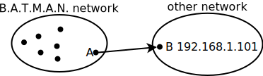
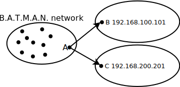
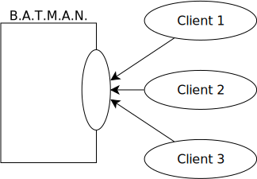

.. SPDX-License-Identifier: GPL-2.0

==============================
B.A.T.M.A.N. - Layer 3 Meshing
==============================

Installing from source
======================

Pre-requirements
----------------

* Compile environment and libraries

  # gcc
  # libc6-dev
  # build-essential
  # binutils
  # makedev
  # GNU make
  # libpthread

* Download the B.A.T.M.A.N. daemon code from the website
  <https://www.open-mesh.org/projects/open-mesh/wiki/Download>

Compiling
---------

All you have to do is untar and make, then you will see the executable
file called *batmand*.

::

  $ wget \
  https://downloads.open-mesh.org/batman/stable/sources/batman/batman-0.3.tar.gz
  $ tar xzvf batman-0.3.tar.gz
  $ cd batman-0.3
  $ make

If you want reduce the size of executable file, just strip it by
executing:

::

  $ strip batmand

Note that if you want to help us finding a bug in the daemon, please
don't strip it.

Installing
----------

Copy *batmand* to a location somewhere in your path, for example

::

  $ cp batmand /usr/sbin/

Or start it right from the directory where you compiled it

::

  $ ./batmand

Usage
=====

If you execute batmand -h or -H, you will see the help page, in the
following we will explain all parameters and how to work with them in a
mesh network.

SYNOPSIS
--------

::

  batmand [options] {interface} [interface]

DESCRIPTION
-----------

You can start batmand without specifying options, but you have to choose
at least one interface batmand runs on.

::

  $ batmand eth1

If you have more interfaces, then you just add them behind the first.

::

  $ batmand eth1 eth2 eth3

The B.A.T.M.A.N. daemon can also run on alias interfaces. Note that we
use alias interfaces to separate B.A.T.M.A.N. routing protocol and olsr
routing protocol.

::

  $ batmand eth1:test1 eth2:test2 eth3:test3

Note that the B.A.T.M.A.N. daemon will take the ip address and the
broadcast address from the given interfaces.

Note also that you have to check whether your essid, channel or wifi
mode is correct or not.

``-a`` add announced network(s)
~~~~~~~~~~~~~~~~~~~~~~~~~~~~~~~

The daemon announces the availability of a connection to another
network. This option can be used multiple times and can be used to add
networks dynamically while the daemon is running. The parameter has to
be in the form of ip-address/netmask.

For example, if you are the node A, and you can connect to *other
network*, then you can execute -a to announce the gateway.

   Announce A as gateway to B

If the other nodes in the B.A.T.M.A.N. network want to connect to node B
after receiving the announce network information form node A, then they
will know they can use node A as gateway to reach node B. Now, you know
what a announced network is, but executing this command is wrong:

::

  $ batmand -a 192.168.100.101 eth1

Because you have to specify the netmask parameter and different netmask
parameters cause different results. Let's make a example:

::

  $ batmand -a 192.168.100.101/32 eth1

In this case, it means that node A can only connect to node B, because
your parameter is /32.

::

  $ batmand -a 192.168.100.101/24 eth1

In this case, it means that node A can connect to the whole
192.168.100.x network, because your parameter is /24. So, if you use
different netmask values, then the results are different.

   Two Announced Networks

Node A can announce more than one network. To announce two networks
execute the following command:

::

  $ batmand -a 192.168.100.101/24 -a 192.168.200.201/24 eth1

Note that node A has to have a route to connect the node or network.

``-A`` delete announced network(s)
~~~~~~~~~~~~~~~~~~~~~~~~~~~~~~~~~~

Delete networks to the daemons list of available connections to another
network(s). This option can be used multiple times and can only be used
while the daemon is running. The parameter has to be in the form of
ip-address/netmask.

``-b`` run connection in batch mode
~~~~~~~~~~~~~~~~~~~~~~~~~~~~~~~~~~~

The debug information are updated after a period of time by default, so
if you use "-b" it will execute once and then stop.

::

  $ batmand eth1
  $ batmand -b -c -d 1

In this case, it means run debug level 1 once.

Note that -b can only be used with -c and debug level 1 & 2.

``-c`` connect via unix socket
~~~~~~~~~~~~~~~~~~~~~~~~~~~~~~

The B.A.T.M.A.N. daemon offers a unix socket interface to which you can
connect. First, you have to create a B.A.T.M.A.N. daemon on your host,
then use -c to connect to its interface. Note you can create as many
client sockets as you like. Deploy it without any arguments to get the
current configuration even if changed at runtime.

   Multiple clients connected to B.A.T.M.A.N. interface

::

  $ batmand eth1
  $ batmand -c -d 1

In this case, you ask the daemon to output debug level 1 in your current
shell. The B.A.T.M.A.N. daemon will update the information after a
period of time.

Note that if you use -c flag, then you only can use -d to see the debug
level.

``-d`` debug level
~~~~~~~~~~~~~~~~~~

The debug level can be set to five values.

0
  debug turned off (default)
1
  list neighbors
2
  list gateways
3
  observe batmand
4
  observe batmand (very verbose)
5
  memory debug / cpu usage

Note that debug level 5 can be turned off at compile time.

For example, you can run in normal start:

::

   $ batmand -d 1 eth1

Level 1
^^^^^^^

just lists the neighbors in your B.A.T.M.A.N. network.

::

  Originator      Router (#/128):       Potential routers... [B.A.T.M.A.N. 0.2,
  MainIF/IP: eth2 105.131.131.175, UT: 0d 0h 3m]
  105.131.83.2    105.131.1.3 (  71):   105.131.1.3 (  71)
  105.131.1.2     105.131.1.2 (  52):   105.131.1.2 (  52)
  105.131.56.10   105.131.1.4 (  25):   105.131.1.4 (  25),105.131.1.6 ( 15),...
  105.131.131.70  105.131.131.70 (121): 105.131.131.70 (121)

* In the first line, we will see the version of the B.A.T.M.A.N.
  daemon, main interface, main IP, and uptime.
* In the first column, we can see those IPs which we can reach.
* In the second column, we can see those IPs which we sent our packets
  to when we want to reach the IP of the first column. The number in
  the parenthesis indicates the link quality of the connection and the
  #/128 shows the maximum number of packets.
* In the third column, we can see those IPs which are one hop neighbors
  and rebroadcasted packets from the originator. The B.A.T.M.A.N.
  daemon will choose the router with the best link quality from the
  potential router list.

In this case, 105.131.1.2 is a one hop neighbor of 105.131.131.175,
because the 105.131.1.2 is originator, router and potential router at
the same time. If 105.131.131.175 wants to exchange data with the
105.131.83.2, then it will sent its packets to the 105.131.1.3, because
it is the router for this destination.

Level 2
^^^^^^^

just lists gateways in the B.A.T.M.A.N. network.

::

  Gateway         Router (#/128)
  105.131.83.5    105.131.41.1 ( 57), gw_class 11  ->6 MBit, reliability: 0
  105.131.41.5    105.131.41.1 ( 53), gw_class 11  ->6 MBit, reliability: 0

* In the first column, we can see those IPs which are our gateways.
* In the second column, we can see those IPs which we sent our packets
  to when we want to reach the IP of the first column. The number in
  the parenthesis indicates the link quality of the connection and the
  #/128 shows the maximum number of packets. The gw_class means gateway
  class of the gateway and 11 ->6 MBit means how much bandwidth the
  gateway owner wants to share. The reliability means how good the
  quality of the internet connection is. In this case, 0 means this is
  the best quality. The reliability number will increase if the quality
  is poor.

Level 3
^^^^^^^

has more information about the neighbors, or shows the error message
when you have an incorrect command. Note that if there is no neighbor in
the B.A.T.M.A.N. network, then it will display nothing.

Level 4
^^^^^^^

has so many information about the B.A.T.M.A.N. network, for example, how
many packets you sent, and sent to where, or how many packets you got,
and received from where etc.

``-g`` gateway class
~~~~~~~~~~~~~~~~~~~~

The gateway class is used to tell other nodes in the network your
available internet bandwidth. Just enter any number (optionally followed
by "kbit" or "mbit") and the daemon will guess your
appropriate gateway class. Use "/" to seperate the down- and upload
rates. You can omit the upload rate and batmand will assume an upload of
.

* 5000
* 5000kbit
* 5mbit
* 5mbit/1024
* 5mbit/1024kbit
* 5mbit/1mbit

You only can set the value in a normal start

::

  $ batmand -g 5mbit/1024 -d 3 eth1

Note that if you use debug level 3, then you will know whether you
succeed setting the gateway class or not.

``-o`` originator interval in ms
~~~~~~~~~~~~~~~~~~~~~~~~~~~~~~~~

A node transmits broadcast messages (we call them originator message or
OGM) to inform the neighboring nodes about it's existence. Originator
interval is the time to wait after sending one message and before
sending the next message. The default value is 1000 ms (1 second). In a
mobile network, you may want to detect network changes very quickly, so
you need to send message very often, for example, use a value of 500 ms.
In a static network, you can save bandwidth by using a higher value.
This option is only available in daemon mode.

::

  $ batmand -o 2000 eth1

In this case, batmand will wait 2 second until sending the next OGMs.

``-p`` preferred gateway
~~~~~~~~~~~~~~~~~~~~~~~~

Set the internet gateway by yourself.

Note that this automatically switches your B.A.T.M.A.N. daemon to
"internet search modus" with "-r 1" unless "-r" is given.
If the preferred gateway is not found the gateway selection will use the
current routing class to choose a gateway.

::

  $ batmand -r 3 -d 3 -p 192.168.1.1 eth1

In this case, you set 192.168.1.1 as your preferred gateway, so all of
your internet packets will be sent to the 192.168.1.1.

``-r`` routing class
~~~~~~~~~~~~~~~~~~~~

The routing class can be set to four values - it enables "internet
search modus". The daemon will choose an internet gateway based on
certain criteria (unless "-p" is specified):

0
  set no default route (default)
1
  use fast connection
2
  use stable connection
3
  use fast-switch connection
XX
  use late-switch connection

Level 1
^^^^^^^

B.A.T.M.A.N tries to find the best available connection by watching the
uplinks throughput and the link quality.

Level 2
^^^^^^^

B.A.T.M.A.N compares the link quality of the internet node and chooses
the one with the best connection.

Level 3
^^^^^^^

B.A.T.M.A.N compares the link quality of the internet node and chooses
the one with the best connection but switches to another gateway as soon
as a better connection is found.

Level XX
^^^^^^^^

B.A.T.M.A.N compares the link quality of the internet node and chooses
the one with the best link quality but switches to another gateway as
soon as this gateway has a TQ value which is XX better than the
currently selected gateway.

XX ist a number between 3 and 256

::

  $ batmand -r 3 -d 3 eth1

In this case, the B.A.T.M.A.N. daemon will choose the best statistic
internet connection for you. Note that if you use debug level 3, then
you will know whether you succeeded setting the routing class or not.

``-s`` visualization server
~~~~~~~~~~~~~~~~~~~~~~~~~~~

Since no topology database is computed by the protocol an additional
solution to create topology graphs has been implemented, the vis server.
B.A.T.M.A.N. daemons may send their local view about their single-hop
neighbors to the vis server. It collects the information and provides
data in a format similar to OLSR's topology information output.
Therefore existing solutions to draw topology graphs developed for OLSR
can be used to visualize mesh-clouds using B.A.T.M.A.N.

``--policy-routing-script``
~~~~~~~~~~~~~~~~~~~~~~~~~~~

This option turns off the policy routing feature of batmand - all
routing changes are send to the script which can make use of this
information or not. Firmware and package maintainers can use this option
to tightly integrate batmand into their own routing policies. This
option is only available in daemon mode.

Troubleshooting
===============

Why the B.A.T.M.A.N. daemon doesn't reload the setting after I fixed the main IP?
---------------------------------------------------------------------------------

You have to restart the B.A.T.M.A.N. daemon after you modified any
network configuration, otherwise the B.A.T.M.A.N. daemon won't use the
new settings.

::

  $ killall batmand
  $ batmand eth1

Why I can't connect to the Internet after setting the default gateway?
----------------------------------------------------------------------

You have to use NAT on your gateway or firewall if you use the -r or -p
options to set default route.

::

  $ iptables -t nat -A POSTROUTING -o eth1 -j MASQUERADE

Note that you don't set the default route by yourself.

