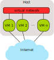

.. SPDX-License-Identifier: GPL-2.0

Emulation Environment
=====================

To give an answer to the often asked question “How to
test/evaluate/debug mesh network protocols?”, this document explains a
virtual machine setup which can be used to test batman-adv in a
controlled environment. The idea is to use
`QEMU <https://www.qemu.org/>`__ (instead of pure simulation systems
like `NS-2 <https://www.isi.edu/nsnam/ns/)>`__ to run an unmodified
Linux system with the unmodified source code as it is used in real world
setups. Besides B.A.T.M.A.N., you could evaluate any routing protocol.

A simple setup is shown first and various extension and debugging
helpers are explained later.

.. _devtools-emulation-environment-architecture:

Architecture
------------

The test stack consists of the following components:

* Host running the virtual instances
* virtual instances (cloned) from a single image
* virtual network to allow commmunication between the virtual instances
* various debugging tools
* optional external devices and services

|image0|

Virtual Instances
-----------------

The main components of the testing setup are the virtual instances.
Various images can be used to create them. There is not a single image
for all tasks but the right one has to be chosen.

.. toctree::
   :maxdepth: 1

   OpenWrt_in_QEMU
   Kernel_hacking_Debian_image

Advanced virtual networks
-------------------------

The default virtual network is only creating a single broadcasting
domain using a bridge. This cannot be used to simulate interesting
topologies. More advanced techniques can be used to extend or replace
the bridge to still achieve a reasonable setup

.. toctree::
   :maxdepth: 1

   Advanced_Bridge_virtual_network
   Vde_switch_virtual_network
   Mixing_VM_with_gluon_hardware

Debugging helpers
-----------------

.. toctree::
   :maxdepth: 1

   Analyzing_virtual_network_packets
   Kernel_Debugging

