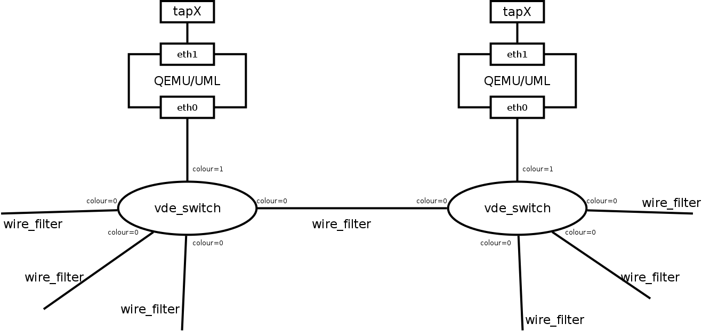
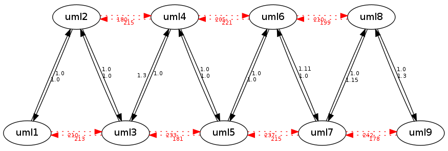

.. SPDX-License-Identifier: GPL-2.0

vde_switch virtual network
==========================

The simple virtual network from 
:ref:`OpenWrt in Qemu <devtools-openwrt-in-qemu-virtual-network-initialization>`
is a Linux bridge which allows
full communication between the tap interfaces of all virtual instances.
This is not optimal to create not fully meshed setups. One alternative
is to use a modified vde_switch to create user defined links between
each virtual instance.

Components
----------

The test stack consists of the following components:

* one (modified, see below)
  `vde_switch <http://wiki.virtualsquare.org/wiki/index.php/VDE_Basic_Networking>`__
  per instance. You need multiple instances to allow interconnection
  with wirefilter.
* one (unmodified)
  `wirefilter <http://wiki.virtualsquare.org/wiki/index.php/VDE#wirefilter>`__
  per link between hosts.

vde setup
---------

Download `vde2.3.1 <https://sourceforge.net/projects/vde/files/vde2/>`__
and the vde colour patch :download:`vde2-2.3.1_colour.patch`

apply “vde2-2.3.1_colour.patch” for vde.
~~~~~~~~~~~~~~~~~~~~~~~~~~~~~~~~~~~~~~~~

.. code-block:: sh

  cd vde-2.3.1
  cp vde2-2.3.1_colour.patch .
  patch -p1 < vde2-2.3.1_colour.patch

compile and install vde
~~~~~~~~~~~~~~~~~~~~~~~

.. code-block:: sh

  cd vde-2.3.1
  ./configure
  make
  sudo make install

Create colourful.rc
~~~~~~~~~~~~~~~~~~~

.. code-block:: sh

  cat > colourful.rc << "EOF"
  port/setcolourful 1
  port/create 1
  port/create 2
  port/create 3
  port/create 4
  port/create 5
  port/setcolour 1 1
  EOF

vde_switch
~~~~~~~~~~

You should read the `detailed vde_switch parameters
documentation <http://www.linuxhowtos.org/manpages/1/vde_switch.htm>`__.
The main advantage of
`vde_switch <http://wiki.virtualsquare.org/wiki/index.php/VDE_Basic_Networking>`__
over
`uml_switch <http://user-mode-linux.sourceforge.net/old/networking.html>`__
is that any clients can be attached to this virtual switch: QEMU, KVM,
UML, tap interfaces, virtual interconnections, and not just UML
instances.

If the vde_switches were just connected with wirefilter “patch cables”
without modification, we would end up creating a broadcast domain and
switch loops which we don’t want: The goal is to allow the packets to
travel only from one host to it’s neighbor, not further.

To accomplish this, the vde_switch needs to be modified to have
“coloured” ports. The idea is:

* each port has a “colour” (an integer number)
* packets are only passed from ports to others with DIFFERENT colours.
* packets are dropped on outgoing ports if it has the SAME colour as
  the incoming port.

In this concept, the host port can have colour 1 while the
interconnection ports have colour 0. This way, packets can only travel
from the host to (all of) the interconnection ports, or from one
interconnection port to the host port. However packets can not travel
between the the interconnection ports, thus only allowing “one hop”
connections and avoiding switch loops and shared broadcast domains. The
concept is illustrated below:

|image0|

You can find the patch against vde2-2.3.1 (current latest stable
version) to add this colour patch here:

* :download:`vde2-2.3.1_colour.patch`

wirefilter
~~~~~~~~~~

Wirefilter manpage: http://manpages.ubuntu.com/manpages/trusty/man1/wirefilter.1.html
wirefilter is a tool where you can simulate various link defects and
limits:

* packet loss
* burst loss
* delay
* duplicates
* bandwidth
* noise (damage to packets)
* mtu
* …

However as the links are only set up bidirectional, interferences can
unfortunately not be simulated with this system.

For advanced testing it might be necessary to apply the aforementioned
link defects to some packets only whereas other packets are able to
traverse the emulated environment unharmed. Once you applied the
‘ethertype’ patch you can specify an ethertype which wirefilter will
simply forward. To apply a packet loss of 50% to all packets except
batman-adv packets, run:

.. code-block:: sh

   wirefilter --ether 0x4305 -l 50

This patch also allows to filter batman-adv packet types. To apply a
packet loss of 50% to all packets except batman-adv ICMP packets, run:

.. code-block:: sh

   wirefilter --ether 0x4305:02 -l 50

You can specify up to 10 packet types (separated by colon). The patch
against vde2-2.3.1 (current latest stable version) can be found here:

* :download:`vde2-2.3.1-wirefilter-ethertype.patch`

Start of the environment
------------------------

virtual network initialization
~~~~~~~~~~~~~~~~~~~~~~~~~~~~~~

The script does:

* kill old instances
* start up vde_switch instances for each host
* install the links between the hosts. The resulting topology will be
  similar to this:
  |image1|

.. code-block:: sh

  cat > virtual-network.sh << "EOF"
  #!/bin/sh

  NUM_SESSIONS=9
  VDESWITCH=vde_switch

  killall -q wirefilter
  killall -q vde_switch

  for i in $(seq 1 "${NUM_SESSIONS}"); do
      ${VDESWITCH} -d --hub --sock num${i}.ctl -f colourful.rc
  done

  for i in $(seq 1 $((${NUM_SESSIONS} - 1))); do
      wirefilter --daemon -v num${i}.ctl:num$((${i} + 1)).ctl
  done

  for i in $(seq 1 $((${NUM_SESSIONS} - 2))); do
      wirefilter --daemon -v num${i}.ctl:num$((${i} + 2)).ctl -l 60
  done
  EOF

  chmod + virtual-network.sh

VM instances bringup
~~~~~~~~~~~~~~~~~~~~

The :ref:`run.sh from the OpenWrt environment <devtools-openwrt-in-qemu-vm-instances-bringup>`
can mostly be reused. There are only minimal
adjustments required. The virtual network tap NIC has to be replaced
with a vde NIC.

.. code-block:: diff

  -        -nic tap,ifname=tap$i,script=no,model=virtio-net-pci,mac=02:ba:de:af:fe:"${twodigit_id}" \
  +        -nic vde,sock=num${i}.ctl,port=1,model=virtio-net-pci,mac=02:ba:de:af:fe:"${twodigit_id}" \

It is also possible to have both (just with different mac addresses) to
allow SSH access to the virtual instance over the tap interface.

Automatic test initialization
~~~~~~~~~~~~~~~~~~~~~~~~~~~~~

The :ref:`test-init.sh from the OpenWrt environment <devtools-openwrt-in-qemu-automatic-test-initialization>`
is always test specific. But it can just
be reused again with this virtual network.

Resources
---------

* :download:`vde2-2.2.3_colour.patch`
* :download:`vde2-2.3.1-wirefilter-ethertype.patch`
* :download:`vde2-2.3.1_colour.patch`
* :download:`vde2-2.3.2-wirefilter-ethertype.patch`
* :download:`vde2-2.3.2_colour.patch`
* :download:`vde2-2.3.2_frame_size.patch`
