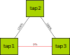

.. SPDX-License-Identifier: GPL-2.0

Advanced Bridge virtual network
===============================

The simple virtual network from
:ref:`OpenWrt in Qemu <open-mesh-openwrt-in-qemu-virtual-network-initialization>`
is a Linux bridge which allows
full communication between the tap interfaces of all virtual instances.
This is not optimal because fully connected meshes are not really
interesting. But it is possible to use the bridge and netfilter
functionality of the host’s kernel to improve the bridge virtual
network.

The tool of choice at the moment is is nft(ables). The following
examples will introduce some common concepts based on nft. For older
systems, ebtables and/or tc can also be used to achieve the same.

It is important to understand the different filter hooks we have to use:

input
  from a bridge slave interface (here tap\*) to the host bridge port

output
  from the host bridge port to a bridge slave interface (here tap\*)

forward
  traffic between bridge slave interfaces (here tap\*)

|image0|

Preventing communication between nodes
--------------------------------------

By default, all ports of a bridge can talk to each other. It is possible
to prevent this forwarding behavior between the tap interfaces. The
communication of the host with the virtual instances is not affected
because it would be handled as output/input traffic.

.. code-block:: sh

  cat > virtual-network-filter-traffic.nft << "EOF"
  #!/usr/sbin/nft -f

  flush ruleset bridge

  table bridge filter {
          chain FORWARD {
                  type filter hook forward priority -200; policy accept;
                  meta obrname "br-qemu" drop
          }
  }
  EOF

  chmod +x virtual-network-filter-traffic.nft

  sudo ./virtual-network-filter-traffic.nft

Allow communication between specific nodes
------------------------------------------

The previous example was not that useful for a mesh because nothing
really meshes anymore. It could be more interesting to allow
communication between specific nodes.

|image1|

A simple chain is build here by allowing forwarding from one slave
interface to another slave interface:

.. code-block:: sh

  cat > virtual-network-filter-traffic.nft << "EOF"
  #!/usr/sbin/nft -f

  flush ruleset bridge

  table bridge filter {
          chain FORWARD {
                  type filter hook forward priority -200; policy accept;

                  iifname "tap1" oifname "tap2" accept
                  iifname "tap2" oifname "tap1" accept

                  iifname "tap2" oifname "tap3" accept
                  iifname "tap3" oifname "tap2" accept

                  meta obrname "br-qemu" drop
          }
  }
  EOF

  chmod +x virtual-network-filter-traffic.nft

  sudo ./virtual-network-filter-traffic.nft

Loss between nodes
------------------

The chain setup is already a nice test for mesh setups. But other
characteristics of a link might be interesting for a mesh protocol. The
probability of packet loss (or in this case packet success) is one of
such a link characteristics.

|image2|

A simple (uniformly distributed, bidirectional) packet loss can be
implemented using

.. code-block:: sh

  cat > virtual-network-filter-traffic.nft << "EOF"
  #!/usr/sbin/nft -f

  flush ruleset bridge

  table bridge filter {
          chain FORWARD {
                  type filter hook forward priority -200; policy accept;

                  iifname "tap1" oifname "tap2" numgen random mod 100 < 90 accept
                  iifname "tap2" oifname "tap1" numgen random mod 100 < 90 accept

                  iifname "tap2" oifname "tap3" numgen random mod 100 < 90 accept
                  iifname "tap3" oifname "tap2" numgen random mod 100 < 90 accept

                  iifname "tap1" oifname "tap3" numgen random mod 100 < 60 accept
                  iifname "tap3" oifname "tap1" numgen random mod 100 < 60 accept

                  meta obrname "br-qemu" drop
          }
  }
  EOF

  chmod +x virtual-network-filter-traffic.nft

  sudo ./virtual-network-filter-traffic.nft

Throughput limit between nodes
------------------------------

It is also possible to limit the maximum throughput per second for a
link. The limits are specified in bytes per second. And bits per second
(in the picture) have to be converted manually to this unit.

|image3|

.. code-block:: sh

  cat > virtual-network-filter-traffic.nft << "EOF"
  #!/usr/sbin/nft -f

  flush ruleset bridge

  table bridge filter {
          chain FORWARD {
                  type filter hook forward priority -200; policy accept;

                  iifname "tap1" oifname "tap2" limit rate 1250 kbytes/second accept
                  iifname "tap2" oifname "tap1" limit rate 1250 kbytes/second accept

                  iifname "tap2" oifname "tap3" limit rate 625 kbytes/second accept
                  iifname "tap3" oifname "tap2" limit rate 625 kbytes/second accept

                  iifname "tap1" oifname "tap3" limit rate 125 kbytes/second accept
                  iifname "tap3" oifname "tap1" limit rate 125 kbytes/second accept

                  meta obrname "br-qemu" drop
          }
  }
  EOF

  chmod +x virtual-network-filter-traffic.nft

  sudo ./virtual-network-filter-traffic.nft

