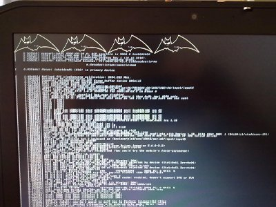
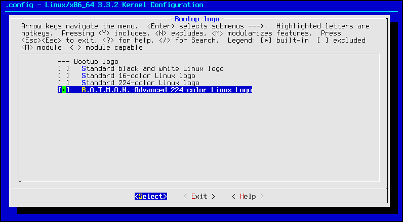

Batman-adv boot logo
====================

If you are a very batman-advanced addicted and enthusiastic fan, you
will surely want to give the B.A.T.M.A.N.-Advanced boot logo a try! This
little howto will drive you through the few necessary steps that will
enable you to select a new custom logo from the kernel menuconfig.

This is what it looks like at the end:

|image0|

Do you like it? Yeah! So, these are the necessary steps (it works for
linux-3.3.2, but should work for older versions as well):

1. download the logo (attachment:logo\_batman\_clut224.ppm) and put it
into your *drivers/video/logo* subfolder in the kernel source directory

2. download the patch (attachment:batman\_logo.patch) and put it into
your kernel source directory

3. open a terminal, jump into your kernel source directory and type

::

    patch -p1 < batman_logo.patch

4. now run the menuconfig by typing

::

    make menuconfig

5. Browse the menu: Device Drivers -> Graphics support -> Bootup Logo
and choose the new B.A.T.M.A.N.-Advanced entry:

|image1|

6. Exit the menu and recompile your kernel! Don't forget to reinstall it
to the proper location!

Enjoy!

