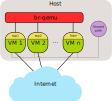

.. SPDX-License-Identifier: GPL-2.0

OpenWrt in QEMU
===============

The :ref:`simple emulation architecture <open-mesh-emulation-environment-architecture>`
can be implemented rather easily using qemu and an x86_64
image from OpenWrt.

|image0|

OpenWrt preparation
-------------------

It is possible to just use an x86_64 which was `downloaded from
OpenWrt’s
servers <https://downloads.openwrt.org/snapshots/targets/x86/64/openwrt-x86-64-combined-ext4.img.gz>`__.
But it is highly recommended to build an own image which:

* enables the routing protocols (like batman-adv) from the
  `openwrt-routing feed <https://git.openwrt.org/?p=feed/routing.git;a=summary>`__.
* enables the 9p filesystem (and virtio)
* integrates its own startup scripts (for automatic test initialization
  and shared path support) via ``files/etc/rc.local``

.. code-block:: sh

  mkdir -p files/etc/
  cat > files/etc/rc.local << "EOF"
  #!/bin/sh

  mkdir -p /host
  mount -t 9p host /host
  [ ! -x /host/test-init.sh ] || /host/test-init.sh
  EOF

The shared path is a folder from the host system which is mapped via 9p
into all virtual instances. It can be used to exchange files between the
instances and the host.

The openwrt build result openwrt-x86-64-combined-ext4.img.gz has to be
extracted and copied to the path with the other scripts.

Start scripts for the simple environment
----------------------------------------

The virtual instances and the virtual network will be started using a
set of simple scripts. This simplifies everything and makes the setup
more reproducible.

.. _open-mesh-openwrt-in-qemu-virtual-network-initialization:

virtual network initialization
~~~~~~~~~~~~~~~~~~~~~~~~~~~~~~

The virtual network (bridge br-qemu with 3 tap devices) has to be
started first to have a simple network. All devices in this virtual
network can talk to each other - which is not optimal for tests but
enough for a start. More complex network setups can be on the pages
:doc:`Vde_switch_virtual_network` and :doc:`Advanced_Bridge_virtual_network`.

The tap interfaces will be created with access rights for the current
user. This allows the qemu instance to start up without being root.

.. code-block:: sh

  cat > virtual-network.sh << "EOF"
  #! /bin/sh

  USER="$(whoami)"
  BRIDGE=br-qemu
  NUM_SESSIONS=3

  sudo ip link add "${BRIDGE}" type bridge
  for i in $(seq 1 "${NUM_SESSIONS}"); do
          sudo ip tuntap add dev tap$i mode tap user "$USER"
          sudo ip link set tap$i up
          sudo ip link set tap$i master "${BRIDGE}"
  done

  sudo ip link set "${BRIDGE}" up
  sudo ip addr replace 192.168.251.1/24 dev "${BRIDGE}"
  EOF

  chmod +x virtual-network.sh

.. _open-mesh-openwrt-in-qemu-vm-instances-bringup:

VM instances bringup
~~~~~~~~~~~~~~~~~~~~

Each instance will need to write to the provided image. If the same
image is specified as drive for each instance then writes to this file
would conflict and data corruption be the result. To avoid this, each
instance gets its own (copy on write) snapshot of the base image.

The three node environment must be started inside a screen session. Each
instance will end up in an own screen window. This allows access to the
serial console of each instance while having each instance’s output
separated from each other.

The qemu instance is started in a rather specific way to enable all
features which might be needed during the test:

* KVM is enabled to speed up the virtual instances (by avoiding slow
  emulation as much as possible)
* no graphic display is activated
* serial output is enabled for kernel output and login shell
* 2 core SMP is activated to better see effects of multicore systems
* 512 MB RAM is provided to the virtual instance
  (`KSM <https://en.wikipedia.org/wiki/Kernel_same-page_merging>`__
  should be activated in setups with larger number of virtual
  instances)
* a NIC is connected to the tap interface (from the virtual network) to
  transport mesh (and other) traffic
* a user NIC is created to transport (NAT’ed) traffic to/from the
  internet
* a shared path from host is provided for the client
* the qemu gdb server is enabled to allow
  :doc:`kernel debugging <Kernel_debugging_with_qemu\'s_GDB_server>`

The ``SHARED_PATH`` in run.sh has to be changed to a valid path which is
used to share things like a precompiled batman-adv.ko and other tools

.. code-block:: sh

  cat > run.sh << "EOF"
  #! /bin/bash

  BOOTARGS=()

  if [ -z "${STY}" ]; then
      echo "must be started inside a screen session" >&2
      exit 1
  fi

  SHARED_PATH="$(pwd)"
  NUM_SESSIONS=3

  ## OpenWrt in QEMU
  BASE_IMG=openwrt-x86-64-combined-ext4.img
  BOOTARGS+=("-serial" "chardev:charconsole0")

  ## Kernel hacking Debian image
  #BASE_IMG=debian.img
  #BOOTARGS+=("-bios" "qboot/bios.bin")
  #BOOTARGS+=("-kernel" "linux-next/arch/x86/boot/bzImage")
  #BOOTARGS+=("-append" "root=/dev/vda rw console=hvc0 nokaslr tsc=reliable no_timer_check noreplace-smp rootfstype=ext4 rcupdate.rcu_expedited=1 reboot=t pci=lastbus=0 i8042.direct=1 i8042.dumbkbd=1 i8042.nopnp=1 i8042.noaux=1")
  #BOOTARGS+=("-device" "virtconsole,chardev=charconsole0,id=console0")

  for i in $(seq 1 "${NUM_SESSIONS}"); do
      if [ ! -e "/sys/class/net/tap${i}" ]; then
          echo "hub script must be started first to create tap$i interface" >&2
          exit 1
      fi
  done

  for i in $(seq 1 "${NUM_SESSIONS}"); do
      normalized_id="$(echo "$i"|awk '{ printf "%02d\n",$1 }')"
      twodigit_id="$(echo $i|awk '{ printf "%02X", $1 }')"

      qemu-img create -b "${BASE_IMG}" -f qcow2 root.cow$i
      screen qemu-system-x86_64 -enable-kvm -name "instance${i}" \
          -display none -no-user-config -nodefaults \
          -m 512M,maxmem=2G,slots=2 -device virtio-balloon \
          -cpu host -smp 2 -machine q35,accel=kvm,usb=off,dump-guest-core=off \
          -drive file=root.cow$i,if=virtio,cache=unsafe \
          -nic tap,ifname=tap$i,script=no,downscript=no,model=virtio,mac=02:ba:de:af:fe:"${twodigit_id}" \
          -nic user,model=virtio,mac=06:ba:de:af:fe:"${twodigit_id}" \
          -virtfs local,path="${SHARED_PATH}",security_model=none,mount_tag=host \
          -gdb tcp:127.0.0.1:$((23000+$i)) \
          -device virtio-rng \
          -device virtio-serial,id=virtio-serial \
          -chardev stdio,id=charconsole0,mux=on,signal=off -mon chardev=charconsole0,mode=readline \
          "${BOOTARGS[@]}"
      sleep 1
  done
  EOF

  chmod +x run.sh

.. _open-mesh-openwrt-in-qemu-automatic-test-initialization:

Automatic test initialization
~~~~~~~~~~~~~~~~~~~~~~~~~~~~~

The test-init.sh script in the SHARED_PATH can be used to automatically
initialize the test setup during boot. A simple example is:

.. code-block:: sh

  cat > test-init.sh << "EOF"
  #! /bin/sh

  set -e

  ## Simple batman-adv setup

  rmmod batman-adv || true
  modprobe batman-adv
  batctl routing_algo BATMAN_IV
  batctl if add eth0
  batctl it 5000
  ip link set up dev eth0
  ip link set up dev bat0
  EOF

  chmod +x test-init.sh

.. _open-mesh-openwrt-in-qemu-start:

Start
-----

Everything can then be started up inside a screen session

.. code-block:: sh

  screen
  ./virtual-network.sh
  ./run.sh

