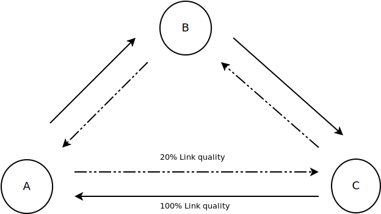
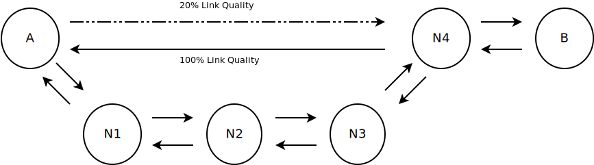
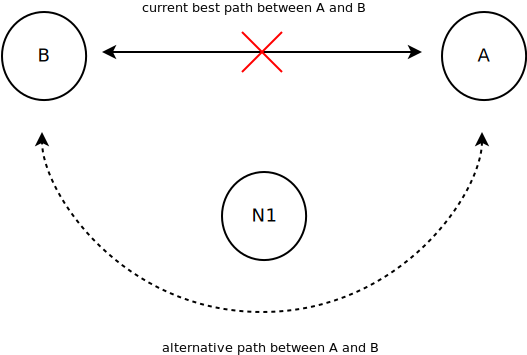
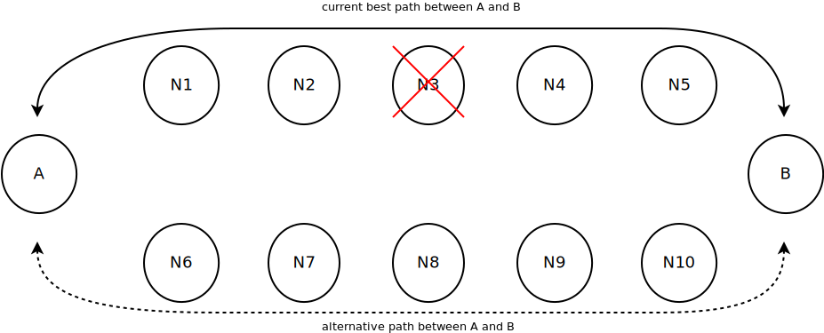
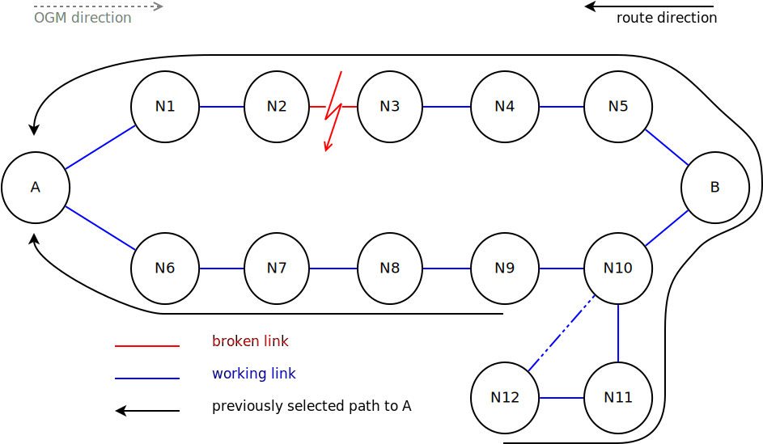
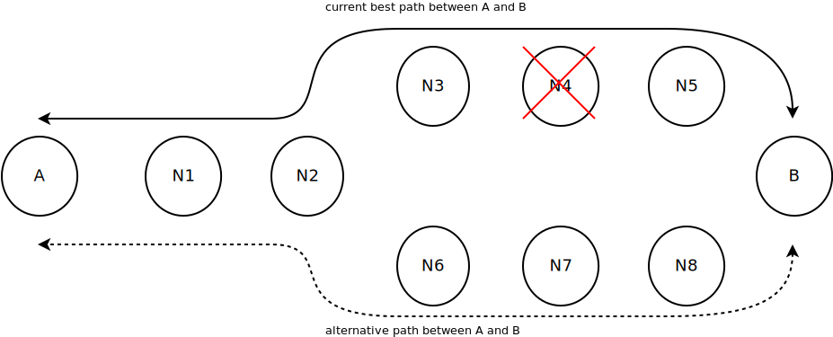
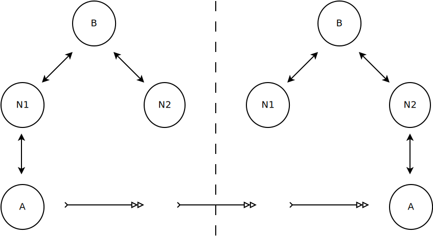
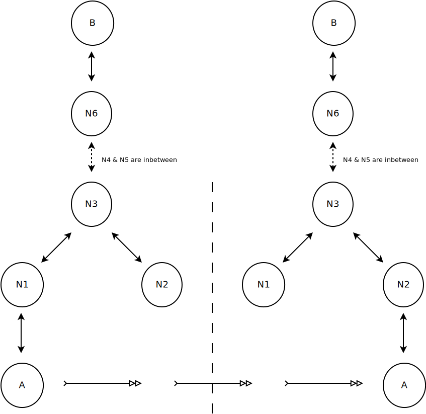
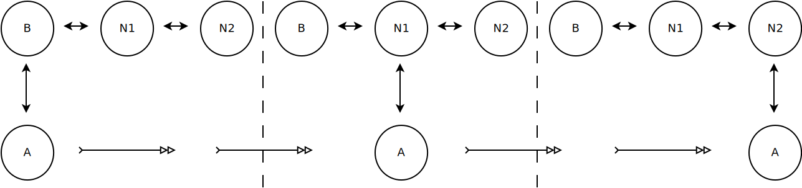

Routing scenarios
=================

This page contains a collection of routing scenarios which all routing
protocol changes have to go through to estimate its impact.

Best route
----------

Asymmetric link
~~~~~~~~~~~~~~~

The nodes A, B and C are connected via asymmetric links - every node has
a good transmit connection to one neighbor and a good receiving
connection from the other. The protocol has to detect that the best
neighbor towards any destination is the one it rarely gets routing
information from.

|image0|

Asymmetric path
~~~~~~~~~~~~~~~

Node A and B are connected via multiple paths with different
characteristics: a short asymmetric path and a long path without packet
loss. The protocol should choose the long path for traffic traveling
from A to B and the short path in the opposite direction.

|image1|

.. _open-mesh-routing_scenarios-convergencespeed:

Convergence speed
-----------------

A and B have 2 possible paths to communicate with each other. One of the
nodes that is part of the currently used path dies or one of the links
breaks down and the protocol needs to detect the unavailability of the
path to switch as fast as possible to the other one.

The triangle
~~~~~~~~~~~~

|image2|

The circle, I
~~~~~~~~~~~~~

|image3|

The circle, II
~~~~~~~~~~~~~~

|image4|

The bottle
~~~~~~~~~~

|image5|

Mobility
--------

While A is moving through the mesh the route between A and B shall
recover as fast as possible.

New neighbor
~~~~~~~~~~~~

|image6|

New distant neighbor
~~~~~~~~~~~~~~~~~~~~

|image7|

Mobile Node
~~~~~~~~~~~

|image8|

